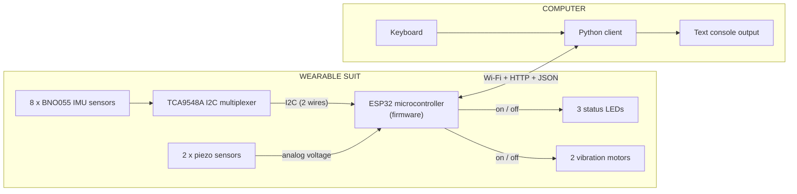
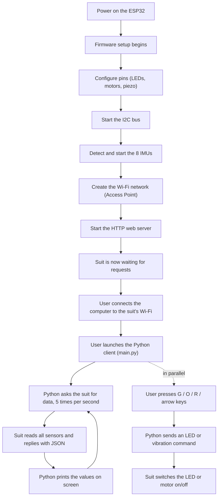
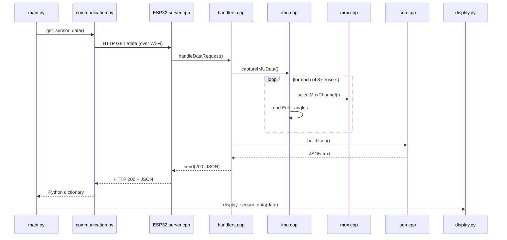
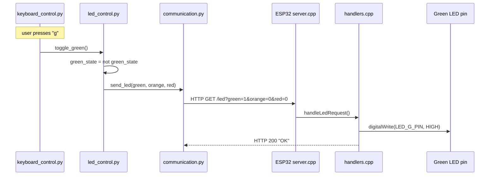
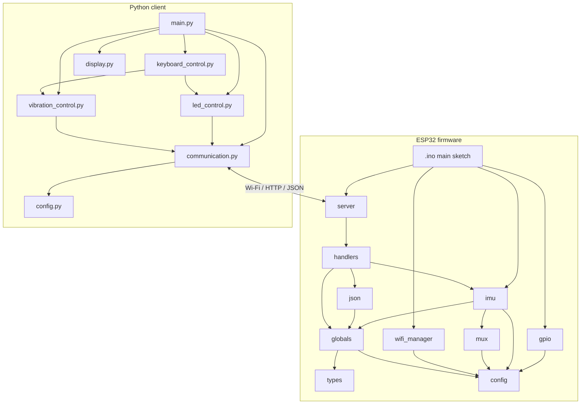
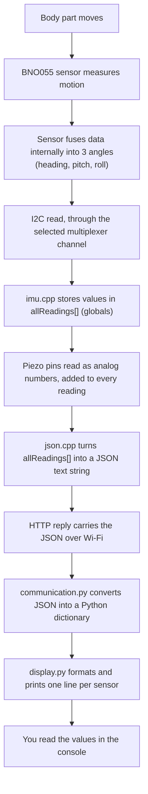
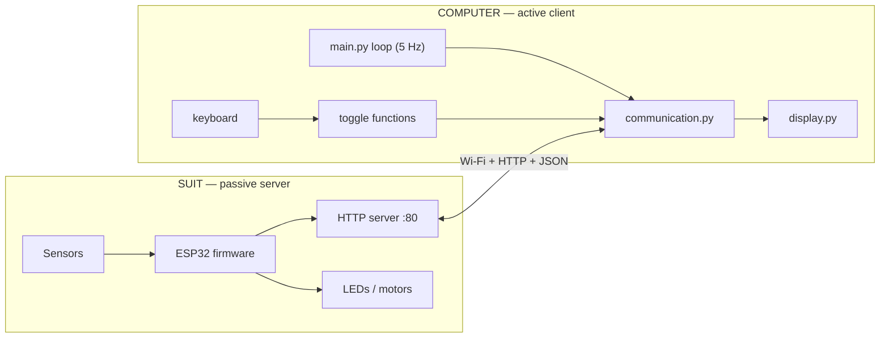

# Get Data — V1
### Wearable Motion Suit — ESP32 Firmware + Python Client

This document explains **how this project works on the inside**.

It is written for someone who has **never seen the project** and who is **not
necessarily an experienced programmer**. Every important idea is introduced
before it is used, and every important file is explained. When you finish
reading, you should understand where the data comes from, how it travels, who
processes it, and who displays it — **without having to open a single source
file**.

> **Scope of this README.**
> This folder (`V1`) is the *first version* of a larger effort. The parent
> folder `Get_Data/` also contains `V2` and `V3`, which add features such as
> automatic calibration. **This README documents V1 only** — the behaviour
> described here is exactly what the V1 source code does, nothing more.

> **A note on honesty.**
> The guideline for this document asks that anything uncertain be stated
> openly rather than guessed. Wherever the code does something surprising, or
> where the physical hardware behaviour cannot be proven from the source alone,
> you will find a **⚠️ Note** box. A consolidated list is given in
> [Section 15 — Known Limitations & Uncertainties](#15-known-limitations--uncertainties).

---

## Table of Contents

1. [Project Overview](#1-project-overview)
2. [Global Workflow](#2-global-workflow)
3. [Folder Structure](#3-folder-structure)
4. [File Explanation](#4-file-explanation)
5. [Communication Between Files](#5-communication-between-files)
6. [Execution Flow](#6-execution-flow)
7. [Data Flow](#7-data-flow)
8. [Initialization](#8-initialization)
9. [Runtime](#9-runtime)
10. [Communication Protocols](#10-communication-protocols)
11. [Algorithms](#11-algorithms)
12. [Error Handling](#12-error-handling)
13. [Configuration](#13-configuration)
14. [Architecture Summary](#14-architecture-summary)
15. [Known Limitations & Uncertainties](#15-known-limitations--uncertainties)

---

## 1. Project Overview

### What the project is

This project is the **data link** between a **wearable motion-capture suit**
and a **normal computer**.

The suit is worn on the body. It carries small sensors that measure **how each
body part is oriented in space** (for example, how much an arm is raised or
rotated). A tiny computer on the suit gathers all those measurements and makes
them available over **Wi-Fi**. A program running on your laptop connects to the
suit, repeatedly asks for the latest measurements, and prints them on screen.

The same link also works in the other direction: from the laptop you can turn
small **signal lights (LEDs)** and **vibration motors** on the suit on and off,
by pressing keys on your keyboard.

### Why it exists

The larger goal (the "Volting MUSIC Project") is to turn **body movement into
something a computer can react to** — for example, to drive music or visuals
from a performer's motion. Before any of that is possible, you first need a
reliable, simple way to:

- **read** every sensor on the suit, and
- **send** commands back to the suit.

That basic read/send capability is exactly what **V1** provides. It is
deliberately kept simple so it can be understood, tested, and trusted before
more advanced features (calibration, gesture detection, sound generation) are
built on top of it in later versions.

### Global objective

> Continuously move body-orientation numbers from the suit to the computer,
> and let the computer light up LEDs and buzz motors on the suit — over a
> plain Wi-Fi connection, using simple, human-readable messages.

### Hardware involved

Before we go further, here are the physical parts. A few one-line definitions
first, because the rest of the document relies on them:

- **Microcontroller** — a very small, cheap computer on a single chip. It has
  no screen or keyboard; it runs one program and talks to electronic parts
  through its pins.
- **IMU (Inertial Measurement Unit)** — a sensor that measures motion and
  orientation. The specific IMU here (a **BNO055**) is special because it does
  the hard mathematics *inside itself* and directly reports the orientation as
  three angles (explained in [Section 11](#11-algorithms)).
- **I²C (pronounced "I-squared-C")** — a common way for a microcontroller to
  talk to several small chips using just **two shared wires**. Explained in
  [Section 10](#10-communication-protocols).
- **Multiplexer ("mux")** — an electronic switch that connects **one** of many
  devices to a shared line at a time.

The suit hardware, as far as the code reveals it:

| Part | Quantity | Role |
|------|----------|------|
| **ESP32** microcontroller | 1 | The brain on the suit. Reads sensors, runs the Wi-Fi network and the web server. |
| **BNO055** IMU sensors | 8 | Measure the orientation of eight body parts. |
| **TCA9548A** I²C multiplexer | 1 | Lets all 8 IMUs share the same two I²C wires by switching between them. |
| **Piezo sensors** | 2 (left / right) | Simple sensors that produce a voltage when tapped, pressed or vibrated. Read as analog values. |
| **LEDs** | 3 (red / orange / green) | Status lights the computer can switch on and off. |
| **Vibration motors** | 2 (left / right) | Small motors that buzz — used for physical feedback ("haptics"). |

### Software involved

The project is made of **two programs** that run on two different machines and
talk to each other over Wi-Fi:

1. **The ESP32 firmware** (written in C++ using the Arduino framework).
   *"Firmware"* simply means the program stored inside the microcontroller.
   It lives in the `Arduino_Suit_ESP32_Get_Send_Data_V1/` folder. It runs on
   the suit.

2. **The Python client** (written in Python).
   It lives in the `Python_Suit_ESP32_Get_Send_Data_V1/` folder. It runs on
   your laptop or desktop.

### High-level architecture

The picture below shows the whole system at a glance. Read it top to bottom:
sensors feed the ESP32, the ESP32 offers a Wi-Fi network, and the Python
program connects to it.



The single most important idea to take away:

> The ESP32 and the computer are **two separate computers** that agree to talk
> using ordinary web technology (Wi-Fi, HTTP, JSON). The suit acts like a tiny
> **website**; the Python program acts like a **web browser** that keeps
> refreshing the page.

Each of those words — Wi-Fi, HTTP, JSON — is explained in
[Section 10](#10-communication-protocols).

---

## 2. Global Workflow

This section describes the **complete lifecycle** of the system, from switching
the suit on to seeing numbers on your screen.



In words:

1. **Power on.** The suit's firmware starts automatically.
2. **Hardware initialization.** The firmware prepares its pins and its sensor
   connections.
3. **Sensor detection.** It tries to wake up all 8 IMUs.
4. **Networking.** It creates its own Wi-Fi network and starts a small web
   server.
5. **Idle waiting.** The suit now does nothing until someone asks it for
   something.
6. **Computer connects.** You join the suit's Wi-Fi and start the Python
   program.
7. **Continuous polling.** The Python program repeatedly requests fresh sensor
   data and prints it.
8. **Optional commands.** At any time you can press keys to control LEDs and
   motors.

> Note: **V1 has no calibration step.** The workflow above intentionally lacks
> the "calibration / T-pose" stage that appears in later versions. In V1 the
> angles are reported exactly as the sensors produce them.

---

## 3. Folder Structure

The `V1` folder contains two program folders plus this documentation.

```
V1/
├── Arduino_Suit_ESP32_Get_Send_Data_V1/   → Firmware for the ESP32 (C++/Arduino)
├── Python_Suit_ESP32_Get_Send_Data_V1/    → Client program for the PC (Python)
├── DOCUMENTATION_GUIDELINES.md            → The rules this README follows
└── README.md                              → This document
```

### `Arduino_Suit_ESP32_Get_Send_Data_V1/`

- **Purpose:** the program that runs *on the suit*.
- **Contents:** one main sketch (`.ino`) plus several pairs of `.cpp`/`.h`
  files, each pair handling one responsibility (Wi-Fi, sensors, the web
  server, and so on).
- **Interaction:** it produces the data that the Python side consumes, and it
  obeys the commands the Python side sends.

> **Why so many files?** The firmware is split by *topic* so that each concern
> can be understood on its own. A `.h` ("header") file announces *what a module
> offers*; the matching `.cpp` file contains the *actual work*. This is a
> normal way to keep C++ projects organized. Every file is explained in
> [Section 4](#4-file-explanation).

### `Python_Suit_ESP32_Get_Send_Data_V1/`

- **Purpose:** the program that runs *on your computer*.
- **Contents:** several small `.py` files, each responsible for one job
  (talking to the suit, reading the keyboard, printing to the screen, etc.),
  plus an auto-generated `__pycache__/` folder.
- **Interaction:** it connects to the suit's Wi-Fi, requests data, and sends
  commands.

> The `__pycache__/` folder is **not source code**. Python automatically
> creates it to store a pre-compiled copy of each module so the program starts
> faster. You can safely ignore or delete it; it will be regenerated.

---

## 4. File Explanation

This is the heart of the document. For **every important file** we explain:
*why it exists*, *what it is responsible for*, its *main functions*, its
*dependencies*, its *inputs and outputs*, and *how it talks to the other files*.

The two programs are described separately.

---

### 4.A — The ESP32 firmware (C++)

A quick idea before the files: in C++ (as used here) the program is split into
**modules**. Each module is a pair:

- a **header** file (`.h`) that lists the functions a module makes available
  to others — think of it as a *menu*;
- a **source** file (`.cpp`) that actually implements those functions — the
  *kitchen* behind the menu.

Other modules only need to read the menu (`.h`) to use a module; they do not
need to know how the kitchen works. This keeps the pieces independent.

---

#### `Arduino_Suit_ESP32_Get_Send_Data_V1.ino` — the entry point

- **Why it exists:** every Arduino program must have a starting file that
  defines two special functions: `setup()` (runs once at power-on) and
  `loop()` (runs over and over, forever). This file is that starting point and
  nothing else — it delegates all real work to the modules.
- **Responsibilities:** boot the whole system in the correct order, then keep
  the web server responsive.
- **Main functions:**
  - `setup()` — starts the serial debug output, then calls, in order:
    `initializeGPIO()`, `Wire.begin(...)` (the I²C bus), `initializeIMUs()`,
    `initializeWiFi()`, and `initializeServer()`.
  - `loop()` — calls `server.handleClient()` and then waits 5 milliseconds.
    This one line is what lets the suit answer incoming requests (see
    [Section 9](#9-runtime)).
- **Dependencies:** it includes the headers of the modules it starts
  (`config.h`, `globals.h`, `gpio.h`, `imu.h`, `wifi_manager.h`, `server.h`).
- **Inputs:** none directly (it reacts to power-on).
- **Outputs:** debug text on the serial port; indirectly, everything the
  modules do.

---

#### `config.h` — all the settings in one place

- **Why it exists:** so that every adjustable number (which pin controls which
  part, the Wi-Fi name and password, how many sensors there are) lives in a
  *single, easy-to-find file*. Nothing here "does" anything; it only defines
  constants.
- **Responsibilities:** describe the physical wiring and the network to the
  rest of the firmware.
- **Main contents:**
  - Pin numbers for the two I²C wires, the two piezo sensors, the three LEDs,
    and the two vibration motors.
  - The I²C address of the multiplexer (`TCA9548A_ADDR = 0x70`).
  - `NUM_IMUS = 8` and `FIRST_IMU_CHANNEL = 8`.
  - The Wi-Fi network name and password.
- **Interaction:** almost every other firmware file includes `config.h` and
  reads these values. All configurable parameters are listed in
  [Section 13](#13-configuration).

> ⚠️ **Note:** `FIRST_IMU_CHANNEL` is **defined but never used** anywhere in
> the firmware (verified by searching the whole project). Its intended purpose
> is unclear from the code alone. It is documented here only for completeness.

---

#### `types.h` — the shape of one sensor reading

- **Why it exists:** to define **one common "record" format** for the data of a
  single sensor, so every module agrees on what a reading looks like.
- **Responsibilities:** declare the `SensorReading` structure.
- **Main structure — `SensorReading`:** a small bundle of values held together:
  - `channel` — which sensor slot this reading came from;
  - `heading`, `pitch`, `roll` — the three orientation angles (in degrees);
  - `piezo_left`, `piezo_right` — the two piezo sensor values.
- **Interaction:** used by `globals` (which stores an array of these), by
  `imu.cpp` (which fills them in), and by `json.cpp` (which reads them out).

> A *structure* (`struct`) is just a way to keep related values together under
> one name, instead of juggling six loose variables. You can picture it as one
> row of a table.

---

#### `globals.h` / `globals.cpp` — the shared memory of the firmware

- **Why they exist:** several modules need to share the *same* objects and
  data (the web server, the eight sensors, the latest readings). Rather than
  passing these around everywhere, they are declared once as **global**
  (program-wide) variables that any module can reach.
- **Responsibilities:** create and hold the long-lived objects and data.
- **Main contents (defined in `globals.cpp`, announced in `globals.h`):**
  - `server` — the web-server object, listening on port 80.
  - `imuSensors[8]` — an array of eight BNO055 sensor objects.
  - `allReadings[8]` — an array of eight `SensorReading` records: the most
    recent measurement from each sensor.
  - `actionTriggered` — a single true/false flag, initialised to `false`.
- **Inputs/Outputs:** this is shared state, so it is *written* by some modules
  and *read* by others (see [Section 5](#5-communication-between-files)).

> ⚠️ **Note:** `actionTriggered` is created and set to `false`, and it is
> *read* when building the JSON reply — but **nothing in V1 ever sets it to
> `true`**. As a result the `action_flag` field sent to the computer is
> **always `false`**. It appears to be a placeholder reserved for a future
> feature. The parent folder's example output confirms this ("Action TX:
> False").

---

#### `gpio.h` / `gpio.cpp` — preparing the simple electrical pins

- **Why they exist:** the LEDs, motors and piezo sensors are wired to plain
  pins of the ESP32. Before use, each pin must be told whether it is an
  **output** (the ESP32 drives it) or an **input** (the ESP32 reads it).
  *"GPIO"* stands for **General-Purpose Input/Output** — the ordinary pins.
- **Responsibilities:** set the direction of every simple pin and make sure all
  outputs start in the "off" state.
- **Main function:**
  - `initializeGPIO()` — sets the three LED pins and the two motor pins as
    outputs (and writes them LOW = off), and sets the two piezo pins as inputs.
- **Inputs:** none. **Outputs:** the electrical configuration of the pins.
- **Interaction:** called once by `setup()`. After this runs, `handlers.cpp`
  can safely switch LEDs and motors on and off.

---

#### `mux.h` / `mux.cpp` — choosing which sensor is "on the line"

- **Why they exist:** all eight BNO055 sensors share the **same I²C address**,
  which normally means they cannot all be on the same two wires (they would all
  answer at once and collide). The **TCA9548A multiplexer** solves this: it is a
  switch that connects only **one** sensor to the wires at a time. This module
  operates that switch.
- **Responsibilities:** select a single multiplexer channel.
- **Main function:**
  - `selectMuxChannel(channel)` — tells the multiplexer which channel to
    connect. It first rejects any `channel` value below 1 or above 8, then
    sends the multiplexer a single byte with one bit set (`1 << channel`).
- **Inputs:** a channel number. **Outputs:** an I²C command to the multiplexer.
- **Interaction:** called by `imu.cpp` before every sensor access, so that the
  correct sensor is connected first.

> ⚠️ **Note (important behaviour):** the callers loop over channel numbers
> `0..7`, but this function *ignores* channel `0` (it fails the `channel < 1`
> test and returns without doing anything). It also uses `1 << channel`, which
> for channel `1` selects hardware line 1, for channel `7` selects hardware
> line 7, and so on. The practical consequences of this off-by-one are
> discussed in [Section 11](#11-algorithms) and
> [Section 15](#15-known-limitations--uncertainties). The exact physical wiring
> cannot be proven from the source alone, so the effect is described as a
> strong inference, not a certainty.

---

#### `imu.h` / `imu.cpp` — talking to the orientation sensors

- **Why they exist:** this is the module that actually **reads the body
  orientation**. It is the single most important sensor module.
- **Responsibilities:** wake up all eight IMUs at start-up, and, on demand,
  read the current angles from all of them plus the two piezo values.
- **Main functions:**
  - `initializeIMUs()` — loops over the eight sensor slots; for each one it
    selects the multiplexer channel, waits briefly, and calls the sensor's
    `begin()` to start it. On success it enables the sensor's *external
    crystal* (a small hardware detail that improves timing accuracy) and prints
    "OK"; on failure it prints "FAILED" but keeps going.
  - `readIMUData(index, heading, pitch, roll)` — asks one sensor for its
    current Euler angles and copies the three numbers back to the caller.
  - `captureIMUData()` — the "read everything now" function. For each of the
    eight slots it selects the channel, waits 3 ms, and reads the angles into
    `allReadings[]`. Afterwards it reads the two piezo pins **once** and copies
    those two values into **all** eight readings.
- **Inputs:** the physical sensors (via I²C) and the piezo pins (analog).
- **Outputs:** it fills the shared `allReadings[]` array in `globals`.
- **Interaction:** it relies on `mux.cpp` to switch channels and on `globals`
  to store results. It is triggered by `handlers.cpp` whenever the computer
  asks for data.

> ⚠️ **Note:** `readIMUData()` always returns `true`. It never reports a failed
> read, even if a sensor is missing or silent. See
> [Section 12](#12-error-handling).

---

#### `json.h` / `json.cpp` — turning readings into a text message

- **Why they exist:** the readings live inside the ESP32 as raw numbers, but
  they must be **sent as text** the computer can understand. This module packs
  them into **JSON**, a simple text format (explained in
  [Section 10](#10-communication-protocols)).
- **Responsibilities:** build one JSON string that contains everything the
  computer needs.
- **Main function:**
  - `buildJson()` — assembles a text message containing a `timestamp`, a list
    (`imu_data`) with one entry per sensor (channel, heading, pitch, roll, and
    the two piezo values), and the `action_flag`. It builds the text *by hand*,
    piece by piece, rather than using a JSON library.
- **Inputs:** the shared `allReadings[]` array and the `actionTriggered` flag.
- **Outputs:** a single JSON string.
- **Interaction:** called by `handlers.cpp` to produce the body of the `/data`
  reply.

---

#### `handlers.h` / `handlers.cpp` — answering the computer's requests

- **Why they exist:** the web server must know *what to do* when a specific
  request arrives. Each "handler" is the function that runs for one type of
  request. This module contains those functions.
- **Responsibilities:** react to the three kinds of request the suit accepts.
- **Main functions:**
  - `handleDataRequest()` — runs when the computer asks for `/data`. It calls
    `captureIMUData()` to refresh all readings, then `buildJson()`, then sends
    the JSON back with an HTTP "200 OK" reply.
  - `handleLedRequest()` — runs for `/led`. It looks for the request options
    `green`, `orange`, `red`; for each one present, a value of `1` switches
    that LED on and anything else switches it off. It replies "OK".
  - `handleVibrationRequest()` — runs for `/vibration`. Same idea, for the
    `left` and `right` motors.
- **Inputs:** the request options sent by the computer.
- **Outputs:** JSON or an "OK" text reply; and, as a side effect, changes to
  the LEDs and motors.
- **Interaction:** these functions are *registered* with the server by
  `server.cpp`. They use `imu.cpp` and `json.cpp` (for data) and the pin
  settings from `config.h`.

---

#### `server.h` / `server.cpp` — the little web server

- **Why they exist:** something has to *listen* for incoming requests and route
  each one to the right handler. That is the web server's job.
- **Responsibilities:** connect each web address to its handler and start
  listening.
- **Main function:**
  - `initializeServer()` — attaches `/data` to `handleDataRequest`, `/led` to
    `handleLedRequest`, and `/vibration` to `handleVibrationRequest`, then calls
    `server.begin()` to start accepting connections on port 80.
- **Inputs/Outputs:** none of its own; it wires requests to handlers.
- **Interaction:** uses the global `server` object and the functions in
  `handlers.cpp`. After this runs, the `loop()` in the main sketch keeps the
  server alive.

---

#### `wifi_manager.h` / `wifi_manager.cpp` — creating the Wi-Fi network

- **Why they exist:** for the computer to reach the suit, a Wi-Fi network must
  exist. Instead of joining an existing router, the suit **creates its own
  network** and acts as the access point. This is simpler and needs no external
  equipment.
- **Responsibilities:** start the ESP32 as a Wi-Fi Access Point.
- **Main function:**
  - `initializeWiFi()` — calls `WiFi.softAP(name, password)` to create the
    network, then prints the network name and the suit's own address
    (`192.168.4.1`, the default) to the serial console.
- **Inputs:** the name/password from `config.h`.
- **Outputs:** a live Wi-Fi network.
- **Interaction:** called once by `setup()`, before the server starts.

> *"SoftAP"* means "software Access Point": the ESP32 behaves like a small
> Wi-Fi router that other devices can connect to.

---

### 4.B — The Python client (PC)

Python here is organized so that **each file has one clear job**. Unlike the
firmware, Python does not use header files; a file simply `import`s the
functions it needs from another file.

---

#### `config.py` — the client's settings

- **Why it exists:** to keep the few adjustable values in one place.
- **Main contents:**
  - `ESP32 = "http://192.168.4.1"` — the web address of the suit.
  - `REQUEST_TIMEOUT = 5` — how many seconds to wait for a reply before giving
    up.
  - `UPDATE_PERIOD = 0.2` — how long to pause between data requests (0.2 s =
    five requests per second).
- **Interaction:** imported by `main.py` and `communication.py`.

---

#### `communication.py` — the only file that talks to the suit

- **Why it exists:** to concentrate **all network traffic** in one place. Every
  message to or from the suit passes through here, so the rest of the program
  never deals with networking directly.
- **Responsibilities:** send commands and fetch data over HTTP.
- **Main functions:**
  - `send_led(green, orange, red)` — builds a web address such as
    `.../led?green=1&orange=0&red=0` and requests it, telling the suit which
    LEDs to switch.
  - `send_vibration(left, right)` — same idea for the two motors, via
    `.../vibration?left=1&right=0`.
  - `get_sensor_data()` — requests `.../data`, then converts the JSON reply
    into a Python dictionary (a set of named values) and returns it.
- **Inputs:** the desired LED/motor states, or nothing (for a data request).
- **Outputs:** a dictionary of sensor data, or `True`/`False`/`None` to report
  success or failure.
- **Interaction:** used by `main.py`, `led_control.py`, and
  `vibration_control.py`. It depends only on `config.py` and the `requests`
  library. Every function is wrapped in error handling (see
  [Section 12](#12-error-handling)).

---

#### `display.py` — showing the data on screen

- **Why it exists:** to turn the raw dictionary of numbers into a **tidy,
  human-readable table** in the console.
- **Responsibilities:** format and print one screen of sensor values.
- **Main function:**
  - `display_sensor_data(data)` — if the data is missing it does nothing;
    otherwise it prints a header, then one line per sensor (channel, heading,
    pitch, roll, and the two piezo values), then the action flag.
- **Inputs:** the dictionary produced by `get_sensor_data()`.
- **Outputs:** printed text.
- **Interaction:** called by `main.py` on every cycle.

---

#### `keyboard_control.py` — listening to the keyboard

- **Why it exists:** to let the user trigger actions by pressing keys, *without
  interrupting* the continuous data display. It uses a helper library
  (`keyboard`) that watches the keyboard in the background.
- **Responsibilities:** connect specific keys to specific actions, and later
  disconnect them.
- **Main functions:**
  - `keyboard_listener(green, orange, red, left_vibration, right_vibration)` —
    registers "hotkeys": `g`, `o`, `r` for the three LEDs, and the Left/Right
    arrow keys for the two motors. Each key is linked to a function to call when
    pressed.
  - `stop_keyboard_listener()` — removes all those key links when the program
    ends.
- **Inputs:** the functions to call for each key.
- **Outputs:** none directly; it causes those functions to run when keys are
  pressed.
- **Interaction:** set up by `main.py`; the functions it calls live in
  `led_control.py` and `vibration_control.py`.

> The library runs the key-handling in a **separate thread** — a second line of
> execution that runs *at the same time* as the main loop. This is why you can
> keep seeing sensor data while also reacting to key presses. Threads are
> explained in [Section 9](#9-runtime).

---

#### `led_control.py` — remembering and toggling LED states

- **Why it exists:** a key press should **toggle** a light (press once = on,
  press again = off). To do that, the program must *remember* whether each LED
  is currently on. This file keeps that memory and flips it.
- **Responsibilities:** hold the current on/off state of the three LEDs and
  update the suit when it changes.
- **Main functions:**
  - `toggle_green()`, `toggle_orange()`, `toggle_red()` — each flips its own
    remembered state, then calls `send_led(...)` with the states of **all
    three** LEDs so the suit always receives a complete picture.
- **Inputs:** none (triggered by key presses).
- **Outputs:** an LED command sent through `communication.py`.
- **Interaction:** its three functions are handed to `keyboard_control.py` as
  the actions for keys `g`, `o`, `r`.

---

#### `vibration_control.py` — remembering and toggling motor states

- **Why it exists:** exactly the same pattern as `led_control.py`, but for the
  two vibration motors.
- **Main functions:**
  - `toggle_left()`, `toggle_right()` — each flips its remembered state and
    calls `send_vibration(...)` with both motor states.
- **Interaction:** its two functions are handed to `keyboard_control.py` as the
  actions for the Left and Right arrow keys.

---

#### `main.py` — the conductor of the Python side

- **Why it exists:** to **tie everything together** and run the main loop. It is
  the file you actually launch.
- **Responsibilities:** start the keyboard listener, repeatedly fetch and
  display data, and clean up on exit.
- **What it does, in order:**
  1. Creates a *lock* (`http_lock`) used to prevent two network requests from
     overlapping (see the note below).
  2. Calls `keyboard_listener(...)`, passing in the toggle functions.
  3. Enters an endless loop: fetch data with `get_sensor_data()`, display it,
     then pause for `UPDATE_PERIOD` seconds.
  4. If you press **Ctrl-C** (or an error occurs), it stops the keyboard
     listener and switches **all LEDs and motors off**, leaving the suit in a
     clean state.
- **Inputs:** your keystrokes and the data from the suit.
- **Outputs:** the on-screen display and the commands sent to the suit.
- **Interaction:** it imports from every other Python file. It is the top of the
  dependency chain.

> ⚠️ **Note:** the `http_lock` is used **only** around the data request in the
> main loop. The LED/vibration commands, which are sent from the keyboard's
> background thread, do **not** take this lock. So the lock does not fully
> prevent a data request and a command request from happening at the same time.
> In practice the suit handles requests one at a time anyway, but this is worth
> knowing. See [Section 12](#12-error-handling).

---

## 5. Communication Between Files

The clearest way to understand the architecture is to read it as a
**conversation**. Below are the two main conversations that happen in this
project.

### Conversation 1 — "Give me the latest sensor data"

> **`main.py`:** "Time for an update." *(It asks `communication.py`.)*
> **`communication.py`:** "I'll request `/data` from the suit." *(Sends an HTTP
> request over Wi-Fi.)*
> **ESP32 `server.cpp`:** "A `/data` request arrived — I'll run its handler."
> **`handlers.cpp`:** "First, refresh everything." *(Calls `imu.cpp`.)*
> **`imu.cpp`:** "For each sensor, I'll switch the multiplexer and read the
> angles." *(Uses `mux.cpp`; stores results in `globals`.)*
> **`handlers.cpp`:** "Now turn the readings into text." *(Calls `json.cpp`.)*
> **`json.cpp`:** "Here is the JSON string." *(Reads from `globals`.)*
> **`handlers.cpp`:** "Sending it back as the HTTP reply."
> **`communication.py`:** "I received JSON; I'll convert it to a dictionary and
> return it."
> **`main.py`:** "Thanks — I'll pass it to `display.py`."
> **`display.py`:** "Printing the table now."

As a diagram:



### Conversation 2 — "Toggle a light"

> **You:** *(press the `g` key)*
> **`keyboard_control.py`:** "The `g` hotkey fired — call its action."
> **`led_control.py` (`toggle_green`):** "Flip the green state; now send all
> three LED states." *(Calls `communication.py`.)*
> **`communication.py`:** "Requesting `/led?green=1&orange=0&red=0`."
> **ESP32 `server.cpp` → `handlers.cpp` (`handleLedRequest`):** "Green = 1, so
> I'll drive the green LED pin high." *(Uses the pin from `config.h`.)*
> **`handlers.cpp`:** "Replying OK."



### The dependency map

This diagram shows which file *uses* which. An arrow means "depends on / calls".



---

## 6. Execution Flow

This section follows the program **from the moment power is applied until it is
switched off**, in order.

### On the suit (ESP32)

1. **Power-on / reset.** The chip runs `setup()` once.
2. `Serial.begin(115200)` — opens the debug channel and prints a banner.
3. `initializeGPIO()` — configures LED, motor and piezo pins; all outputs off.
4. `Wire.begin(SDA_PIN, SCL_PIN)` — starts the I²C bus on pins 21 and 22.
5. `initializeIMUs()` — for each of the 8 sensors: select its channel, wait,
   call `begin()`, and (on success) enable the external crystal.
6. `initializeWiFi()` — creates the Wi-Fi Access Point `ESP32_Test`.
7. `initializeServer()` — registers the three routes and starts listening.
8. Prints "System ready".
9. **`loop()` forever:** `server.handleClient()` then `delay(5)`. The suit now
   simply *reacts* to requests. It does **not** read sensors on its own — a
   read happens only when a `/data` request arrives.

### On the computer (Python)

1. You connect your computer to the `ESP32_Test` Wi-Fi network.
2. You run `main.py`.
3. `main.py` creates the lock and registers the keyboard hotkeys.
4. **Main loop:** request `/data`, print the result, sleep 0.2 s, repeat.
5. **Meanwhile**, in the background, key presses trigger LED/motor commands.
6. When you press **Ctrl-C**, the loop stops, the keyboard hotkeys are removed,
   and a final command switches every LED and motor off before the program
   exits.

> There is no formal "shutdown" on the suit: it keeps serving until it loses
> power. The clean-up on exit happens on the **computer** side, which politely
> turns the suit's outputs off first.

---

## 7. Data Flow

Here we **follow the numbers**, from a moving body part to a line of text on
your screen, listing every transformation on the way.



Step by step:

1. **Movement** happens on the body.
2. The **BNO055** senses it and, *inside the chip*, combines its internal
   measurements into three orientation angles (this internal step is the
   "sensor fusion" described in [Section 11](#11-algorithms)).
3. The ESP32 reads those angles over **I²C**, after the **multiplexer** has
   connected the right sensor.
4. `imu.cpp` writes them into the shared `allReadings[]` table.
5. The two **piezo** pins are read as plain numbers and copied into every
   reading.
6. `json.cpp` converts the whole table into one **JSON** text message.
7. The message is sent back inside an **HTTP** reply over **Wi-Fi**.
8. On the computer, `communication.py` turns the JSON text back into structured
   Python values.
9. `display.py` prints them.

The **command** data flows the opposite way: a key press → a remembered
on/off state → an HTTP request with options like `green=1` → a handler on the
ESP32 → a pin driven high or low → a light or a motor.

---

## 8. Initialization

"Initialization" is everything that must happen **before the system is ready to
do its real job**. There are two independent initializations.

### Suit initialization (inside `setup()`)

The order matters, because later steps depend on earlier ones:

1. **Serial** first, so that all following steps can print progress.
2. **GPIO** next, so LEDs and motors are in a known (off) state and pins have a
   direction.
3. **I²C bus** (`Wire.begin`), because the sensors and the multiplexer all live
   on it.
4. **IMUs**, which need the I²C bus and the multiplexer already working. Each
   sensor is selected, started, and (if successful) told to use its external
   crystal.
5. **Wi-Fi**, creating the network the computer will join.
6. **Web server**, which must be started *after* Wi-Fi exists.

Only after all six succeed does the suit print "System ready" and enter its
loop.

> The parent folder's usage notes suggest **waiting about 30 seconds** after
> power-on before the sensors are fully ready. The firmware itself only contains
> short explicit pauses (a 10 ms wait per sensor during start-up and a 3 ms wait
> per sensor per read). The longer settling time comes from the BNO055 sensors'
> own internal start-up, not from a timer in this code — so the "30 seconds"
> figure is guidance from usage, not a value you will find written in the
> source.

### Client initialization (top of `main.py`)

1. Create the `http_lock`.
2. Register the keyboard hotkeys and their actions.
3. Begin the main loop.

There is no sensor detection or calibration on the client side — the client
trusts whatever the suit reports.

---

## 9. Runtime

"Runtime" is the steady state: what repeats, how often, and what moves in and
out. There are **two loops** running on **two machines**.

### The suit's loop

```cpp
void loop() {
    server.handleClient();
    delay(5);
}
```

- **What repeats:** checking whether a web request has arrived and, if so,
  running its handler.
- **How often:** roughly every 5 milliseconds (about 200 times per second) — but
  this is only a *readiness* check. Most of the time there is nothing to do.
- **What updates:** nothing, until a request arrives. Sensor values are refreshed
  **only** when a `/data` request is handled. LEDs and motors change **only**
  when a `/led` or `/vibration` request arrives.
- **What is transmitted / received:** the suit receives HTTP requests and
  transmits HTTP replies (JSON for `/data`, "OK" for the others).

> Key insight: **the suit is passive.** The *computer's* polling rate, not the
> suit's loop, sets how often the sensors are actually read.

### The computer's loop

```python
while True:
    with http_lock:
        data = get_sensor_data()
    display_sensor_data(data)
    time.sleep(config.UPDATE_PERIOD)   # 0.2 s
```

- **What repeats:** request data → display it → wait.
- **How often:** every `UPDATE_PERIOD` = 0.2 s, i.e. **5 times per second**.
- **What updates:** the on-screen table.
- **What is transmitted / received:** it transmits a `/data` request and
  receives a JSON reply; separately, key presses transmit `/led` and
  `/vibration` requests.

### Threads (running two things at once)

The main loop above keeps refreshing the display. But the program must **also**
notice key presses at any moment. It cannot do both in a single line of
execution, so the `keyboard` library runs its watching in a **separate thread** —
think of it as a second worker running alongside the main one. When you press a
key, that second worker calls the matching toggle function, which sends a
command. Meanwhile the main worker keeps polling and printing, undisturbed.

---

## 10. Communication Protocols

A **protocol** is simply an agreed set of rules two parties use to exchange
information. This project layers several protocols. Here is each one, and *why*
it is used.

### Serial (115200 baud)

- **What:** a direct cable link between the ESP32 and a connected computer for
  printing plain text.
- **Why:** it is the developer's window into the suit — every step and error is
  printed here. It is **not** used for the actual data transfer to the Python
  client. "115200 baud" just means the speed of that text link.

### I²C (Inter-Integrated Circuit)

- **What:** a two-wire bus (a *data* wire `SDA` on pin 21 and a *clock* wire
  `SCL` on pin 22) that lets the ESP32 talk to several chips.
- **Why:** the BNO055 sensors and the TCA9548A multiplexer all speak I²C, and
  it needs only two wires no matter how many chips you attach.
- **The address problem it creates:** every I²C chip has an "address". All eight
  BNO055 sensors share the **same** address, so they cannot all listen on the
  bus at once. That is exactly why the **multiplexer** exists — see the next
  point and [Section 11](#11-algorithms).

### The multiplexer channel selection (on top of I²C)

- **What:** the TCA9548A (at I²C address `0x70`) is itself an I²C chip. Writing
  it a single byte decides which of its eight downstream channels is connected.
- **Why:** it lets the eight identical sensors coexist by connecting them **one
  at a time**.

### Wi-Fi (SoftAP)

- **What:** the ESP32 creates its own wireless network named `ESP32_Test`
  (password `12345678`) and gives itself the address `192.168.4.1`.
- **Why:** the computer needs a way to reach the suit wirelessly, and making the
  suit its own access point avoids depending on any external router.

### HTTP (HyperText Transfer Protocol)

- **What:** the same request/reply language web browsers use. The computer sends
  a short request naming a path (`/data`, `/led`, `/vibration`) and optional
  options; the suit sends back a reply with a status code (`200` = success) and
  some content.
- **Why:** it is simple, well understood, and already built into both the ESP32
  library and Python's `requests` library. The suit behaves like a tiny website;
  the client behaves like a browser.
- **How options are passed:** after a `?`, as `name=value` pairs joined by `&`,
  for example `/led?green=1&orange=0&red=0`. A `1` means "on".

### JSON (JavaScript Object Notation)

- **What:** a lightweight **text** format for structured data, using `{ }` for
  named groups and `[ ]` for lists. Example (shortened):

  ```json
  {
    "timestamp": 1305435,
    "imu_data": [
      { "channel": 0, "heading": 359.90, "pitch": 4.60, "roll": 48.60,
        "piezo_left": 0, "piezo_right": 0 }
    ],
    "action_flag": false
  }
  ```

- **Why:** it is readable by humans *and* easy for the computer to turn back
  into structured values. Both sides already understand it, so it is a natural
  choice for the sensor reply.

### Analog reading (ADC) — for the piezo sensors

- **What:** not a "conversation" protocol, but a signal path. The piezo sensors
  produce a *voltage*; the ESP32's **Analog-to-Digital Converter** turns that
  voltage into a number (`analogRead`).
- **Why:** a piezo output is a smoothly varying voltage, not a digital on/off,
  so it must be measured as a number rather than simply read as high/low.

---

## 11. Algorithms

This project contains a few noteworthy pieces of logic. They are explained here
in plain language, with the *intuition* rather than the mathematics.

### 1. Sensor fusion (done inside the BNO055, not in this code)

Raw motion sensors are individually unreliable: one drifts over time, another is
noisy. The BNO055 chip continuously **combines** its internal measurements to
produce a single, stable estimate of orientation, expressed as three angles:

- **heading** — which way it is turned (like a compass);
- **pitch** — tilt forward/backward;
- **roll** — tilt left/right.

The important point: **this project does not compute orientation itself.** It
simply asks the sensor for the finished angles (`getVector(VECTOR_EULER)`). That
is why the firmware has no heavy mathematics.

> ⚠️ **Convention note:** the code copies the three returned values into
> `heading`, `pitch`, and `roll` in that order. Which physical axis each value
> truly represents depends on the BNO055's own angle convention and on how the
> sensor is mounted on the body. The names in the code are labels; confirming
> that each label matches the real-world axis would require testing the hardware.

### 2. Sharing eight identical sensors with a multiplexer

Because all eight BNO055 sensors answer to the same I²C address, the firmware
**never** tries to read two at once. Instead, for every reading it:

1. tells the multiplexer to connect exactly one sensor,
2. waits a few milliseconds for the line to settle,
3. reads that sensor,
4. moves on to the next.

The selection is done with a **bit pattern**: the multiplexer connects channel
*k* when bit *k* of the byte it receives is set to 1. The code produces that
byte with `1 << channel` (a `1` shifted left `channel` times).

> ⚠️ **The off-by-one, explained plainly.** The reading loops count
> `channel = 0, 1, 2, … 7`. But `selectMuxChannel` **ignores 0** (it only
> accepts 1–8) and uses `1 << channel`. The practical effects are:
>
> - For channels **1 through 7**, hardware lines 1 through 7 are selected — one
>   sensor at a time, as intended.
> - For channel **0**, the function does nothing, so the multiplexer stays
>   pointed at whatever channel was selected **last** (channel 7 from the
>   previous cycle). Reading "sensor 0" therefore re-reads whichever sensor is
>   still connected, rather than a distinct channel-0 sensor.
> - A TCA9548A only has channels 0–7, so there is no way for this scheme to
>   reach a genuine eighth line beyond channel 7.
>
> This matches the example output in the parent folder's README, where
> `CH 0` and `CH 7` show **identical** angles. The behaviour above is a **strong
> inference** from reading the code; the exact result on real hardware depends on
> the physical wiring, which the source does not reveal. This is the most
> significant thing to verify before trusting all eight channels. See
> [Section 15](#15-known-limitations--uncertainties).

### 3. Building JSON by hand

Rather than using a JSON library, `buildJson()` glues the text together piece by
piece, inserting commas between items and taking care not to put a comma after
the last one. The intuition: it is writing out the message exactly as it should
look, character by character. This keeps the firmware small, at the cost of
being easy to break if edited carelessly.

### 4. Toggle state machines (Python)

Each LED and motor is controlled by a tiny two-state memory: a boolean that
flips between `False` and `True` every time its key is pressed. After flipping,
the program sends the **complete** set of states to the suit, so the suit's
lights always reflect the client's memory. This is the simplest possible way to
turn a momentary key press into a persistent on/off control.

### 5. Polling instead of streaming

The computer does not wait for the suit to *push* updates. Instead it **asks
repeatedly** ("polls"), five times per second. Polling is simple and predictable,
and it fits the request/reply nature of HTTP. The trade-off is that data is only
as fresh as the last request.

---

## 12. Error Handling

This section gathers how the project copes when things go wrong. V1's error
handling is **basic and deliberately non-fatal**: it prefers to keep running
rather than stop.

### Missing or silent sensors

- During start-up, if a sensor's `begin()` fails, the firmware prints
  `FAILED` and **continues** with the others. The failed sensor is *not*
  removed; its slot still exists.
- During reading, `readIMUData()` **always reports success**, even for a sensor
  that did not really answer. So a missing sensor does not raise an error; it
  simply produces stale or meaningless angles in its slot.
- **Consequence:** the computer always receives eight entries. It cannot tell
  from V1's data whether a given sensor is healthy. (Later versions add
  "detected/calibrated" flags to fix this.)

### Communication failures (computer side)

- Every network call in `communication.py` is wrapped so that a failure is
  **caught and reported**, not allowed to crash the program:
  - `get_sensor_data()` prints `[DATA ERROR] …` and returns `None`;
  - `send_led()` / `send_vibration()` print an error and return `False`.
- `display_sensor_data()` checks for `None` and simply **does nothing** that
  cycle, so a dropped reply just means one skipped screen update — the loop
  continues and tries again 0.2 s later.

### Timeouts

- Every request uses `REQUEST_TIMEOUT = 5` seconds. If the suit does not answer
  within five seconds (for example, if Wi-Fi drops), the request gives up and is
  handled as a normal error rather than freezing the program.

### Invalid or missing values

- `display_sensor_data()` uses safe lookups (`data.get(...)`) with default
  values, so a reply that is missing `imu_data` or `action_flag` will not crash
  the display.

### Out-of-range multiplexer channels

- `selectMuxChannel()` guards against channels below 1 or above 8 by returning
  without acting. As explained in [Section 11](#11-algorithms), this guard is
  also the source of the channel-0 off-by-one.

### Recovery on shutdown

- If you press **Ctrl-C** or an unexpected error occurs, `main.py`'s `finally`
  block always runs: it unhooks the keyboard and sends commands to switch
  **all** LEDs and motors off, so the suit is never left buzzing or lit.

### Concurrency caution

- As noted in [Section 4](#4-file-explanation), the `http_lock` only guards the
  data poll, not the keyboard-triggered commands. Overlapping requests are
  therefore possible in principle. The suit processes requests one at a time,
  which keeps this from being a practical problem in normal use, but it is not
  strictly prevented in the client.

---

## 13. Configuration

Everything you might reasonably want to change lives in just two files:
`config.h` (suit) and `config.py` (computer).

### Suit configuration — `Arduino_Suit_ESP32_Get_Send_Data_V1/config.h`

**Pin assignments** (which ESP32 pin connects to which part):

| Constant | Pin | Connected to | Direction |
|----------|-----|--------------|-----------|
| `SDA_PIN` | 21 | I²C data wire | bidirectional |
| `SCL_PIN` | 22 | I²C clock wire | output |
| `PIEZO_LEFT_PIN` | 34 | Left piezo sensor | input (analog) |
| `PIEZO_RIGHT_PIN` | 35 | Right piezo sensor | input (analog) |
| `LED_R_PIN` | 16 | Red LED | output |
| `LED_O_PIN` | 17 | Orange LED | output |
| `LED_G_PIN` | 18 | Green LED | output |
| `VIB_LEFT_PIN` | 12 | Left vibration motor | output |
| `VIB_RIGHT_PIN` | 13 | Right vibration motor | output |

**I²C / sensor settings:**

| Constant | Value | Meaning |
|----------|-------|---------|
| `TCA9548A_ADDR` | `0x70` | I²C address of the multiplexer |
| `NUM_IMUS` | `8` | How many IMU slots the firmware handles |
| `FIRST_IMU_CHANNEL` | `8` | **Defined but never used** (see note below) |

**Wi-Fi settings:**

| Constant | Value | Meaning |
|----------|-------|---------|
| `WIFI_SSID` | `"ESP32_Test"` | Name of the network the suit creates |
| `WIFI_PASSWORD` | `"12345678"` | Password for that network |

**Timing constants** are not in `config.h`; they are small literal values inside
the code: a `10 ms` pause per sensor at start-up (`imu.cpp`), a `3 ms` pause per
sensor per read (`imu.cpp`), and the `5 ms` loop delay (main sketch).

> ⚠️ **Note:** changing `NUM_IMUS` alone will not fix the channel-0 behaviour
> described in [Section 11](#11-algorithms); that comes from the logic in
> `selectMuxChannel()`. And `FIRST_IMU_CHANNEL` has no effect at all, because
> nothing reads it.

### Computer configuration — `Python_Suit_ESP32_Get_Send_Data_V1/config.py`

| Constant | Value | Meaning |
|----------|-------|---------|
| `ESP32` | `"http://192.168.4.1"` | The suit's web address. Must match the SoftAP address. |
| `REQUEST_TIMEOUT` | `5` | Seconds to wait for any reply before giving up. |
| `UPDATE_PERIOD` | `0.2` | Seconds between data requests (0.2 s = 5 per second). |

### Key mappings (in `main.py` + `keyboard_control.py`)

| Key | Action |
|-----|--------|
| `G` | Toggle the green LED |
| `O` | Toggle the orange LED |
| `R` | Toggle the red LED |
| `←` (Left arrow) | Toggle the left vibration motor |
| `→` (Right arrow) | Toggle the right vibration motor |
| `Ctrl-C` | Quit and switch all outputs off |

### HTTP endpoints (the suit's "API")

| Request | Purpose | Options | Reply |
|---------|---------|---------|-------|
| `GET /data` | Read all sensors | none | JSON (see [Section 10](#10-communication-protocols)) |
| `GET /led` | Set the LEDs | `green`, `orange`, `red` (`1`=on) | `OK` |
| `GET /vibration` | Set the motors | `left`, `right` (`1`=on) | `OK` |

---

## 14. Architecture Summary

You should now be able to answer the four key questions:

- **Where does the data come from?**
  From eight BNO055 IMU sensors on the suit (orientation angles) and two piezo
  sensors (tap/pressure), all read by the ESP32.

- **How does it move?**
  Sensors → **I²C** (through the **multiplexer**, one at a time) → the ESP32's
  shared `allReadings[]` table → packed into **JSON** text → sent over **Wi-Fi**
  inside an **HTTP** reply → received by the Python client → turned back into
  structured values.

- **Who processes it?**
  The BNO055 chips do the heavy orientation maths themselves. The ESP32 firmware
  only *collects and formats* the numbers. The Python client only *requests and
  displays* them. There is intentionally very little computation in this
  project — V1 is about establishing a clean data link.

- **Who displays it?**
  `display.py` prints one tidy line per sensor, five times per second.

And in the reverse direction: your **keyboard** → Python **toggle** functions →
**HTTP** commands → ESP32 **handlers** → **LED and motor pins**.

The whole design rests on one clean separation:

> The **suit is a passive little web server** that reads sensors on request and
> obeys simple commands. The **computer is an active client** that polls for
> data and issues commands. They meet over ordinary Wi-Fi using HTTP and JSON —
> nothing exotic — which is what makes the system easy to understand, test, and
> extend.



---

## 15. Known Limitations & Uncertainties

In keeping with the goal of *reverse engineering honestly*, here is a single
list of everything that is either a limitation of V1 or that **cannot be proven
from the source code alone**. None of these were changed — they are reported as
found.

1. **Multiplexer channel 0 (off-by-one).** The read loops use channels `0..7`,
   but `selectMuxChannel()` ignores `0` and selects lines with `1 << channel`.
   The strong inference (supported by the parent README's example, where `CH 0`
   equals `CH 7`) is that "sensor 0" re-reads the last-selected sensor rather
   than a distinct one, and that only lines 1–7 are ever selected. The exact
   hardware outcome depends on physical wiring that the source does not show.
   *(See [Section 11](#11-algorithms).)*

2. **`action_flag` is always `false`.** The `actionTriggered` flag is read but
   never set to `true` in V1, so this field carries no information yet. It looks
   like a reserved placeholder. *(See [Section 4](#4-file-explanation).)*

3. **`FIRST_IMU_CHANNEL` is unused.** Defined in `config.h`, referenced nowhere.
   Its intended meaning is unknown.

4. **No real per-sensor error detection.** `readIMUData()` always returns
   `true`; a missing or silent sensor still produces an entry, so bad data can
   look valid. *(See [Section 12](#12-error-handling).)*

5. **Piezo values are shared across all channels.** Both piezo sensors are read
   once per cycle and the same two numbers are copied into all eight readings.
   This is by design, but it means the per-channel `piezo_left`/`piezo_right`
   fields do not represent eight independent measurements.

6. **Euler axis labelling.** The mapping of the sensor's three returned values to
   `heading`/`pitch`/`roll` is taken at face value; confirming each corresponds
   to the intended physical axis needs hardware testing. *(See
   [Section 11](#11-algorithms).)*

7. **Partial locking on the client.** `http_lock` guards the data poll but not
   the keyboard-triggered commands, so overlapping requests are not strictly
   prevented. *(See [Section 12](#12-error-handling).)*

8. **No IMU-to-body-part mapping in V1.** V1 reports sensors only by numeric
   channel. Which channel sits on which body part is not encoded in this
   version's code (later versions add named body parts).

9. **The "~30 s warm-up" figure** comes from the parent folder's usage notes,
   not from any timer in the V1 source. The firmware's own explicit delays are
   only a few milliseconds each.

10. **External requirements are implied, not declared.** The firmware needs the
    Arduino `Adafruit_BNO055` (and its dependencies) and the ESP32 `WiFi` /
    `WebServer` libraries; the Python client needs `requests` and `keyboard`.
    There is no `requirements.txt` or library manifest in the V1 folder, so
    these are inferred from the `import`/`#include` lines.

---

*End of document. This README describes the V1 source exactly as it exists; no
code was modified in the course of writing it.*
