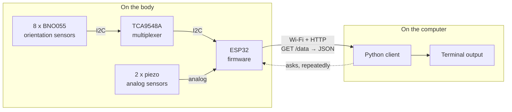
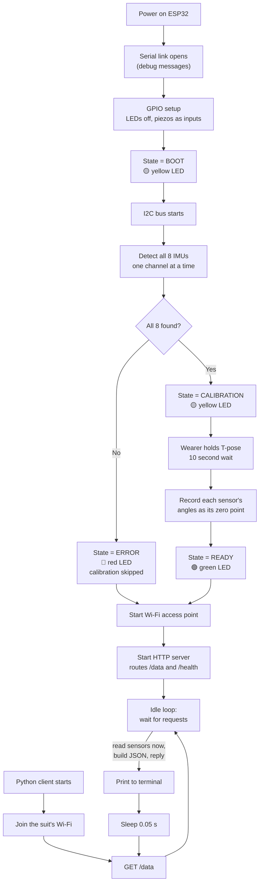
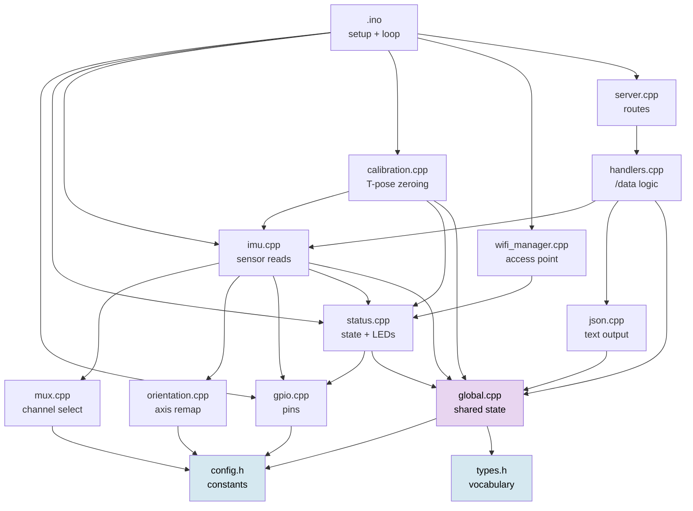
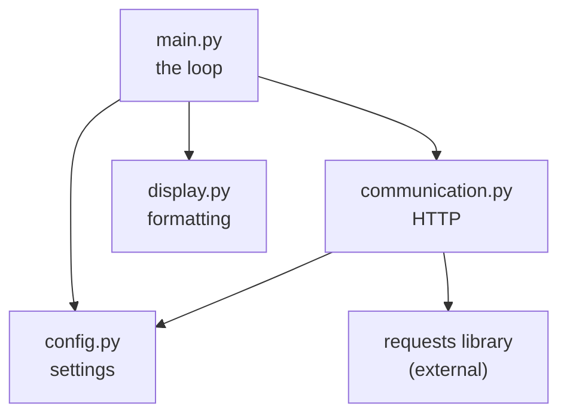
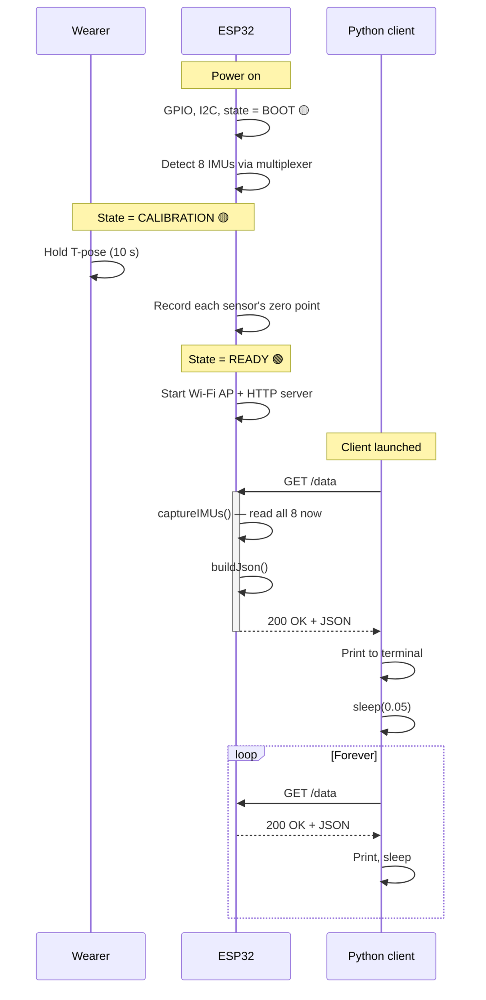
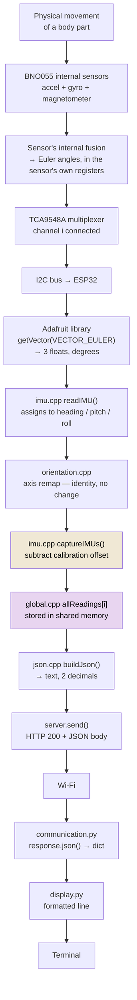
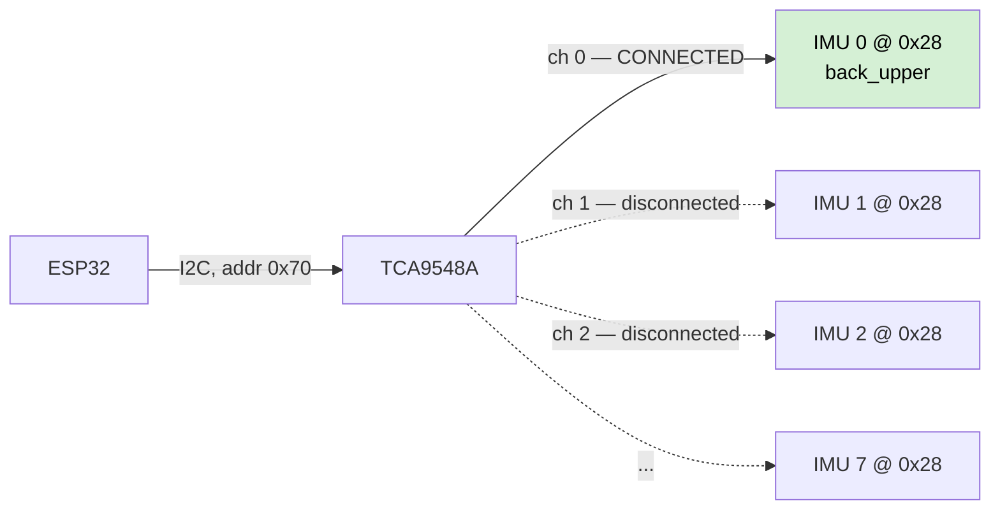
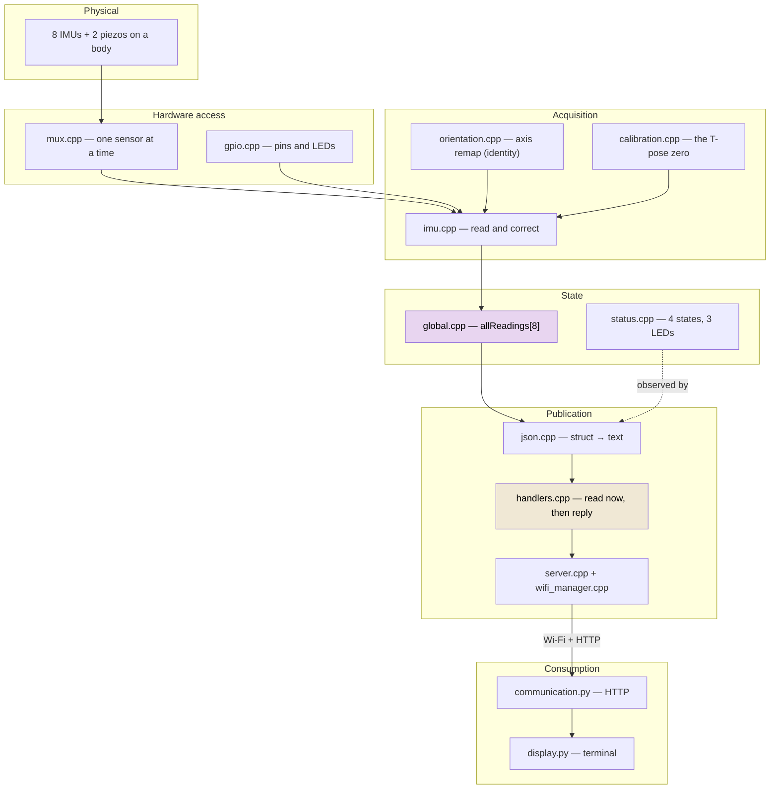

# Get Data — V2
### Wearable Motion Suit — ESP32 Firmware + Python Client

---

---

## Table of Contents

1. [Project Overview](#1-project-overview)
2. [Global Workflow](#2-global-workflow)
3. [Folder Structure](#3-folder-structure)
4. [File Explanation](#4-file-explanation)
5. [Communication Between Files](#5-communication-between-files)
6. [Execution Flow](#6-execution-flow)
7. [Data Flow](#7-data-flow)
8. [Initialization](#8-initialization)
9. [Runtime](#9-runtime)
10. [Communication Protocols](#10-communication-protocols)
11. [Algorithms](#11-algorithms)
12. [Error Handling](#12-error-handling)
13. [Configuration](#13-configuration)
14. [Architecture Summary](#14-architecture-summary)
15. [What the Code Does Not Determine](#15-what-the-code-does-not-determine)
16. [Observations From the Implementation](#16-observations-from-the-implementation)

---

## 1. Project Overview

### What the project is

Version 2 captures the **posture of a human body** and delivers it to a computer as a live stream of numbers.

A person wears a suit fitted with eight orientation sensors — one on each tracked body part. A small microcontroller board on the suit reads all eight sensors, packages the measurements, and publishes them over Wi-Fi. A program on a nearby computer repeatedly asks for the latest measurements and prints them to a terminal.

### Why it exists

To use body movement as an input signal, the movement must first become **data**. This version solves only that problem: getting trustworthy, labelled orientation numbers off the body and onto a computer, reliably and continuously. It deliberately stops there — V2 displays the data in a terminal and does nothing else with it. There is no music generation, recording, or graphical output anywhere in this version's source.

### The two concepts you need first

**IMU (Inertial Measurement Unit).** A sensor that reports *which way it is facing*. Each IMU here is a Bosch BNO055, which combines an accelerometer, a gyroscope, and a magnetometer, and does the maths internally to output a final orientation. This matters: the microcontroller never has to fuse raw motion data itself. It asks the sensor "which way are you facing?" and gets a direct answer.

**Euler angles.** The way an orientation is expressed here — three numbers, in degrees:

| Angle | Plain meaning |
|---|---|
| `heading` | Rotation left/right, like shaking your head "no" |
| `pitch` | Rotation up/down, like nodding "yes" |
| `roll` | Rotation sideways, like tilting your head to your shoulder |

Three numbers per sensor, eight sensors, so **24 numbers describe a body pose**. That is the payload this project moves.


### Hardware involved

Inferred from the pin assignments, I2C addresses, and libraries used in the source:

| Component | Quantity | Role in the system |
|---|---|---|
| ESP32 microcontroller | 1 | Runs the firmware; reads sensors; hosts the Wi-Fi network and server |
| BNO055 IMU | 8 | One per tracked body part; reports orientation |
| TCA9548A I2C multiplexer | 1 | Lets all eight identical sensors share one wire pair (see [Section 11](#111-why-a-multiplexer-is-required)) |
| Piezo sensor | 2 | Two analog inputs, read as raw numbers (left and right) |
| LED | 3 | Red / yellow / green — shows system state without a computer attached |

The eight body parts are fixed in the firmware:

```
back_upper   back_lower
left_arm     right_arm
left_forearm right_forearm
left_hand    right_hand
```

### Software involved

Two separate programs, running on two separate machines:

| Program | Language | Runs on | Job |
|---|---|---|---|
| `Arduino_Suit_ESP32_Get_Data_V2` | C++ (Arduino) | The ESP32 on the suit | Read sensors, publish them |
| `Python_Suit_ESP32_Get_Data_V2` | Python | A laptop/PC | Fetch published data, print it |

### High-level architecture

The single most important thing to understand about V2 is that **the two programs share exactly one contract**: a web address that returns a block of text. Nothing else couples them. The Python side knows nothing about multiplexers, calibration, or LEDs; the firmware knows nothing about who is asking.



Note the dotted arrow. **The computer asks; the suit answers.** The suit never sends anything on its own initiative. This one decision shapes the whole design and is revisited in [Section 9](#9-runtime).

---

## 2. Global Workflow

The complete life of the system, from power-on to running:



Two things in this diagram are worth pausing on, because they are easy to assume wrongly:

- **An error does not stop the system.** If sensors are missing, the suit still brings up Wi-Fi and still serves data. It reports its own failure in the data instead of going silent. See [Section 12](#12-error-handling).
- **Sensors are read *during* the request**, in the box labelled "read sensors now". They are not read on a timer in the background. See [Section 9](#9-runtime).

---

## 3. Folder Structure

```
V2/
├── Python_Suit_ESP32_Get_Data_V2/     ← client: runs on a computer
├── Arduino_Suit_ESP32_Get_Data_V2/    ← firmware: runs on the suit
└── README.md                          ← this file

| Folder | Purpose | Interaction with the rest |
|---|---|---|
| `Arduino_Suit_ESP32_Get_Data_V2/` | Everything that runs on the suit. Compiled and flashed to the ESP32 via the Arduino IDE. The folder name must match the `.ino` name — an Arduino requirement. | Talks to the Python folder **only** by answering HTTP requests. Shares no files or code with it. |
| `Python_Suit_ESP32_Get_Data_V2/` | Everything that runs on the computer. Plain Python scripts, no packaging. | Talks to the firmware **only** by sending HTTP requests to a hardcoded address. |

The two folders are independent programs in different languages. They agree on one thing: the shape of the JSON at `GET /data`. If you change that shape on one side, you must change it on the other.


---

## 4. File Explanation

Files are presented in **dependency order**: foundations first, then the parts built on them. This is also roughly the order in which they run.

### 4.1 Foundations

#### `config.h` — every tunable number, in one place

**Why it exists.** Hardware details change: a wire moves to a different pin, calibration feels too short, the Wi-Fi name clashes with another. If those values were scattered across a dozen files, each change would mean a hunt. This file collects all of them so that adapting the firmware to different hardware means editing one file.

**What it holds.** Pin numbers, the multiplexer's address, the sensor count, timing values, and Wi-Fi credentials. Full list in [Section 13](#13-configuration).

**Dependencies.** None. It is the bottom of the stack.
**Used by.** Nearly every other firmware file.

Every value is `constexpr`, meaning it is fixed when the code is compiled and costs no memory or time at runtime. **These are not settings you can change while the suit is running** — changing any of them requires recompiling and re-flashing the ESP32.

#### `types.h` — the vocabulary of the system

**Why it exists.** Before code can talk about "the upper back sensor's pitch", there must be an agreed way to say it. This file defines that shared vocabulary so that every other file means the same thing by the same word.

**What it defines.**

- `BodyPart` — the eight tracked parts, numbered `0`–`7`. **This ordering is load-bearing**: it is simultaneously the enum order, the array index, *and* the physical multiplexer channel. See [Section 11.2](#112-the-index-is-the-wiring-map).
- `SystemState` — the four states the system can be in: `SYSTEM_BOOT`, `SYSTEM_CALIBRATION`, `SYSTEM_READY`, `SYSTEM_ERROR`.
- `EulerAngles` — three floats: `heading`, `pitch`, `roll`.
- `CalibrationOffset` — three floats; structurally identical to `EulerAngles` but kept separate because it means something different: a *correction to subtract*, not a *measurement*.
- `IMUStatus` — two flags per sensor: `detected` (did it answer at startup?) and `calibrated` (did we record its zero point?).
- `SensorReading` — one complete reading for one body part: which part, its angles, and the two piezo values.

**Dependencies.** Arduino core only.
**Used by.** `global`, `status`, `json`, `imu`, `calibration`.

#### `global.h` / `global.cpp` — the shared state

**Why it exists.** Several files need to reach the *same* sensor data. `handlers.cpp` triggers a reading, `imu.cpp` writes the result, `json.cpp` reads it to build the reply. Rather than passing large structures between them, V2 keeps one copy in a place all of them can see.

**What it holds.**

| Variable | Meaning |
|---|---|
| `server` | The HTTP server object, listening on port 80 |
| `imuSensors[8]` | The eight sensor driver objects |
| `allReadings[8]` | The latest reading for each body part — **the heart of the system** |
| `imuOffsets[8]` | Each sensor's recorded T-pose zero point |
| `imuStatus[8]` | Per-sensor `detected` / `calibrated` flags |
| `systemState` | Which of the four states the system is in |

`global.cpp` also performs a quiet but critical step: it stamps each slot of `allReadings` with its body part, in enum order, so slot `2` permanently *is* `LEFT_ARM`.

**Dependencies.** `config.h`, `types.h`, and the `WebServer` and `Adafruit_BNO055` libraries.
**Used by.** `status`, `imu`, `calibration`, `wifi_manager`, `server`, `handlers`, `json`, and the `.ino`.

**The trade-off.** Global state is convenient and, in a single-threaded program of this size, workable. Its cost is that nothing is protected: `handleDataRequest()` writes `allReadings` while `buildJson()` reads it. That is safe *here* only because both run one after the other on the same single thread, never at the same time. It would stop being safe the moment anything ran concurrently.

### 4.2 Hardware access

#### `gpio.h` / `gpio.cpp` — the pin layer

**Why it exists.** "Turn the LED on" is a clear idea; `digitalWrite(17, HIGH)` is not — it requires knowing that pin 17 is the yellow LED. This file translates hardware pins into named intentions, so that no other file needs to know a pin number.

**Main functions.** `initializeGPIO()` sets the three LED pins as outputs (all off) and the two piezo pins as inputs; `setRedLED()` / `setYellowLED()` / `setGreenLED()` control the lights; `readLeftPiezo()` / `readRightPiezo()` return raw analog readings.

**Inputs.** Pin numbers from `config.h`.
**Outputs.** LED voltages; piezo numbers.
**Dependencies.** `config.h`.
**Used by.** `status.cpp` (for LEDs), `imu.cpp` (for piezos), the `.ino` (for setup).

Piezo pins `34` and `35` are **input-only** pins on the ESP32 — physically incapable of output — which is why `INPUT` is the only mode they are given.

#### `mux.h` / `mux.cpp` — one sensor at a time

**Why it exists.** This tiny file solves the project's central hardware problem. All eight BNO055 sensors have the **same** built-in I2C address (`0x28`). Two devices with the same address on one bus cannot be told apart. The TCA9548A multiplexer is an electronically controlled switch that connects exactly one group of wires at a time. This file drives that switch.

**How it works.** `selectMuxChannel(channel)` refuses any channel `>= 8`, then sends a single byte to the multiplexer at address `0x70`. That byte is `1 << channel` — a *bitmask*, where each bit position corresponds to one channel. Channel 3 becomes `00001000`. The multiplexer connects the channels whose bits are set, and disconnects the rest.

**Consequence.** After `selectMuxChannel(3)`, address `0x28` unambiguously means "the sensor on channel 3". Every sensor read in this firmware is therefore a two-step move: *select, then read*.

**Dependencies.** `Wire` (the I2C library), `config.h`.
**Used by.** `imu.cpp` only.

The byte format would allow several channels at once, but the firmware never does this — it always selects exactly one. The function does not check whether the multiplexer acknowledged the command; see [Section 12](#12-error-handling).

### 4.3 State and feedback

#### `status.h` / `status.cpp` — what the suit tells you without a screen

**Why it exists.** A person wearing the suit cannot see a serial console. Three LEDs communicate the system's state at a glance. This file is the single authority on the mapping from state to lights, so that state and display can never drift apart.

**How it works.** `setSystemState()` stores the new state **and immediately refreshes the LEDs** — the two always happen together, by construction. `refreshStatus()` holds the actual mapping:

| State | 🔴 Red | 🟡 Yellow | 🟢 Green | Meaning |
|---|---|---|---|---|
| `SYSTEM_BOOT` | off | **on** | off | Starting up |
| `SYSTEM_CALIBRATION` | off | **on** | off | Hold the T-pose |
| `SYSTEM_READY` | off | off | **on** | Working normally |
| `SYSTEM_ERROR` | **on** | off | off | A sensor or Wi-Fi failed |

`updateStatus()` is intended to blink the yellow LED every 500 ms during calibration, and is called from the main loop. **In practice it never blinks** — calibration begins and finishes entirely inside `setup()`, before the main loop runs even once, and nothing sets the state back to `SYSTEM_CALIBRATION` afterwards. By the time `updateStatus()` is first called, the state is always `READY` or `ERROR`, and the function returns immediately. The yellow LED is therefore *solid* during calibration, not blinking. See [Section 16](#16-observations-from-the-implementation).

**Dependencies.** `types.h`, `global.h`, `gpio.h`.
**Used by.** `imu`, `calibration`, `wifi_manager`, the `.ino`.

### 4.4 Sensor acquisition

#### `orientation.h` / `orientation.cpp` — correcting for how sensors are mounted

**Why it exists.** A sensor strapped to a forearm is not mounted the same way up as one on the back. Without correction, "pitch" would mean something different on every limb. This file is where each sensor's physical mounting is compensated in software — so the wiring can be convenient and the data can still be consistent.

**How it works.** `imuOrientation[8]` holds, per sensor, which raw axis feeds each output angle and whether to flip its sign. `applyOrientation()` copies the three raw values aside, reassigns them according to that table, then applies any requested sign flips.

**Its current state.** All eight entries are set to the identity mapping — `X→heading, Y→pitch, Z→roll`, no inversions. **As written, this file changes nothing.** It is scaffolding: the mechanism is complete and wired in, waiting for real mounting values to be measured and filled in. That is worth knowing before you go looking for a bug in axis handling — there is no correction happening yet.

**Dependencies.** `config.h`.
**Used by.** `imu.cpp`.

#### `imu.h` / `imu.cpp` — reading the sensors

**Why it exists.** This is where physical reality becomes numbers. Every orientation value in the system originates here.

**`initializeIMUs()`** — walks channels `0`–`7`. For each: select the channel, wait 20 ms to let the bus settle, call `begin()` on the sensor, and record whether it answered. A sensor that answers is also told to use its external crystal (`setExtCrystalUse(true)`), a more accurate timing source than its internal one. Each result is printed to serial as `OK` or `FAILED`. If **all eight** answered → `SYSTEM_CALIBRATION`. If **even one** did not → `SYSTEM_ERROR`.

**`readIMU(index, heading, pitch, roll)`** — reads one sensor. It refuses out-of-range indices and sensors that were never detected, selects the channel, waits `IMU_DELAY_MS` (3 ms), asks the sensor for its Euler vector, assigns the three components to `heading` / `pitch` / `roll`, and applies the orientation mapping. Returns `true` on success.

The three results are returned through **references** (the `&` in the signature) — a C++ way of saying "write your answers directly into my variables." It is how one function returns three values at once.

**`captureIMUs()`** — reads all eight sensors, subtracts each one's calibration offset, and stores the result in `allReadings`. Then reads the two piezos **once** and copies those same two numbers into all eight entries. If a sensor read fails, that slot is skipped — see [Section 12](#12-error-handling).

**`allIMUsDetected()`** — reports whether all eight are present. **This function is never called anywhere in V2.** It is dead code; the same check is done inline inside `initializeIMUs()`.

**Dependencies.** `config.h`, `global.h`, `gpio.h`, `mux.h`, `status.h`, `orientation.h`, `Wire`.
**Used by.** `calibration.cpp`, `handlers.cpp`, the `.ino`.

#### `calibration.h` / `calibration.cpp` — defining "zero"

**Why it exists.** A sensor reports its orientation relative to the *earth*, not to the *body*. Mounted on an arm, it might read 47° while the arm hangs naturally. That 47° is meaningless as motion data — what matters is *change* from a known posture. Calibration establishes that known posture.

**How it works.** `calibrateIMUs()` prints "Keep the T-pose...", sets the state to `SYSTEM_CALIBRATION`, then **stops the entire program for 10 seconds** with `delay(CALIBRATION_TIME_MS)` while the wearer gets into position. It then reads each sensor **once** and stores those angles as that sensor's offset, marking it `calibrated`. Finally it sets `SYSTEM_READY`.

From then on, every reading has its offset subtracted, so the T-pose reads as `(0, 0, 0)` and all later values are movement *away from* the T-pose. The algorithm and its limits are in [Section 11.3](#113-t-pose-calibration).

**Dependencies.** `global.h`, `imu.h`, `status.h`.
**Used by.** The `.ino`, once, during startup.

### 4.5 Communication

#### `wifi_manager.h` / `wifi_manager.cpp` — the suit makes its own network

**Why it exists.** A wearable cannot rely on a router being present — not on a stage, not in a rehearsal room. So the ESP32 **creates its own Wi-Fi network** rather than joining one. The computer joins the suit. No infrastructure required.

**How it works.** `initializeWiFi()` calls `WiFi.softAP(WIFI_SSID, WIFI_PASSWORD)`. "SoftAP" means *software access point* — the ESP32 behaves as a small Wi-Fi router. If this fails, it sets `SYSTEM_ERROR` and returns. On success it prints the network name, the password, and the assigned IP address to serial.

**The crucial detail.** The firmware **never chooses an IP address** — it reports whatever `WiFi.softAPIP()` returns. The Python client, meanwhile, has `192.168.4.1` hardcoded. These two agree because `192.168.4.1` is the Arduino-ESP32 core's default soft-AP address, not because either side negotiates it. **This is a silent convention, not an enforced contract.** If the core's default ever changed, the two halves would stop talking and nothing in the code would explain why. The serial output at boot is the way to check the real address.

**Dependencies.** `WiFi`, `config.h`, `global.h`, `status.h`.
**Used by.** The `.ino`.

#### `server.h` / `server.cpp` — answering requests

**Why it exists.** Having data is not enough; something must hand it out on request. This file defines *which questions the suit answers*.

**How it works.** `initializeServer()` registers two routes and starts listening on port 80:

| Route | Method | Handler | Reply |
|---|---|---|---|
| `/data` | GET | `handleDataRequest` (in `handlers.cpp`) | Fresh sensor readings as JSON |
| `/health` | GET | `handleHealthRequest` (local to this file) | `{"status":"ok"}` |

Registering a route means: "when a request for this path arrives, call this function." The server then handles the network details itself.

`/health` is a **liveness check** — it answers instantly without touching a sensor, so a positive reply proves the server is alive even if the sensors are not. It is a deliberately cheap question. Note that **the V2 Python client never calls it**; it exists for manual checks or future use.

**Dependencies.** `global.h`, `handlers.h`.
**Used by.** The `.ino`.

#### `handlers.h` / `handlers.cpp` — what happens when data is asked for

**Why it exists.** This ten-line function is the hinge of the entire system, and it defines V2's timing model.

**How it works.** `handleDataRequest()` does exactly three things, in order:

1. `captureIMUs()` — read every sensor **right now**
2. `buildJson()` — format the readings as text
3. `server.send(200, "application/json", json)` — reply

**Why this matters.** Sensors are read *inside the request*. There is no background sampling, no buffer, no history. Data is always fresh — never older than the request itself — but it is only ever produced when someone asks. **If nobody asks, the suit measures nothing.** The consequences are worked through in [Section 9](#9-runtime).

`200` is the HTTP code for "here is what you asked for".

**Dependencies.** `global.h`, `imu.h`, `json.h`.
**Used by.** `server.cpp`, as the `/data` route handler.

#### `json.h` / `json.cpp` — packaging the numbers as text

**Why it exists.** The firmware speaks C++; the client speaks Python. They cannot exchange C++ structures. They need a neutral format both understand: JSON — plain text, human-readable, with `{...}` for labelled records and `[...]` for lists.

**How it works.** `buildJson()` assembles the reply by **appending text to a string**, piece by piece. There is no JSON library involved: every brace, quote, and comma is written by hand. Two helpers convert internal numbers to readable words — `bodyName()` turns `LEFT_ARM` into `"left_arm"`, and `stateName()` turns `SYSTEM_READY` into `"ready"`. Without these, the client would receive bare numbers and have to know the enum ordering.

Angles are formatted to **two decimal places**. The loop appends a comma between entries but not after the last one.

The result:

```json
{
  "timestamp": 123456,
  "system": "ready",
  "imu_data": [
    {
      "body": "back_upper",
      "detected": true,
      "calibrated": true,
      "heading": 12.34,
      "pitch": -5.67,
      "roll": 0.89,
      "piezo_left": 512,
      "piezo_right": 480
    }
    // ... seven more, one per body part
  ]
}
```

| Field | Meaning |
|---|---|
| `timestamp` | Milliseconds since the ESP32 booted (`millis()`). **Not** a wall-clock date/time. |
| `system` | The current state: `boot`, `calibration`, `ready`, or `error` |
| `body` | Which body part this entry describes |
| `detected` | Did this sensor answer at startup? |
| `calibrated` | Was a zero point recorded for it? |
| `heading`, `pitch`, `roll` | Degrees, offset-corrected, 2 decimals |
| `piezo_left`, `piezo_right` | Raw analog values — **identical in all eight entries** |

The piezo duplication is real: two suit-wide values are repeated eight times because they are stored per-`SensorReading`, and `SensorReading` is per-body-part. The client reads them from entry `0` and ignores the other seven copies.

**Dependencies.** `global.h`.
**Used by.** `handlers.cpp`.

### 4.6 The firmware entry point

#### `Arduino_Suit_ESP32_Get_Data_V2.ino`

**Why it exists.** Every Arduino program has two required functions: `setup()`, which runs once at power-on, and `loop()`, which runs over and over forever afterwards. This file is deliberately thin — it is a **table of contents**, not a worker. It decides *order*, and delegates every actual task.

**`setup()`** — the startup sequence, detailed in [Section 8](#8-initialization). Its one piece of real logic is the guard `if(getSystemState() != SYSTEM_ERROR) { calibrateIMUs(); }` — do not try to calibrate sensors that are not there.

**`loop()`** — two calls, forever: `updateStatus()` (LED blinking, which as established never triggers) and `server.handleClient()` (check for and serve any pending HTTP request).

**Dependencies.** `config.h`, `gpio.h`, `status.h`, `imu.h`, `calibration.h`, `wifi_manager.h`, `server.h`, `global.h`, `Wire`.

### 4.7 The Python client

#### `config.py` — the client's settings

Three values, and each encodes a decision:

| Setting | Value | Meaning |
|---|---|---|
| `ESP32` | `"http://192.168.4.1"` | The suit's address — the default soft-AP IP (see `wifi_manager` above) |
| `REQUEST_TIMEOUT` | `30` | Give up on a request after 30 seconds |
| `UPDATE_PERIOD` | `0.05` | Wait 0.05 s between requests |

#### `communication.py` — talking to the suit

**Why it exists.** To isolate every network concern in one place, so `main.py` never has to think about HTTP, and so failures are handled once rather than at every call site.

**How it works.** `get_sensor_data()` sends `GET http://192.168.4.1/data`, raises an error for any failure status code, and returns the parsed JSON as a Python dictionary. If anything network-related goes wrong it prints `[HTTP ERROR]` and returns `None`.

**The design decision here.** Returning `None` instead of crashing means a dropped Wi-Fi packet is a *hiccup*, not a *stop*. This is what makes the client survive a suit that reboots mid-session.

**Inputs.** `config.py`. **Outputs.** A dictionary, or `None`.

#### `display.py` — showing the data

**Why it exists.** To keep formatting away from program logic. `main.py` decides *when* to show data; this file decides *how* it looks.

**How it works.** `display_sensor_data(data)` returns immediately if handed `None` — this is the other half of the error strategy, and it is why a failed request produces no output rather than a crash. Otherwise it prints the timestamp and system state, then one aligned line per sensor, then the piezo values **from entry `0` only**.

Each line looks like:

```
left_arm        | H=  12.34 P=  -5.67 R=   0.89 | Detected=True Cal=True
```

The `:15s` and `:7.2f` in the code are alignment instructions — pad the name to 15 characters, print the number in 7 columns with 2 decimals — so the columns line up and can be read while moving.

#### `main.py` — the client's entry point

**Why it exists.** To be the shortest, most readable statement of what the client does. Its brevity is the point: the whole client is a three-step cycle, and the file shows exactly that.

**How it works.** Prints a banner, then loops forever: fetch, display, sleep `UPDATE_PERIOD`. The entire loop sits inside `try / except KeyboardInterrupt`, so pressing `Ctrl+C` prints "Program stopped." and exits cleanly rather than dumping an error trace.

Note that this is **module-level code**, not wrapped in a function — it runs the moment the file is executed.

---

## 5. Communication Between Files

Read as a conversation. First, **the computer asks for data**:

> **`main.py`** says to `communication.py`: "Get me the current sensor data."
>
> **`communication.py`** sends `GET http://192.168.4.1/data` over Wi-Fi and waits.
>
> — *the request crosses the air* —
>
> **`server.cpp`** (already listening) recognises `/data` and calls the function registered for it.
>
> **`handlers.cpp`** takes over: "Someone wants data. `imu.cpp` — read everything, now."
>
> **`imu.cpp`**, for each of the eight sensors, asks **`mux.cpp`**: "Connect channel 3." Then it reads the sensor, hands the values to **`orientation.cpp`** for mounting correction, subtracts the offset recorded by **`calibration.cpp`**, and writes the result into `allReadings` in **`global.cpp`**. It also asks **`gpio.cpp`** for the two piezo values.
>
> **`handlers.cpp`**: "`json.cpp` — turn that into text."
>
> **`json.cpp`** reads `allReadings` from **`global.cpp`** and returns one long JSON string.
>
> **`handlers.cpp`** hands the string to `server.send()`.
>
> — *the reply crosses the air* —
>
> **`communication.py`** parses the text into a dictionary and returns it.
>
> **`main.py`** passes it to **`display.py`**, which prints it, then sleeps 0.05 s and starts over.

Notice that `global.cpp` is where the two halves of the firmware meet: `imu.cpp` *writes* there, `json.cpp` *reads* there, and they never call each other.

### Dependency diagram (firmware)

An arrow means "uses". Note that arrows only ever point *downward* — no cycles.



The two blue boxes are pure definitions — no behaviour. The purple box is shared state, which nearly everything touches. That concentration is the architectural cost of the global-state approach.

### Dependency diagram (client)



`display.py` depends on nothing — it is pure formatting. This is why the client is easy to repurpose: to send data somewhere other than a terminal, you replace one leaf file and touch nothing else.

---

## 6. Execution Flow

### Firmware, from power-on

```
1.  Serial.begin(115200)         open the debug link
2.  delay(500)                   let the link settle
3.  print banner                 "ESP32 MUSIC SUIT V2"
4.  initializeGPIO()             LED pins out (off), piezo pins in
5.  initializeStatus()           state = BOOT → yellow LED on
6.  Wire.begin(21, 22)           start the I2C bus
7.  initializeIMUs()             detect all 8 → CALIBRATION or ERROR
8.  if state != ERROR:
        calibrateIMUs()          10 s T-pose wait → record offsets → READY
9.  initializeWiFi()             create the access point (or → ERROR)
10. initializeServer()           register /data and /health, start listening
11. print "System ready."
        ↓
12. loop() forever:
        updateStatus()           (no-op in practice)
        server.handleClient()    serve a request if one is waiting
```

Steps 1–11 happen exactly once. Step 12 repeats until power is removed. **There is no shutdown path** — the firmware runs until it loses power or is reset.

### Client, from launch

```
1.  print banner                 "ESP32 MUSIC SUIT CLIENT"
2.  loop forever:
        get_sensor_data()        GET /data  → dict, or None on failure
        display_sensor_data()    print it, or return silently if None
        sleep(0.05)
3.  on Ctrl+C:                   print "Program stopped." and exit
```

### The two together



---

## 7. Data Flow

Following one angle, from the physical world to the screen:



The two highlighted steps are the only places the numbers are *changed* or *kept*. Everything else transports or reformats them.

Following the piezos, which take a shorter path:

```
Piezo voltage → ESP32 ADC pin (34 / 35) → analogRead() → raw integer
    → copied into all 8 readings → JSON (8 identical copies)
    → Python reads copy [0] → terminal
```

Piezo values are **never calibrated, scaled, filtered, or converted to units**. What the client prints is the raw number the ADC produced.

---

## 8. Initialization

Everything below happens before the system can answer a single request.

### Stage 1 — Serial (debug link)

`Serial.begin(115200)` opens a text channel over the USB cable, then waits 500 ms. `115200` is the **baud rate** — the speed, in bits per second — and both ends must agree, so a serial monitor must also be set to 115200 or the output is unreadable garbage. This channel is the only way to see what the firmware is doing internally; it is where the multiplexer results, the calibration progress, and (importantly) the **real IP address** are printed.

### Stage 2 — GPIO

`initializeGPIO()` sets the three LED pins as outputs and turns all of them off, so the suit starts from a known dark state rather than whatever the pins happened to be. The two piezo pins are set as inputs.

### Stage 3 — Status

`initializeStatus()` sets `SYSTEM_BOOT` and lights the **yellow** LED. From this moment on, the LEDs are meaningful.

### Stage 4 — I2C

`Wire.begin(SDA_PIN, SCL_PIN)` starts the two-wire bus on pins 21 and 22. **I2C** is a protocol where many devices share the same two wires and are addressed by number. Nothing on the bus is contacted yet — this only prepares the ESP32's side. Note that V2 never calls `Wire.setClock()`, so the bus speed is whatever the Arduino-ESP32 core defaults to.

### Stage 5 — IMU detection

The most involved stage. For each channel `0`–`7`:

1. `selectMuxChannel(i)` — connect that channel
2. `delay(20)` — let the electrical connection settle
3. `imuSensors[i].begin()` — try to wake the sensor; record `true`/`false`
4. If it answered: `setExtCrystalUse(true)` for better timing accuracy
5. Print `IMU i : OK` or `IMU i : FAILED`

**This is all-or-nothing.** One missing sensor sends the whole system to `SYSTEM_ERROR` (red LED), which skips calibration entirely. The reasoning is defensible: a body pose reconstructed from seven of eight sensors is incomplete, and the system should say so loudly rather than quietly serve a partial skeleton.

Time cost: 8 × 20 ms = **160 ms**, plus each sensor's own startup time.

### Stage 6 — Calibration

Runs only if Stage 5 succeeded. Detailed in [Section 11.3](#113-t-pose-calibration). Time cost: **just over 10 seconds** — 10 s of waiting plus 8 × 3 ms of reading. During this window the firmware is completely blocked and does nothing else.

### Stage 7 — Wi-Fi

`initializeWiFi()` creates the access point. On failure → `SYSTEM_ERROR`, but **startup continues to Stage 8 regardless** — the `return` exits this function only, not `setup()`.

### Stage 8 — HTTP server

`initializeServer()` registers `/data` and `/health` and starts listening on port 80. Registration happens **before** `begin()`, so no request can arrive before its handler exists.

### Total startup time

The determinable, fixed costs:

| Stage | Time |
|---|---|
| Serial settle | 500 ms |
| IMU detection delays | 160 ms |
| Calibration wait | 10,000 ms |
| Calibration reads | ~24 ms |
| **Determinable total** | **≈ 10.7 s** |

Wi-Fi bring-up, server start, and each sensor's internal boot time are not determinable from the source. The real figure is somewhat above 10.7 seconds.

---

## 9. Runtime

### The firmware's loop

Once started, the firmware's entire ongoing behaviour is:

```cpp
void loop() {
    updateStatus();          // returns immediately (state is never CALIBRATION here)
    server.handleClient();   // serve a request if one is waiting
}
```

This loop runs as fast as the processor allows — thousands of times per second — and almost always does nothing. **The suit is idle until asked.** No timer fires, no sensor is polled, no data accumulates. The `.ino` contains no `delay()` in `loop()`; the pacing comes entirely from the client.

### What a request costs

When `server.handleClient()` finds a `/data` request, `handleDataRequest()` runs and the loop **blocks** until it finishes. During that time the ESP32 does nothing else — this server is single-threaded and handles one client at a time.

The cost is dominated by a hard, code-determined floor:

```
8 sensors × delay(IMU_DELAY_MS = 3 ms) = 24 ms  ← minimum, guaranteed
```

On top of that sit the I2C transactions, the JSON string building, and the HTTP send — none of which can be quantified from source alone. **So: a `/data` request takes at least 24 ms, and in reality more.**

### The actual update rate

This is the most commonly misread number in the project, so it is worth being precise.

`UPDATE_PERIOD = 0.05` looks like "20 Hz". It is not. Look at the client's loop:

```python
data = get_sensor_data()      # blocks until the reply arrives — at least 24 ms
display_sensor_data(data)     # printing takes time too
time.sleep(config.UPDATE_PERIOD)   # then wait a further 50 ms
```

The sleep happens **after** the request completes, not on a fixed schedule. So the real cycle is:

```
period = request time + print time + 50 ms
       ≥ 24 ms + (unknown) + 50 ms
       ≥ 74 ms   →   ≤ ~13.5 updates per second
```

**The true rate is below 13.5 Hz, and the exact value cannot be determined from the source** — it depends on I2C speed, Wi-Fi conditions, and terminal speed. To be clear about what `UPDATE_PERIOD` is: it is a *delay between requests*, not a period, and it cannot be used to derive the sample rate. Raising the rate meaningfully would require attention to the 24 ms floor, not just a smaller sleep.

### What updates, what does not

| | Behaviour |
|---|---|
| **Repeats** | Client: request → print → sleep. Firmware: check for a request. |
| **Updates on every request** | All 8 sets of angles, both piezo values, the timestamp, the system state |
| **Never updates after startup** | `detected` flags, calibration offsets, `calibrated` flags, LEDs (state never changes at runtime) |
| **Transmitted suit → computer** | One JSON object per request |
| **Transmitted computer → suit** | Only the bare GET request — no parameters, no commands |

The last row is worth dwelling on: **the client cannot control the suit at all.** There is no route to recalibrate, reconfigure, or reset. The suit is strictly read-only over the network; changing anything means re-flashing it.

---

## 10. Communication Protocols

V2 uses five protocols. Each was chosen for a reason.

### I2C — between the ESP32 and the sensors

**What it is.** A protocol where many chips share just two wires: `SDA` (data) and `SCL` (clock). Each device has a numeric address; the controller names an address, and only that device responds.

**Why it is used.** Eight sensors on two wires instead of eight separate connections. On a garment, wire count is a physical constraint — every wire is something to route, flex, and break.

**Where.** `Wire.begin(21, 22)` in the `.ino`; used by `mux.cpp` and, through the Adafruit library, by `imu.cpp`.

**The problem it creates.** I2C identifies devices by address — but all eight BNO055s have the *same* address, `0x28`. This is what the multiplexer exists to solve ([Section 11.1](#111-why-a-multiplexer-is-required)).

**Addresses in V2:** `0x70` = multiplexer, `0x28` = whichever sensor is currently connected.

### Wi-Fi — between the suit and the computer

**What it is.** Wireless networking. Normally devices join a network created by a router; here, the ESP32 **is** the router.

**Why it is used.** A cable from a moving performer to a computer is a hazard and a constraint. And creating its own network means the suit needs no infrastructure — it works anywhere.

**Where.** `WiFi.softAP()` in `wifi_manager.cpp`.

**Configuration.** SSID `ESP32_Test`, password `12345678`, WPA2-protected (a password is supplied). The computer must join this network manually before the client can reach the suit.

### HTTP — the request/response layer

**What it is.** The protocol the web runs on. A client requests a path; a server returns a status code and content.

**Why it is used.** It is the least surprising choice available. Any language, any tool, any browser can already speak it — `curl http://192.168.4.1/data` works with no client code at all, which makes the suit debuggable without writing anything.

**Where.** `WebServer server(80)` in `global.cpp`; routes in `server.cpp`; the `requests` library in `communication.py`.

**Routes.**

| Route | Purpose | Cost | Used by V2's client? |
|---|---|---|---|
| `GET /data` | Read all sensors and return them | ≥ 24 ms | Yes, continuously |
| `GET /health` | Confirm the server is alive | Immediate | No |

**Status codes.** `200` means success. Both handlers always return `200` — there is no error status anywhere in V2. Failures are reported *inside* the JSON body, via `system: "error"` and per-sensor `detected` flags, never via HTTP.

**The trade-off.** HTTP is request/response: the client must ask for every single sample. For a continuous stream this is wasteful — each sample pays for a full connection cycle. A push protocol (such as WebSockets or raw UDP) would suit streaming better. V2 chose simplicity and debuggability over efficiency, which is a reasonable trade for a data-acquisition version, and it is the main thing that bounds the update rate.

### JSON — the data format

**What it is.** JavaScript Object Notation: structured data as plain text. `{ }` holds labelled fields, `[ ]` holds lists.

**Why it is used.** C++ and Python cannot exchange each other's data structures. JSON is a neutral middle ground that both read natively — and being text, a human can read the reply straight out of a browser.

**Where.** Written by hand in `json.cpp`; parsed by `response.json()` in `communication.py`.

**Note.** No JSON library is used on the firmware side — the string is built by concatenation. This avoids a dependency and any memory the library would need, at the cost of correctness resting entirely on the punctuation in `json.cpp` being right.

### Serial (UART) — debugging

**What it is.** Text over the USB cable, at 115200 bits per second.

**Why it is used.** The suit has three LEDs and no screen. When something fails, "red LED" is not a diagnosis. Serial is where the detail lives: which sensor failed, which IP was assigned, whether calibration completed.

**Where.** `Serial.println()` calls throughout the firmware.

**One-directional.** V2 only ever *prints* to serial. It never reads from it — there are no serial commands.

---

## 11. Algorithms

### 11.1 Why a multiplexer is required

**The problem.** I2C addresses devices by number. All eight BNO055 sensors ship with the same address, `0x28`. Put two on one bus and both answer at once — the data collides and neither is readable. (The BNO055 does support a second address, `0x29`, but that yields two sensors, not eight.)

**The solution.** The TCA9548A is an electronically controlled switch sitting between the ESP32 and the sensors. It has eight channels and connects only the ones you select. With one sensor per channel and only one channel ever active, address `0x28` is never ambiguous.



**The algorithm**, in `selectMuxChannel()`:

```
1. Reject any channel number ≥ 8
2. Start a transmission to 0x70
3. Send the byte (1 << channel)     e.g. channel 3 → 00001000
4. End the transmission
```

Bit `n` of that byte means "connect channel `n`". `1 << 3` shifts a single `1` three places left, producing exactly one set bit.

**Everything follows from this.** Reading eight sensors means eight select-then-read cycles, and each one needs a settling delay after switching. That delay — 3 ms, eight times — is precisely the 24 ms floor from [Section 9](#9-runtime). **The multiplexer is the reason the suit cannot sample faster.** It is the price of eight identical sensors on two wires.

### 11.2 The index is the wiring map

Not an algorithm so much as the convention everything rests on. One number, `i`, means all of these simultaneously:

```
i = 2  →  multiplexer channel 2       (physical: which wires)
       →  imuSensors[2]               (which driver object)
       →  allReadings[2]              (where the data goes)
       →  imuOffsets[2]               (which zero point applies)
       →  imuStatus[2]                (which flags)
       →  BodyPart 2 = LEFT_ARM       (what it means)
       →  imuOrientation[2]           (which axis mapping)
       →  "left_arm" in the JSON      (what the client is told)
```

This is why the firmware has no lookup tables and no configuration mapping sensors to body parts: the array index *is* the mapping. It is elegant and it is fragile. **The sensor physically wired to multiplexer channel 2 must be the one on the left arm** — otherwise every layer above reports confidently wrong data, with no error anywhere. Nothing in the software can detect this; the sensors are identical and cannot say where they are. The `BodyPart` enum order in `types.h` is, in effect, a wiring diagram.

### 11.3 T-pose calibration

**The problem.** Each sensor reports its orientation relative to the earth. Bolted to a forearm at an arbitrary angle, it might read 47° with the arm at rest. That number says as much about how the strap sits as about the body. What is wanted is *change from a known posture*.

**The intuition.** Have the wearer stand in one agreed posture — the T-pose, arms straight out — and write down what every sensor reads. That set of numbers *is* the T-pose. Subtract it from everything afterwards, and every reading becomes "how far from the T-pose", which is what actually describes movement.

**The algorithm**, in `calibrateIMUs()`:

```
1. Print "Keep the T-pose..."
2. State = CALIBRATION (yellow LED on)
3. delay(10000)                    ← 10 s, fully blocking
4. For each sensor 0–7:
       read it ONCE
       store those angles as that sensor's offset
       mark it calibrated
5. State = READY (green LED)
```

And then, in `captureIMUs()`, forever after:

```
reported_angle = measured_angle − offset
```

Three characteristics of this implementation are worth understanding, because each has a visible consequence:

**It takes a single sample.** Step 4 reads each sensor exactly once — no averaging over time. Whatever noise, drift, or small sway is present in that one instant is baked permanently into the offset and subtracted from every subsequent reading. Averaging over, say, one second would cost nothing extra (the system is already waiting 10 seconds) and would reduce this.

**It ignores the sensor's own calibration state.** The BNO055 maintains internal calibration status registers reporting how well its own gyroscope, accelerometer, and magnetometer are calibrated. V2 never reads them. The 10-second wait is a fixed guess that they will have settled, not a check that they have. So **`"calibrated": true` in the JSON means "we recorded a zero point for this sensor" — it does not mean the sensor is internally well-calibrated.** These are different claims, and the field name invites confusion.

**Subtraction does not handle angle wraparound.** This is the one with a concrete failure. `heading` runs `0`–`360` and wraps around. Plain subtraction does not know that:

```
T-pose heading = 350°
Later heading  =  10°     (a small 20° turn through north)
Reported       =  10 − 350 = −340°     ← should be +20°
```

The number is wrong by a full turn, and the error appears suddenly whenever the wearer's heading crosses the wrap point. Sensors whose T-pose heading lands near `0°`/`360°` are affected; others are not. A wraparound correction (adjusting the result into a `−180`…`+180` range) would fix it. This is stated as an observation from the code, not a required change.

### 11.4 Orientation mapping

**The problem.** A sensor on the back and one on a forearm are not mounted the same way up. The same physical motion produces different raw numbers depending on how the sensor happens to sit.

**The intuition.** Rather than mounting every sensor identically — impractical on a body — record how each one is mounted and correct for it in software.

**The algorithm**, in `applyOrientation()`:

```
1. Look up this sensor's mapping
2. Copy the three raw values aside as x, y, z
3. heading = whichever of x/y/z the table says
   pitch   = whichever of x/y/z the table says
   roll    = whichever of x/y/z the table says
4. Flip the sign of any the table marks inverted
```

Step 2 matters: without copying the values aside first, reassigning `heading` would corrupt the source of `pitch`.

**Its current effect: none.** All eight entries in `imuOrientation` are `{AXIS_X, AXIS_Y, AXIS_Z, false, false, false}` — every angle maps to itself, nothing is inverted. The function runs on every read and returns its input unchanged. The mechanism is finished and connected; the values are not yet filled in. This is a placeholder awaiting real mounting measurements, not a bug.

---

## 12. Error Handling

V2's philosophy is consistent and worth naming: **degrade and report, never stop.** No failure in either program halts it. Everything continues and says what went wrong.

### Missing or unresponsive sensors

**At startup.** `imuSensors[i].begin()` returning `false` records `detected = false`. Any single failure sets `SYSTEM_ERROR`, which lights the red LED and — via the guard in `setup()` — **skips calibration entirely**. Note the scope of that: calibration is skipped for *all* sensors, not just the missing one. So every offset stays `0.0`, every `calibrated` flag stays `false`, and the working sensors report **raw, uncorrected earth-relative angles**.

Startup nevertheless continues: Wi-Fi comes up, the server starts, and `/data` is served normally with `"system": "error"`. A client can connect and see exactly which sensors are missing.

**At read time.** `readIMU()` refuses undetected sensors and returns `false`. In `captureIMUs()`, that triggers `continue` — the slot is **skipped, leaving its previous contents in place**. The consequence: a failed sensor's JSON entry shows `0.00` (its initial value) or, if it worked earlier and then failed, its **last successful reading, indefinitely**. Nothing in the numbers reveals that they are stale. The `detected` flag is the only signal, and a client that ignores it will silently treat frozen data as live.


### Multiplexer failure

`selectMuxChannel()` ignores the return value of `Wire.endTransmission()`, so a failed channel switch is invisible. In practice this is largely covered at startup — if the multiplexer is absent, no sensor answers `begin()`, and the system reports `SYSTEM_ERROR`. A multiplexer that fails *after* startup would not be detected.

### Wi-Fi failure

`WiFi.softAP()` returning `false` sets `SYSTEM_ERROR` and returns from `initializeWiFi()` — but `setup()` carries on and still starts the HTTP server. That server is then unreachable, since there is no network to reach it over. The red LED and the serial message are the only indications. This is not a contradiction so much as an accepted redundancy: the failure is reported by the means still available.

### Client-side network failures

`get_sensor_data()` wraps its request in `try / except requests.RequestException` — the parent of every error the `requests` library raises for network problems, including timeouts, refused connections, DNS failures, and bad status codes (via `raise_for_status()`). Any of them prints `[HTTP ERROR]` and returns `None`. `display_sensor_data()` returns immediately on `None`, and `main.py` sleeps and tries again.

**The result:** if the suit is switched off mid-session, the client prints errors and keeps trying. When the suit returns, data resumes with no intervention. Nothing needs restarting. This is the payoff of the `None` convention.

### Timeouts

`REQUEST_TIMEOUT = 30` seconds. Sensible in isolation, but consider it against the 50 ms poll: **a hung suit freezes the client for 30 seconds** — roughly 400 missed updates — before it even reports a problem. For a system aiming at ~13 updates per second, a timeout under a second would fail far faster and lose nothing, since any request taking longer than that has already missed its slot. This is an observation from the values in the code, not a required change.


### Summary

| Failure | Detected? | Response | Recovers? |
|---|---|---|---|
| Sensor missing at boot | Yes | Red LED, calibration skipped for all, serves data with `detected: false` | No — needs a reboot |
| Sensor fails after boot | **No** | Reports its last value forever | No |
| Sensor returns garbage | **No** | Passes it on unchanged | n/a |
| Multiplexer absent | Indirectly | All sensors fail → `SYSTEM_ERROR` | No |
| Multiplexer fails later | **No** | Silent | No |
| Wi-Fi AP fails | Yes | Red LED; server starts but is unreachable | No |
| Client can't reach suit | Yes | `[HTTP ERROR]`, retry after 50 ms | **Yes, automatically** |
| Request times out | Yes | Same, but after **30 s** | **Yes** |
| Reply missing a field | **No** | `KeyError` — client crashes | No |
| `Ctrl+C` on the client | Yes | Clean exit | n/a |

The pattern is clear: **startup failures are caught; runtime failures are not.** The firmware checks its hardware once, at boot, and then trusts it forever.

---

## 13. Configuration

### Firmware — `Arduino_Suit_ESP32_Get_Data_V2/config.h`

All values are compile-time constants. **Changing any of them requires recompiling and re-flashing.**

#### Pins

| Constant | Value | Purpose | Notes |
|---|---|---|---|
| `SDA_PIN` | `21` | I2C data | ESP32 default |
| `SCL_PIN` | `22` | I2C clock | ESP32 default |
| `PIEZO_LEFT_PIN` | `34` | Left piezo (analog in) | Input-only pin |
| `PIEZO_RIGHT_PIN` | `35` | Right piezo (analog in) | Input-only pin |
| `LED_RED_PIN` | `16` | Error indicator | |
| `LED_YELLOW_PIN` | `17` | Boot / calibration indicator | |
| `LED_GREEN_PIN` | `18` | Ready indicator | |

#### I2C

| Constant | Value | Purpose |
|---|---|---|
| `TCA9548A_ADDR` | `0x70` | The multiplexer's address. Its default; changeable via its address pins if `0x70` conflicts. |

The sensors' own address, `0x28`, is **not** in `config.h` — it is the Adafruit library's default, applied implicitly by `Adafruit_BNO055(i)` in `global.cpp`, where the argument is a sensor *ID*, not an address. This is worth knowing if you ever go looking for the address and cannot find it.

#### Sensors

| Constant | Value | Purpose | Notes |
|---|---|---|---|
| `NUM_IMUS` | `8` | Number of sensors | **Not freely adjustable** — see below |
| `IMU_DELAY_MS` | `3` | Settling wait after a channel switch | The single biggest lever on update rate |

`NUM_IMUS` is used as the array size for `imuSensors`, `allReadings`, `imuOffsets`, `imuStatus`, and `imuOrientation`, and as the bound in `selectMuxChannel()`. But those arrays are **explicitly initialised with eight entries each** in `global.cpp` and `orientation.cpp`, and `BodyPart` names exactly eight parts. Changing `NUM_IMUS` alone would not work — the initialiser lists and the enum must change with it. It also happens to equal the multiplexer's channel count, which is why it doubles as the channel-range check in `mux.cpp`.


#### Calibration

| Constant | Value | Purpose |
|---|---|---|
| `CALIBRATION_TIME_MS` | `10000` | How long the wearer has to reach the T-pose |

Ten seconds of fully blocking wait. It is a wait for the *human*, not for the sensors — nothing about the sensors is checked when it expires.

#### Wi-Fi

| Constant | Value | Purpose |
|---|---|---|
| `WIFI_SSID` | `"ESP32_Test"` | The network name the suit broadcasts |
| `WIFI_PASSWORD` | `"12345678"` | The network password |

Both are plaintext compile-time constants, and both are **printed to the serial console at every boot** by `initializeWiFi()`. This is a development-grade default: the name is generic enough to collide if two suits are ever powered on together, and the password is a placeholder. Anyone in Wi-Fi range with these credentials can join the network and read `/data`, which has no authentication of any kind.


### Client — `Python_Suit_ESP32_Get_Data_V2/config.py`

| Constant | Value | Purpose | Notes |
|---|---|---|---|
| `ESP32` | `"http://192.168.4.1"` | The suit's base address | Must match the IP the ESP32 prints at boot |
| `REQUEST_TIMEOUT` | `30` | Seconds before giving up on a request | Very long relative to a 50 ms poll — see [Section 12](#12-error-handling) |
| `UPDATE_PERIOD` | `0.05` | Seconds to wait **between** requests | **Not** the update period — see [Section 9](#9-runtime) |

### Dependencies

**Firmware** — required libraries, inferred from the `#include` directives (V2 vendors no libraries and ships no manifest):

- `Adafruit_BNO055` — the sensor driver
- `Adafruit_Unified_Sensor` — required by the above
- `WiFi`, `WebServer`, `Wire` — part of the Arduino-ESP32 core

**Client** — inferred from the imports (V2 ships no `requirements.txt`):

- `requests` — HTTP
- `time` — standard library

No version is pinned anywhere in V2 for anything.

### Configuring a working setup

Derived from the code, in the order the values must line up:

1. Wire each sensor to the multiplexer channel matching its `BodyPart` number ([Section 11.2](#112-the-index-is-the-wiring-map)) — nothing in software can verify this.
2. Set the pins in `config.h` to match the board.
3. Flash the firmware; watch the serial output at 115200 for eight `OK` lines.
4. **Read the IP address the firmware prints** — do not assume it.
5. Set `ESP32` in `config.py` to that address.
6. Join the `ESP32_Test` network from the computer.
7. Power on, hold the T-pose for the yellow LED's duration, wait for green.
8. Run `python main.py`.

---

## 14. Architecture Summary

### Where the data comes from

Physical movement rotates eight BNO055 sensors on the body. Each one fuses its own accelerometer, gyroscope, and magnetometer internally and reports a finished orientation as three angles. The ESP32 never computes an orientation — it asks and receives.

### How it moves

Because all eight sensors share one I2C address, they cannot be read simultaneously. A TCA9548A multiplexer connects one at a time; the firmware selects a channel, waits 3 ms, and reads. Eight times. That sequence — and its 24 ms cost — is the defining constraint of the system's timing.

The readings are corrected (axis mapping, currently a no-op; then offset subtraction), written to a shared array, and serialised to JSON by hand. They travel over a Wi-Fi network the ESP32 creates itself, in reply to an HTTP request, and are parsed into a dictionary on the far side.

### Who processes it

Very little processing occurs at all, and this is deliberate. The sensors do the hard work. The firmware's only arithmetic is one subtraction per angle — the calibration offset. There is no filtering, smoothing, fusion, or interpretation anywhere in V2. **The suit is a measurement instrument, not an interpreter.**

### Who displays it

`display.py`, in a terminal, as aligned text. Nothing is stored, recorded, or forwarded. V2 ends at the screen.

### The shape of the thing



### The five ideas that explain everything else

If you remember nothing else from this document:

1. **The suit is pulled, not pushed.** Sensors are read *inside* the HTTP handler. No request, no measurement. The client's polling *is* the sample clock.
2. **The multiplexer sets the ceiling.** Eight identical I2C addresses force one-at-a-time reads at 3 ms each. That 24 ms floor is why the update rate is what it is, and no amount of client tuning moves it.
3. **The array index is the wiring diagram.** `2` means channel 2, `allReadings[2]`, and `"left_arm"` — all at once. Miswire a sensor and the whole stack reports confident nonsense.
4. **Calibration means "subtract the T-pose."** One sample, taken once, subtracted forever. It does not mean the sensor is internally calibrated.
5. **Failures are reported, never fatal** — but only startup failures are noticed at all. After boot, the firmware trusts its hardware unconditionally.