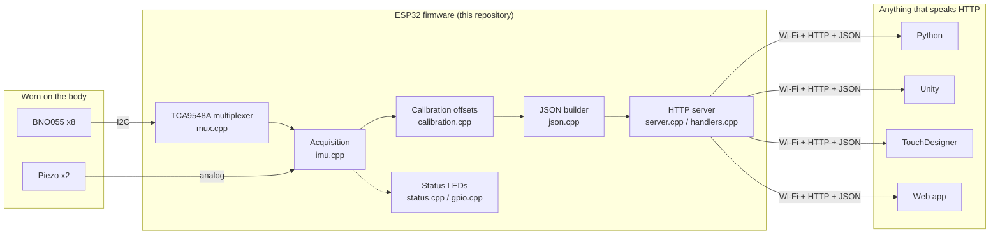
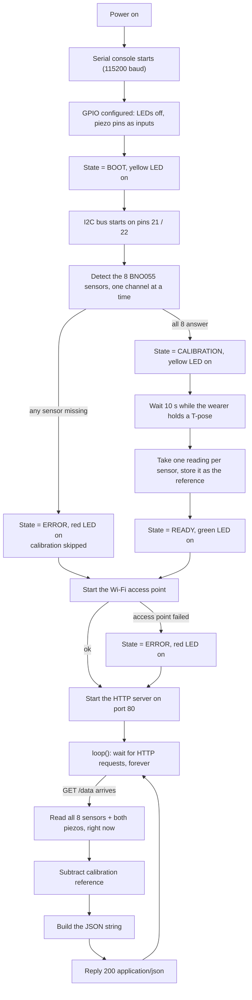
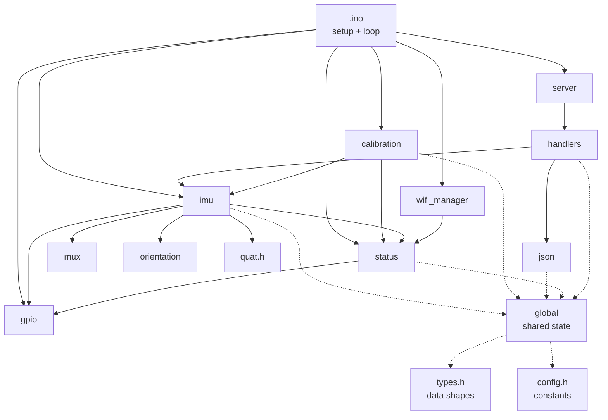
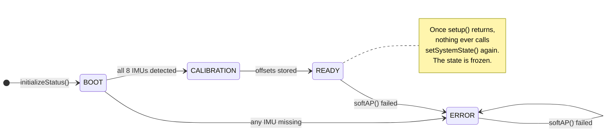
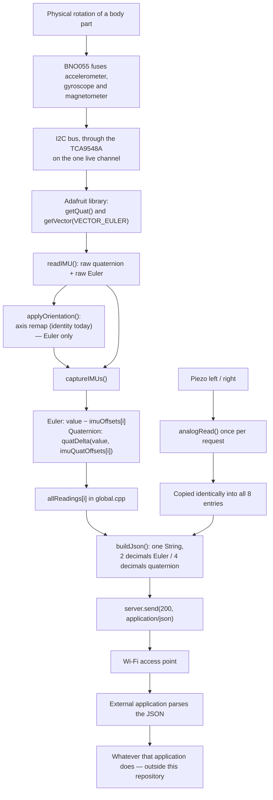

# ESP32 Motion Suit — Sensor Data Server (V3)

This folder contains the firmware for a wearable motion-capture suit built around an
ESP32 microcontroller, eight orientation sensors and two piezo sensors.

The firmware has exactly one job: **acquire sensor data and expose it over a simple
HTTP interface**. It does not draw anything, does not interpret gestures, does not
make sound, and does not know or care what is listening to it. Anything capable of
sending an HTTP request — Python, Unity, TouchDesigner, Max/MSP, Processing, Unreal
Engine, a web page — can consume it.

Think of it as a small sensor *web server* that you strap to a body.

This README is written for someone who has never seen the project and is not
necessarily an embedded programmer. Every concept is introduced before it is used,
and everything described here was verified against the source in
`Arduino_Suit_ESP32_Get_Data_V3/`.

---

## Table of contents

1. [Project overview](#1-project-overview)
2. [Vocabulary](#2-vocabulary-read-this-first)
3. [Global workflow](#3-global-workflow)
4. [Folder structure](#4-folder-structure)
5. [File by file](#5-file-by-file)
6. [Communication between files](#6-communication-between-files)
7. [Execution flow](#7-execution-flow)
8. [Data flow](#8-data-flow)
9. [Initialization](#9-initialization)
10. [Runtime](#10-runtime)
11. [Communication protocols and the HTTP API](#11-communication-protocols-and-the-http-api)
12. [Algorithms](#12-algorithms)
13. [Error handling](#13-error-handling)
14. [Configuration](#14-configuration)
15. [Architecture summary](#15-architecture-summary)

---

## 1. Project overview

### What the project is

A person wears a suit. Eight small sensor boards are attached to eight places on their
body. Each sensor continuously works out **which way that part of the body is pointing**.
An ESP32 board collects all eight answers, plus two extra impact/pressure readings, and
publishes them on a Wi-Fi network as text that any program can read.

### Why it exists

Motion data is only useful once it leaves the body. The hard, fiddly, hardware-specific
work — talking to sensors, dealing with a shared wire, resetting the reference pose —
should happen once, in one place, and everything downstream should just receive clean
numbers.

So this repository draws a hard line:

| Inside this repository | Deliberately outside it |
| --- | --- |
| Reading the sensors | Drawing a skeleton |
| Removing a reference pose | Recognising gestures |
| Formatting the result as JSON | Generating music or visuals |
| Serving it over HTTP | Recording to disk |

The firmware is a **data provider**, not an application. There is no client program in
this folder, and the API is described below without reference to any particular one.

### Hardware involved

Everything below is taken from `config.h` and `global.cpp`.

| Part | Role | How the code reaches it |
| --- | --- | --- |
| ESP32 board | Runs the firmware, hosts the Wi-Fi network and the web server | — |
| 8 × BNO055 | Orientation sensors ("IMUs"), one per body part | I²C, via the multiplexer |
| 1 × TCA9548A | I²C multiplexer at address `0x70`; lets eight identical sensors share one bus | I²C, GPIO 21/22 |
| 2 × piezo sensors | Analog inputs, read on GPIO 34 and 35 | `analogRead()` |
| 3 × LEDs | Red / yellow / green status indicator on GPIO 16 / 17 / 18 | `digitalWrite()` |

The eight body positions are fixed in the code (`types.h`, `global.cpp`):

`back_upper`, `back_lower`, `left_arm`, `right_arm`, `left_forearm`, `right_forearm`,
`left_hand`, `right_hand`.

### Software involved

- The Arduino framework for ESP32 (provides `Wire`, `WiFi` and `WebServer`).
- The **Adafruit BNO055** library (provides `Adafruit_BNO055`, and the `imu::Quaternion`
  / `imu::Vector` maths types the code uses). It in turn requires the **Adafruit Unified
  Sensor** library.
- No other dependency. JSON is assembled by hand with string concatenation — there is no
  JSON library in this project.

### High-level architecture



---

## 2. Vocabulary (read this first)

Short definitions of every term used later. Skip if you already know them.

**Microcontroller / firmware / sketch.** The ESP32 is a small computer with no operating
system and no screen. The single program it runs is called *firmware*. In the Arduino
world a program is called a *sketch*, and it is built from two functions: `setup()`, which
runs once at power-on, and `loop()`, which runs over and over forever afterwards.

**Single-threaded.** There is one line of execution. Nothing happens "in the background".
If the code is waiting, the whole system is waiting. This matters more than it sounds like
it should, and it explains several design choices below.

**IMU (Inertial Measurement Unit).** A chip that senses acceleration, rotation and the
Earth's magnetic field, and fuses those into an answer to "which way am I facing?". The
BNO055 does that fusion internally, so this firmware never has to.

**Orientation, two ways of writing it.** The same rotation can be described as:
- **Euler angles** — three separate numbers (*heading*, *pitch*, *roll*), in degrees.
  Easy to read, but they interact badly at extremes.
- **Quaternion** — four numbers (*w*, *x*, *y*, *z*). Hard to read by eye, but smooth
  everywhere and what 3D engines actually want.

This firmware reports **both** for every sensor, so the consumer picks.

**I²C.** A two-wire bus (a data wire `SDA` and a clock wire `SCL`) that lets several chips
share the same pair of wires. Every chip on the bus needs a unique address.

**The multiplexer, and why it is unavoidable.** In `global.cpp` all eight sensors are
created as `Adafruit_BNO055(0)` … `Adafruit_BNO055(7)`. Only a sensor *ID* is passed, so
every one of them uses the library's default I²C address on the default bus — eight chips,
one address. They cannot coexist on one bus. The **TCA9548A** solves this: it is a switch
sitting between the ESP32 and the sensors, with eight channels. Enable channel 3 and the
ESP32 is wired to sensor 3 alone; the other seven are disconnected. So all sensor access
in this project is: *switch channel → talk → switch channel → talk*.

**Access Point.** Instead of joining an existing Wi-Fi network, the ESP32 **creates** one
and other devices join it. No router needed.

**HTTP / endpoint / GET.** The protocol of the web. A client sends a request for a path
(an *endpoint*, e.g. `/data`); the server replies. `GET` means "give me this, don't change
anything".

**JSON.** A plain-text format for structured data (`{"name": value, ...}`). Every
language can parse it.

**Piezo sensor.** A crystal that emits a small voltage when knocked or squeezed. Read as a
number via the ESP32's analog-to-digital converter.

**Calibration.** Sensors report angles relative to *their own* idea of zero (magnetic
north, gravity). What we want is angles relative to *the wearer*. Calibration = record the
sensors' readings in a known pose, then subtract that reference from everything after.

---

## 3. Global workflow

The complete life of the system, from power-on onwards:



The single most important thing on that diagram: **acquisition hangs off the request, not
off the loop.** Nothing is sampled unless somebody asks for `/data`. See
[Runtime](#10-runtime).

---

## 4. Folder structure

The tree is deliberately flat — there are only two levels.

```
V3/
├── README.md                          ← this document
├── DOCUMENTATION_GUIDELINES.md        ← house style for writing this README
└── Arduino_Suit_ESP32_Get_Data_V3/    ← the sketch; this is what gets compiled
    ├── Arduino_Suit_ESP32_Get_Data_V3.ino
    ├── config.h
    ├── types.h
    ├── global.h / global.cpp
    ├── gpio.h / gpio.cpp
    ├── mux.h / mux.cpp
    ├── imu.h / imu.cpp
    ├── orientation.h / orientation.cpp
    ├── quat.h
    ├── calibration.h / calibration.cpp
    ├── status.h / status.cpp
    ├── wifi_manager.h / wifi_manager.cpp
    ├── server.h / server.cpp
    ├── handlers.h / handlers.cpp
    └── json.h / json.cpp
```

**Why the folder name repeats the file name.** The Arduino toolchain requires a sketch
folder to contain a `.ino` file of exactly the same name — that file is the entry point.
Every other `.cpp` in the folder is compiled and linked automatically; there is no
makefile and nothing to configure.

**Why so many small files.** Each file owns exactly one concern, and the concerns are
layered: hardware access at the bottom, maths in the middle, network at the top. That
layering is what makes the [dependency graph](#6-communication-between-files) a clean tree
rather than a knot.

**A note on the two `.md` files.** `DOCUMENTATION_GUIDELINES.md` describes how this README
should be written. It is documentation *about* documentation and has no effect on the
firmware.

---

## 5. File by file

Presented bottom-up: the files that touch hardware first, then the ones built on top of
them. This is also a reasonable order in which to read the source.

### `config.h` — every tunable number, in one place

**Why it exists.** So that changing a pin, a Wi-Fi password or the calibration duration
never requires hunting through logic code. It contains no code at all — only `constexpr`
constants (values fixed at compile time, costing no memory at runtime).

**Contents.** Pin numbers, the multiplexer's I²C address, the number of IMUs, two timing
values, and the Wi-Fi credentials. Every constant is explained in
[Configuration](#14-configuration).

**Consumed by.** Nearly every other file.

### `types.h` — the shared vocabulary

**Why it exists.** Modules need to hand structured values to each other. Rather than
passing loose floats around, the project defines the shapes once so that "an orientation"
means the same thing everywhere.

**Defines:**

- `BodyPart` — the eight positions, numbered `0`–`7`. This enum is the backbone of the
  whole system: **a body part, a sensor index and a multiplexer channel are all the same
  number.** Sensor 4 is on channel 4 and is the left forearm.
- `SystemState` — `SYSTEM_BOOT`, `SYSTEM_CALIBRATION`, `SYSTEM_READY`, `SYSTEM_ERROR`.
- `EulerAngles`, `CalibrationOffset` — three floats each (heading, pitch, roll), zeroed.
- `Quaternion` — `w, x, y, z`, defaulting to `w=1, x=y=z=0` (the "no rotation" value; this
  default matters, see [Algorithms](#12-algorithms)).
- `IMUStatus` — `detected`, `calibrated`, both false initially.
- `SensorReading` — everything known about one body part: its `BodyPart`, its `Quaternion`,
  its `EulerAngles`, and two piezo integers.

### `global.cpp` / `global.h` — the shared state

**Why it exists.** In a program with no operating system and one thread, the pragmatic way
to share data between modules is a small set of global variables, declared once and visible
to all. This file is that set, and keeping them together makes the shared surface obvious
rather than scattered.

**Owns:**

| Variable | What it holds |
| --- | --- |
| `server` | The `WebServer` instance, **bound to port 80** |
| `imuSensors[8]` | The eight `Adafruit_BNO055` driver objects, constructed with IDs `0`–`7` |
| `allReadings[8]` | The latest processed reading per body part; initialised with the body parts **in enum order**, which fixes the order of the JSON array |
| `imuOffsets[8]` | The Euler reference captured at calibration |
| `imuQuatOffsets[8]` | The quaternion reference captured at calibration |
| `imuStatus[8]` | Per-sensor `detected` / `calibrated` flags |
| `systemState` | The current state, starting at `SYSTEM_BOOT` |

### `gpio.cpp` / `gpio.h` — the thinnest possible hardware layer

**Why it exists.** So no other file ever writes a raw pin number. Everywhere else says
`setGreenLED(true)`, not `digitalWrite(18, 1)` — the pin lives only in `config.h`.

**Provides.** `initializeGPIO()` (LED pins to output and switched off, piezo pins to
input); `setRedLED` / `setYellowLED` / `setGreenLED`; `readLeftPiezo()` /
`readRightPiezo()`, which return raw `analogRead()` values.

### `mux.cpp` / `mux.h` — one function, and the whole project depends on it

**Why it exists.** It is the answer to "eight sensors, one address" described in
[Vocabulary](#2-vocabulary-read-this-first).

**How it works.** `selectMuxChannel(channel)` refuses anything `>= NUM_IMUS`, then sends a
single byte to the TCA9548A at `0x70`: `1 << channel`. The byte is a bit mask, one bit per
channel. Because exactly one bit is ever set, exactly one channel is ever live. The
firmware never sends `0` (all channels off).

**The rule this creates.** Every single sensor access, everywhere in the project, must call
`selectMuxChannel(i)` first. `imu.cpp` is the only file that does — which is exactly why
sensor access is confined to that file.

### `orientation.h` / `orientation.cpp` — the per-sensor mounting correction

**Why it exists.** A sensor taped to a forearm is not necessarily mounted the same way up
as one on the back. This module is the hook for fixing that in software instead of
insisting on perfect mounting.

**How it works.** `imuOrientation[8]` gives each sensor a rule: which raw axis feeds
*heading*, which feeds *pitch*, which feeds *roll*, and whether each should be negated.
`applyOrientation()` applies that rule to one sensor's Euler angles, in place.

**Its current state — read this before trusting it.** All eight entries are
`{AXIS_X, AXIS_Y, AXIS_Z, false, false, false}`: identity mapping, no inversions. **As
committed, `applyOrientation()` changes nothing.** It is wiring that is in place and ready,
not a transformation currently being performed.

**One real limitation.** It is applied to the Euler angles only. The quaternion goes
through `readIMU()` untouched, so a non-identity table here would make the two
representations disagree.

### `quat.h` — quaternion maths, header-only

**Why it exists.** To express "the rotation from the calibration pose to now" without
Euler-angle headaches. It is header-only and `inline` because the functions are a handful
of multiplications each — cheaper to inline than to call.

**Provides.** `quatConjugate()` (negate x, y, z — for a rotation this is the inverse),
`quatMultiply()` (the Hamilton product — composes two rotations), and `quatDelta(current,
reference)`, which returns `current ⊗ conjugate(reference)`. The intuition is in
[Algorithms](#12-algorithms).

### `imu.cpp` / `imu.h` — where sensor data enters the system

**Why it exists.** This is the only file allowed to touch a BNO055. It owns the
channel-switching discipline the multiplexer demands.

**`initializeIMUs()`** walks channels 0–7. On each: select the channel, wait 20 ms, call
`begin()` and record the result in `imuStatus[i].detected`. If the sensor answered, it also
calls `setExtCrystalUse(true)`, telling the BNO055 to use the accurate crystal on its
breakout board rather than its internal oscillator, and prints `OK`; otherwise `FAILED`.
**The pass mark is all eight**: any failure sends the whole system to `SYSTEM_ERROR`.

**`readIMU(index, heading&, pitch&, roll&, quat&)`** reads one sensor. It refuses an
out-of-range index and refuses any sensor that was never detected — returning `false` — and
otherwise selects the channel, waits `IMU_DELAY_MS`, then takes two readings from the chip:
`getQuat()` and `getVector(VECTOR_EULER)`. The Euler triple goes through
`applyOrientation()`. Both values come out **raw** — uncalibrated. The exact field mapping
is in [the API reference](#the-imu_data-entries).

**`captureIMUs()`** is the one called per HTTP request. For each sensor it calls
`readIMU()`, **skipping to the next on failure** — a skipped entry keeps whatever was in
`allReadings[i]` from before, which for a sensor that never appeared means the `types.h`
defaults (identity quaternion, zero angles). For each successful read it applies the
calibration reference and stores the result. Then, **once**, outside that loop, it reads
both piezo pins and copies that same pair of values into **all eight** entries.

**`allIMUsDetected()`** is declared and defined here — and is called from nowhere in the
project. It is dead code today.

### `calibration.cpp` / `calibration.h` — teaching the suit what "neutral" means

**Why it exists.** See *Calibration* in [Vocabulary](#2-vocabulary-read-this-first).

**How it works.** `calibrateIMUs()` prints `Keep the T-pose...`, sets state
`SYSTEM_CALIBRATION`, then `delay(CALIBRATION_TIME_MS)` — **ten seconds during which the
whole system does nothing at all**. That pause is not measuring anything; it is time for
the wearer to get into position (and for the sensors to settle). Then it takes **one**
reading per sensor, stores the Euler triple in `imuOffsets[i]`, the quaternion in
`imuQuatOffsets[i]`, marks the sensor `calibrated`, and finally sets `SYSTEM_READY`.

**Worth being clear about:** the reference is a single instantaneous sample taken *after*
the wait, not an average over it. A twitch at second 10 lands in the reference; a twitch at
second 3 does not.

### `status.cpp` / `status.h` — the state machine and its three LEDs

**Why it exists.** The suit has no screen, and the person wearing it cannot see a serial
console. Three LEDs are the entire user interface.

**How it works.** `setSystemState()` stores the new state and immediately calls
`refreshStatus()`, which drives the LEDs from a straight `switch`:

| State | Red | Yellow | Green | Meaning |
| --- | :---: | :---: | :---: | --- |
| `SYSTEM_BOOT` | ○ | ● | ○ | Starting up |
| `SYSTEM_CALIBRATION` | ○ | ● | ○ | Hold the T-pose |
| `SYSTEM_READY` | ○ | ○ | ● | Serving data |
| `SYSTEM_ERROR` | ● | ○ | ○ | A sensor or the access point failed |

`updateStatus()` is the only status function called from `loop()`. It is written to blink
the yellow LED every 500 ms while the state is `SYSTEM_CALIBRATION`.

**What actually happens, though:** by the time `loop()` first runs, `setup()` has always
moved the state to either `SYSTEM_READY` or `SYSTEM_ERROR` — calibration happens inside a
blocking `delay()` in `setup()`, where `loop()` is not running and `updateStatus()` is
never called. So the yellow LED is **solid**, not blinking, for the whole calibration, and
the blink branch never executes as the code stands. The LED table above is what you will
observe.

### `wifi_manager.cpp` / `wifi_manager.h` — creating the network

**Why it exists.** To make the suit self-sufficient. It does not join a network; it *is*
the network, so the system works with no router, no infrastructure, and no venue Wi-Fi.

**How it works.** `initializeWiFi()` calls `WiFi.softAP(WIFI_SSID, WIFI_PASSWORD)`. On
failure it prints, sets `SYSTEM_ERROR` and returns. On success it prints the SSID, the
password and — the value you actually need — `WiFi.softAPIP()`, the address clients must
target.

**Note it can only ever set `SYSTEM_ERROR`, never clear it.** A run whose sensors failed
stays in error even if the network comes up perfectly.

### `server.cpp` / `server.h` — the routing table

**Why it exists.** To map URL paths to functions, and to keep that map in one glanceable
place.

**How it works.** `initializeServer()` registers `GET /data` → `handleDataRequest` (from
`handlers.cpp`) and `GET /health` → `handleHealthRequest` (a local function returning the
fixed string `{"status":"ok"}`), then calls `server.begin()`. Two routes; nothing else is
registered, and no custom not-found handler is installed.

**Why `/health` is trivial on purpose.** It answers "is the box reachable and serving?"
without touching a single sensor — so it stays fast, and a failure to reach it is
unambiguously a network problem.

### `handlers.cpp` / `handlers.h` — the request, end to end

**Why it exists.** It is the seam between the network world and the sensor world, and it is
deliberately tiny. `handleDataRequest()` is three steps: `captureIMUs()`, `buildJson()`,
`server.send(200, "application/json", json)`.

**Why this file is where the architecture is decided.** Because acquisition is called
*here* — inside a request — rather than in `loop()`, the client's polling rate *is* the
sampling rate. See [Runtime](#10-runtime).

### `json.cpp` / `json.h` — the public face of the system

**Why it exists.** Everything above this point is C++ structs that only this firmware
understands. `buildJson()` turns them into text that every language on earth can parse. It
is the project's contract with the outside world.

**How it works.** Two private helpers translate enums into stable strings: `bodyName()`
(`BACK_UPPER` → `"back_upper"`) and `stateName()` (`SYSTEM_READY` → `"ready"`). Then
`buildJson()` concatenates one `String`: a timestamp, the system state, and an array of
eight objects read straight out of `allReadings` and `imuStatus`. Euler angles are
formatted to 2 decimals, quaternion components to 4.

**Note it only reads.** `buildJson()` never triggers acquisition; it serialises whatever
`captureIMUs()` last left in the globals. The full output is documented in
[the API reference](#the-imu_data-entries).

### `Arduino_Suit_ESP32_Get_Data_V3.ino` — the conductor

**Why it exists.** The entry point. It contains no logic of its own — it decides *order*,
and order is the one thing every module depends on and none can express alone.

`setup()` runs, in this order: serial → GPIO → status → I²C → sensors → *calibration, only
if the state is not `SYSTEM_ERROR`* → Wi-Fi → HTTP server. That single conditional is the
whole error policy: broken sensors skip calibration, but **everything after it still
starts**.

`loop()` is two lines: `updateStatus()` and `server.handleClient()`.

---

## 6. Communication between files

The modules form a layered tree. An arrow means "includes and calls".



Solid arrows are function calls; dotted arrows are reads/writes of shared state.

### The same story, as a conversation

Someone's laptop asks for `/data`:

1. **`server`** recognises the path and hands off to **`handlers`**.
2. **`handlers`** tells **`imu`**: *give me a fresh capture*.
3. **`imu`** asks **`mux`** to switch to channel 0, waits 3 ms, and asks the Adafruit
   library for a quaternion and an Euler triple.
4. **`imu`** passes the Euler triple to **`orientation`**, which applies sensor 0's
   mounting rule (currently: nothing).
5. **`imu`** asks **`quat`** for the difference between this quaternion and the one
   **`calibration`** stored at boot, subtracts the stored Euler offsets, and writes the
   result into **`global`**'s `allReadings[0]`.
6. Steps 3–5 repeat for channels 1 through 7.
7. **`imu`** asks **`gpio`** for both piezo values, once, and copies them into all eight
   entries.
8. **`handlers`** tells **`json`**: *serialise it*. **`json`** reads `allReadings`,
   `imuStatus` and `systemState` from **`global`** and returns one string.
9. **`handlers`** hands that string to **`server`**, which sends it back.

Note who talks to whom. `json` never touches a sensor. `imu` never knows HTTP exists.
`global` is the noticeboard both read from. The only file that knows the whole story is
`handlers`, and it is 30 lines long.

---

## 7. Execution flow

### Power-on to ready

```
setup()
├── Serial.begin(115200); delay(500)
├── prints the banner
├── initializeGPIO()            → LEDs off, piezo pins are inputs
├── initializeStatus()          → state = BOOT       → yellow on
├── Wire.begin(21, 22)          → I²C bus up
├── initializeIMUs()            → 8 × { selectMuxChannel(i); delay(20); begin() }
│                               → all detected ? state = CALIBRATION : state = ERROR
├── if (state != ERROR) calibrateIMUs()
│                               → state = CALIBRATION → yellow on
│                               → delay(10 000)       → the T-pose window
│                               → 8 × readIMU() → store offsets, mark calibrated
│                               → state = READY       → green on
├── initializeWiFi()            → softAP(); on failure state = ERROR → red on
└── initializeServer()          → register /data and /health; server.begin()
```

The banner printed at boot reads:

```
==================================
      ESP32 MUSIC SUIT V2
==================================
```

That text is what the V3 source prints — the string was not updated with the folder name.
It is cosmetic and affects nothing.

### Ready onwards

```
loop()                          ← forever, as fast as the CPU can go
├── updateStatus()              → returns immediately (state is never CALIBRATION here)
└── server.handleClient()       → if a request is pending, serve it; else return
```

### Shutdown

There isn't one. There is no shutdown path, no sleep mode and no cleanup code: the firmware
runs until power is removed. Calibration offsets live in RAM only, so **every power cycle
requires a new T-pose**.

### The state machine



That note is a genuine property of the code, not a simplification: nothing reachable from
`loop()` calls `setSystemState()`. The consequences are covered in
[Error handling](#13-error-handling).

---

## 8. Data flow

Following one number from a body part to an application:



### The transformations that matter

| Step | Input | Output | Where |
| --- | --- | --- | --- |
| Fusion | Raw accel/gyro/mag | Absolute orientation | Inside the BNO055 |
| Axis remap | Raw Euler | Remapped Euler (identity today) | `orientation.cpp` |
| Euler zeroing | Absolute Euler | Angle relative to T-pose | `imu.cpp`, subtraction |
| Quaternion zeroing | Absolute quaternion | Rotation since T-pose | `imu.cpp` → `quat.h` |
| Serialisation | C++ structs | JSON text | `json.cpp` |

---

## 9. Initialization

Everything that must happen before the first byte of data can be served.

**1 — Serial (115200 baud).** Diagnostics only. Nothing depends on a console being
attached; the 500 ms delay just gives the port time to come up so the banner is not lost.

**2 — GPIO.** LED pins to `OUTPUT` and explicitly switched **off**, so the LEDs mean
something from the first millisecond rather than showing a floating leftover. Piezo pins to
`INPUT`.

**3 — Status.** State set to `SYSTEM_BOOT`, LEDs refreshed → solid yellow. From here the
LED always reflects the truth.

**4 — I²C.** `Wire.begin(SDA_PIN, SCL_PIN)` on GPIO 21 and 22. Must precede any sensor or
multiplexer contact — which is why it sits above `initializeIMUs()` in `setup()`.

**5 — Sensor detection.** For each channel 0–7: select it, wait 20 ms for the switch to
settle, call `begin()`. This is both a driver setup and a census: `imuStatus[i].detected`
is simply whatever `begin()` returned. Detected sensors are switched to their external
crystal. **All eight must answer or the system enters `SYSTEM_ERROR`.**

**6 — Calibration.** Skipped entirely if the state is `SYSTEM_ERROR`. Otherwise: ten
blocking seconds, then one reference sample per sensor. Details in
[Algorithms](#12-algorithms).

**7 — Network.** The access point is created from the credentials in `config.h`. Its IP is
printed to serial. Runs whether or not the sensors are healthy.

**8 — HTTP server.** Two routes registered, `begin()` called, port 80 open. Also runs
unconditionally — **the API is served even in `SYSTEM_ERROR`**, which is a deliberate and
useful property: a client can connect and read `"system": "error"` plus the per-sensor
`detected` flags to find out precisely what is wrong. A dead suit still tells you why.

---

## 10. Runtime

### What repeats

`loop()` does two things, endlessly: `updateStatus()` (which, as established, returns
immediately) and `server.handleClient()`, which serves one pending request if there is one
and returns otherwise. With no client connected, the system is idle — **it is not sampling
anything.**

### What triggers acquisition

A `GET /data` request. Nothing else. There is no timer, no interrupt, no background task.

This is the design decision that shapes everything, and it has real consequences:

- **The client sets the sample rate.** Poll 10×/s and you get 10 samples/s. Poll once an
  hour and the sensors are read once an hour.
- **Data is never stale.** Every response is measured after the request arrived, so there
  is no buffer holding old readings.
- **There is a ceiling.** `captureIMUs()` deliberately waits `IMU_DELAY_MS` (3 ms) per
  sensor after switching channels: 8 × 3 ms = **24 ms of pure delay per request**, before
  counting I²C transfer time, JSON building and Wi-Fi. So a response cannot be produced
  faster than roughly 24 ms — an upper bound somewhere **under ~40 Hz**, with the real
  figure lower.
- **Requests cannot overlap.** One thread, and `captureIMUs()` blocks it. Two clients
  polling hard will queue behind each other, not run in parallel.

### What is updated per request

`allReadings[0..7]` (quaternion and Euler for every sensor that read successfully, both
piezo values for all eight). Nothing else changes: `imuStatus` is fixed at boot,
`imuOffsets` at calibration, `systemState` when `setup()` returned.

### What is received

Nothing but HTTP requests. `/data` and `/health` are both `GET` and take no parameters —
the firmware accepts no commands, no configuration and no input of any kind at runtime.
Everything is set at compile time or at boot. That is what makes it a *data provider*
rather than a device you drive.

---

## 11. Communication protocols and the HTTP API

### The protocol stack

| Protocol | Why it is used | Who exchanges what | Where |
| --- | --- | --- | --- |
| **I²C** | Lets many chips share two wires; what the BNO055 and TCA9548A speak | ESP32 ↔ multiplexer (channel byte), ESP32 ↔ sensors (orientation) | `mux.cpp`, `imu.cpp` |
| **Analog** | Piezos output a voltage, not data | Piezo → ESP32, one integer each | `gpio.cpp` |
| **Wi-Fi (Access Point)** | Self-contained; needs no router | ESP32 hosts, clients join | `wifi_manager.cpp` |
| **HTTP** | Universally supported; every language can already speak it | Client requests, ESP32 responds | `server.cpp`, `handlers.cpp` |
| **JSON** | Human-readable, parseable everywhere, no schema needed | The response body | `json.cpp` |
| **Serial (115200)** | Diagnostics during boot | ESP32 → console, one way | everywhere |

The HTTP + JSON pairing is the whole reason this firmware is reusable: neither imposes a
language, a platform or a library on the consumer.

### Connecting

1. Power the ESP32.
2. Join the Wi-Fi network it creates — SSID and password are in `config.h` (see
   [Configuration](#14-configuration)).
3. Read the ESP32's IP from the serial output at boot (`IP Address : ...`). With the
   default ESP32 access-point settings this is `192.168.4.1`, but the printed value is
   authoritative.
4. Send `GET` requests to port 80.

### `GET /health`

Always replies `200` with exactly:

```json
{"status":"ok"}
```

It touches no sensors. Use it to confirm reachability.

### `GET /data`

Triggers a fresh capture of all eight sensors and both piezos, then replies `200` with
`Content-Type: application/json`.

The real body is a single line with no whitespace. Pretty-printed, and with two of the
eight entries shown (the other six follow the same shape):

```json
{
  "timestamp": 48213,
  "system": "ready",
  "imu_data": [
    {
      "body": "back_upper",
      "detected": true,
      "calibrated": true,
      "heading": 1.44,
      "pitch": -0.31,
      "roll": 0.07,
      "qw": 0.9998,
      "qx": 0.0013,
      "qy": -0.0027,
      "qz": 0.0126,
      "piezo_left": 0,
      "piezo_right": 12
    },
    {
      "body": "back_lower",
      "detected": true,
      "calibrated": true,
      "heading": 0.62,
      "pitch": 0.19,
      "roll": -0.44,
      "qw": 0.9999,
      "qx": 0.0002,
      "qy": 0.0041,
      "qz": 0.0055,
      "piezo_left": 0,
      "piezo_right": 12
    }
  ]
}
```

*(Values illustrative; the structure, field names, order and precision are exact.)*

#### Top-level fields

| Field | Type | Meaning |
| --- | --- | --- |
| `timestamp` | integer | `millis()` — milliseconds since the ESP32 booted. **Not** a wall clock: it has no date, it resets on every power cycle, and it wraps to 0 after ~49.7 days. Use it for ordering and for measuring intervals, not for absolute time. |
| `system` | string | `"boot"`, `"calibration"`, `"ready"` or `"error"`. In practice a client only ever sees `"ready"` or `"error"`, since the server does not accept requests before `setup()` finishes. |
| `imu_data` | array | Always exactly 8 entries, **always in this order**: `back_upper`, `back_lower`, `left_arm`, `right_arm`, `left_forearm`, `right_forearm`, `left_hand`, `right_hand`. The order is fixed by `allReadings` in `global.cpp` and never varies — you may index it positionally, though `body` is there if you would rather not. |

#### The `imu_data` entries

| Field | Type | Meaning |
| --- | --- | --- |
| `body` | string | Which body part this entry describes. |
| `detected` | bool | Did this sensor answer **at boot**? Never re-evaluated afterwards. |
| `calibrated` | bool | Did this sensor get a reference sample? `false` for every sensor if calibration was skipped. |
| `heading` | float, 2 dp | Degrees. From the sensor's Euler `x`, minus the stored heading offset. |
| `pitch` | float, 2 dp | Degrees. From the sensor's Euler `y`, minus the stored pitch offset. |
| `roll` | float, 2 dp | Degrees. From the sensor's Euler `z`, minus the stored roll offset. |
| `qw`, `qx`, `qy`, `qz` | float, 4 dp | The quaternion, as the rotation **since the calibration pose**. This is the primary orientation output — prefer it for anything 3D. |
| `piezo_left` | integer | Raw `analogRead()` of GPIO 34. |
| `piezo_right` | integer | Raw `analogRead()` of GPIO 35. |

#### Four things a consumer must know

1. **The piezos are not per body part.** Both pins are read once per request and the same
   two values are written into all eight entries. `imu_data[0].piezo_left` and
   `imu_data[7].piezo_left` are always identical — it is one global pair repeated eight
   times, not eight separate sensors. Read them from any entry.
2. **An undetected sensor still gets a full entry**, carrying `detected: false` and the
   default values (`qw: 1.0000`, the rest `0.00`). Always check `detected` before believing
   a number: zeros here mean "no data", not "not moving".
3. **Uncalibrated data is absolute, not broken.** If calibration was skipped, the offsets
   are all zero and the quaternion reference is the identity — so the maths passes the raw
   sensor values straight through. You get real orientations, just measured against the
   sensors' own reference (magnetic north and gravity) rather than the wearer's T-pose.
   `calibrated: false` tells you which you are looking at.
4. **No CORS headers are sent.** The firmware sets no `Access-Control-Allow-Origin`, so a
   browser page served from another origin will be blocked from reading `/data` by the
   browser itself. Native apps, Python, Unity and friends are unaffected.

#### The piezo scale

The sketch never calls `analogReadResolution()`, so the values are whatever the ESP32 core
produces by default — 12-bit, i.e. **0–4095**, on the standard ESP32 core. The firmware
applies no threshold, no filtering and no scaling: what the pin reads is what you get.
Deciding what counts as a "hit" is the consumer's job.

---

## 12. Algorithms

There are only three, and none is complicated. The intelligence is in the arrangement.

### Sensor fusion — the one this project does not do

Turning shaking accelerometer, drifting gyroscope and noisy magnetometer data into a stable
orientation is the genuinely hard problem here, and the BNO055 does it on-chip. That single
hardware choice is why this codebase has no filter, no Kalman maths and no drift
compensation: it asks the sensor for an answer and gets one.

### Channel switching

The multiplexer accepts a bit mask, one bit per channel. `1 << channel` sets exactly one
bit — `1 << 3` = `0b00001000` = channel 3 only. Send the byte, and the ESP32 is wired to
that one sensor until the next byte. The 3 ms wait afterwards gives the switch and the
sensor time to settle before the read.

### Calibration, and why it is subtraction

The sensors measure against the universe: heading against magnetic north, pitch and roll
against gravity. Standing still facing east, an arm sensor reads a large heading — true,
and useless. What an application wants is *how far has this arm moved from neutral*.

So: capture the readings in a known pose, and subtract them from everything after.

**For Euler angles** it is literal subtraction, per axis:

```
reported_heading = current_heading − imuOffsets[i].heading
```

In the T-pose all three come out ~0. Move, and they measure the departure from it.

*The honest caveat:* this is plain subtraction with no wrap-around handling. Nothing in the
code brings the result back into a range, so `heading − offset` can go negative or exceed
360 near the wrap point. Fine for a quick look, awkward for continuous rotation — one more
reason the quaternion is the primary output.

**For quaternions** the same idea, done properly. Rotations do not subtract; they compose,
and undoing one means composing with its inverse. For a rotation quaternion, the inverse is
the conjugate (negate `x`, `y`, `z`). So:

```
reported = current ⊗ conjugate(reference)
```

which `quat.h` calls `quatDelta()`. Read it as: *"undo the calibration pose, then apply
where we are now."* Two properties fall straight out of the arithmetic, and both are load
bearing:

- **If nothing has moved**, `current` equals `reference`, and `q ⊗ conjugate(q)` is the
  identity `(1, 0, 0, 0)` — "no rotation". So the T-pose reports identity, exactly as
  intended.
- **If calibration never ran**, `imuQuatOffsets[i]` still holds its `types.h` default,
  which is the identity. The conjugate of identity is identity, and anything composed with
  identity is itself — so `quatDelta()` returns the raw quaternion untouched. This is
  precisely why uncalibrated data is absolute rather than garbage: the zeroing step
  becomes a no-op instead of a corruption.

### Axis remapping

Described in [`orientation.cpp`](#orientationh--orientationcpp--the-per-sensor-mounting-correction):
a per-sensor table saying which raw axis feeds which output and whether to negate it.
Currently identity for all eight, so today it is a no-op — an extension point, not an
active algorithm.

---

## 13. Error handling

The strategy across the whole firmware is: **detect at boot, show it on an LED, report it
in the JSON, and keep serving.** Nothing is ever retried.

### Missing or dead sensors

`begin()` fails → `imuStatus[i].detected = false` → `FAILED` on serial → the whole system
goes to `SYSTEM_ERROR`, red LED, calibration skipped.

But the Wi-Fi and HTTP server still start. In `captureIMUs()`, `readIMU()` returns `false`
for that sensor and the loop skips it, leaving its `types.h` defaults in place. So the API
stays up and reports `"system": "error"` with `detected: false` on exactly the sensor at
fault — the failure is diagnosable over the network, without a serial cable.

**The all-or-nothing rule.** One missing sensor out of eight downgrades the entire system,
even though the other seven work fine and continue to be served (uncalibrated, since
calibration was skipped for everyone).

### Access point failure

`softAP()` returns false → message on serial → `SYSTEM_ERROR` → red LED. `initializeServer()`
still runs, though with no network there is nobody to serve. The serial console is the only
diagnostic in this case.

### Failures that are not detected at all

Being explicit about the gaps matters as much as describing the handling:

- **`Wire.endTransmission()`'s return value is ignored** in `selectMuxChannel()`. If the
  multiplexer is absent or unwired, the failure is silent and every sensor simply appears
  undetected.
- **A sensor that dies after boot is never noticed.** `detected` is written once, during
  `initializeIMUs()`, and never revisited. A sensor that comes loose mid-performance keeps
  reporting `detected: true` while `getQuat()` returns whatever the library returns for a
  chip that is not answering.
- **The state never changes after `setup()`.** Nothing reachable from `loop()` calls
  `setSystemState()`, so a suit that was green at boot stays green forever, whatever
  happens afterwards.
- **No values are range-checked.** No NaN check, no plausibility check, no piezo threshold.
  Whatever the sensor returns is formatted and sent.

### There is no recovery mechanism

No retries, no re-initialisation, no watchdog, no re-calibration endpoint. **Power-cycling
the ESP32 is the only recovery path**, and because offsets live in RAM, that also means a
fresh T-pose every time.

### The client's checklist

Because the firmware will not tell you twice, a well-behaved consumer should:

1. Check `system` — is it `"ready"`?
2. Check each entry's `detected` before using its numbers.
3. Check `calibrated` to know whether values are T-pose-relative or absolute.
4. Watch `timestamp` advance — a frozen timestamp means the suit stopped responding.

---

## 14. Configuration

Everything tunable lives in `config.h`. Change a value, re-upload, done — no other file
needs touching.

### Pins

| Constant | Value | Why it exists |
| --- | --- | --- |
| `SDA_PIN` | `21` | I²C data line to the multiplexer. |
| `SCL_PIN` | `22` | I²C clock line. |
| `PIEZO_LEFT_PIN` | `34` | Left piezo. GPIO 34/35 are input-only, analog-capable ESP32 pins — they cannot be outputs, which is fine here. |
| `PIEZO_RIGHT_PIN` | `35` | Right piezo. |
| `LED_RED_PIN` | `16` | Error indicator. |
| `LED_YELLOW_PIN` | `17` | Boot / calibration indicator. |
| `LED_GREEN_PIN` | `18` | Ready indicator. |

### I²C and sensors

| Constant | Value | Why it exists |
| --- | --- | --- |
| `TCA9548A_ADDR` | `0x70` | The multiplexer's I²C address — its factory default. Changeable in hardware via address pins; if you do that, change it here too. |
| `NUM_IMUS` | `8` | The size of **every** per-sensor array, the loop bound everywhere, and the guard in `selectMuxChannel()`. It is the project's master dimension. Raising it also requires: more `Adafruit_BNO055` entries and more `allReadings` entries in `global.cpp`, more `BodyPart` values and names in `types.h`/`json.cpp`, and more rows in `imuOrientation[]`. It is not a one-line change — and 8 is the TCA9548A's channel count anyway. |
| `IMU_DELAY_MS` | `3` | Settling time after switching channels, before reading. **This is the main throughput knob**: it is paid eight times per request (~24 ms). Lower it for speed at the risk of reading a channel that has not settled; raise it for reliability at the cost of rate. Note that `initializeIMUs()` does *not* use it — detection uses its own hard-coded `delay(20)`. |

### Calibration

| Constant | Value | Why it exists |
| --- | --- | --- |
| `CALIBRATION_TIME_MS` | `10000` | How long the wearer has to reach and hold the T-pose before the reference sample is taken. It is a wait, not a measurement window — see [Algorithms](#12-algorithms). It also fixes how long boot takes, since it blocks. |

### Wi-Fi

| Constant | Value | Why it exists |
| --- | --- | --- |
| `WIFI_SSID` | `"ESP32_Test"` | The name of the network the ESP32 creates. |
| `WIFI_PASSWORD` | `"12345678"` | Its password. Must be at least 8 characters for WPA2. |

These are development defaults, hardcoded in the sketch and printed to serial at every
boot. Anyone within radio range who knows them can reach `/data`. Worth changing before the
suit is used anywhere public — and worth remembering that `config.h` is committed to the
repository, so whatever you put here is in the git history.

### Not configurable without editing code

The HTTP port (`80`, in `global.cpp`'s `WebServer server(80)`), the serial baud rate
(`115200`, in the `.ino`), the route paths (`server.cpp`), the JSON field names
(`json.cpp`), the LED patterns (`status.cpp`) and the body-part list (`types.h` +
`global.cpp` + `json.cpp`).

### Building it

Open `Arduino_Suit_ESP32_Get_Data_V3/Arduino_Suit_ESP32_Get_Data_V3.ino` in the Arduino
IDE with ESP32 board support installed, and install the **Adafruit BNO055** library (the
library manager will pull in **Adafruit Unified Sensor** with it). Select your ESP32 board,
and upload. `Wire`, `WiFi` and `WebServer` come with the ESP32 core. No other setup — the
sketch pins no specific ESP32 variant, so any board exposing GPIO 16, 17, 18, 21, 22, 34
and 35 will do.

---

## 15. Architecture summary

**Where the data comes from.** Eight BNO055 sensors on the body, each doing its own sensor
fusion, plus two analog piezos. The sensors are electrically identical and share one I²C
address, so a TCA9548A multiplexer puts exactly one of them on the bus at a time — a
constraint that shapes the whole acquisition layer.

**How it moves.** `imu.cpp` is the only file that talks to a sensor: switch channel, wait,
read a quaternion and an Euler triple, remap the axes (identity today), remove the
calibration reference, store it in the globals in `global.cpp`. `json.cpp` reads those
globals and turns them into text. Neither knows the other exists — they meet at the shared
state, and `handlers.cpp` is the only file that knows the full sequence.

**How it is processed.** Barely, and on purpose. The BNO055 does the hard part in silicon.
This firmware's only real contribution is *zeroing* — subtraction for Euler angles,
`quatDelta()` for quaternions — turning "where is this sensor in the universe" into "how
far has this body part moved from its T-pose".

**How it is exposed.** The ESP32 hosts its own Wi-Fi access point and serves two `GET`
endpoints on port 80: `/health` for reachability, `/data` for everything else. `/data`
answers with a fixed-shape JSON document: a timestamp, a system state, and eight entries in
a guaranteed order, each carrying its health flags, Euler angles, a quaternion, and the
shared piezo pair.

**The design decision to remember.** Acquisition is triggered by the request, not by a
timer. `loop()` samples nothing; it waits. So the client chooses the rate, every reading is
fresh at the moment it was asked for, no buffering exists anywhere, and the physical delays
(8 × 3 ms) set a ceiling somewhere under ~40 Hz.

**How to consume it.** Join the network, `GET /data`, parse the JSON, check `system`, check
each `detected`, check `calibrated`, use the quaternions. That is the entire contract, and
it is why this repository is a reusable sensor server rather than part of somebody's
application: **the firmware has no idea who is listening, and never needs to.**

---

## Appendix: known quirks

Small things that are surprising if you have read the source, all confirmed against the
code and all harmless:

- The boot banner says `ESP32 MUSIC SUIT V2`, in the V3 sketch.
- `allIMUsDetected()` (`imu.h` / `imu.cpp`) is fully implemented and never called.
- The yellow-blink branch of `updateStatus()` is unreachable: calibration happens inside a
  blocking `delay()` in `setup()`, so the state is never `SYSTEM_CALIBRATION` while
  `loop()` is running.
- `imuOrientation[]` is identity for all eight sensors, so `applyOrientation()` currently
  has no effect.
- `orientation.h` carries a header comment reading `ORIENTATION.cpp`, and `handlers.h` one
  reading `HANDLERS.cpp`.
