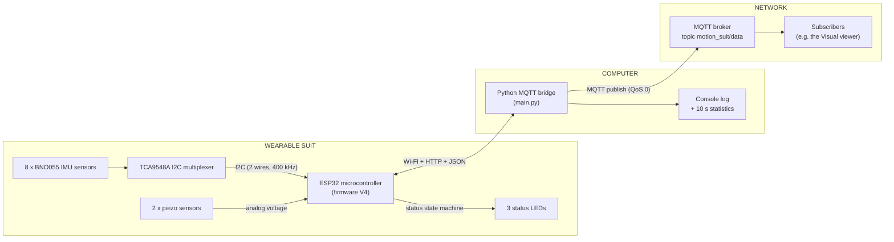
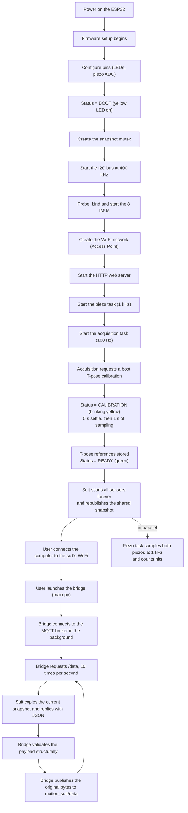
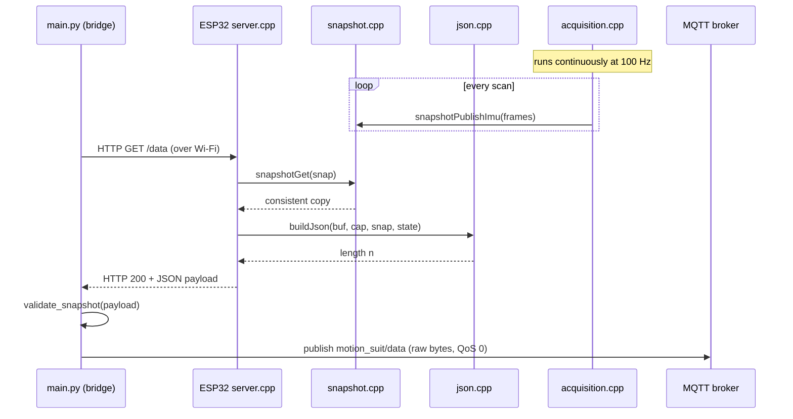
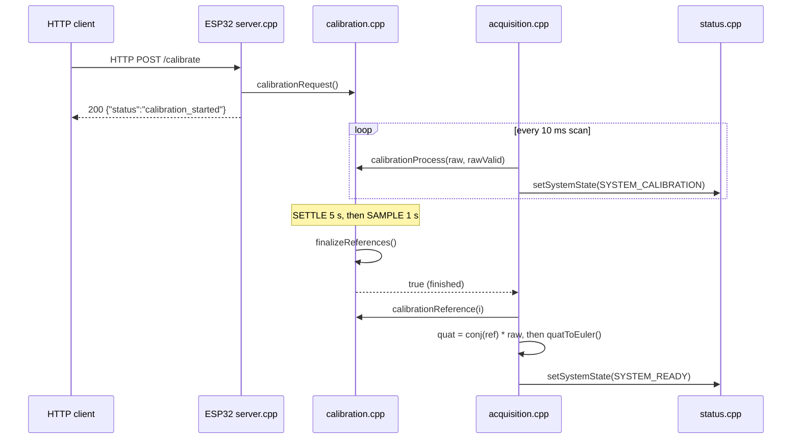
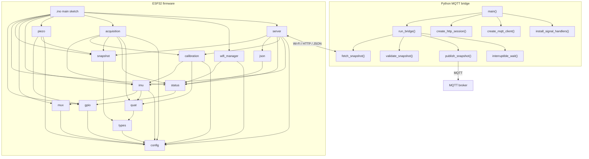
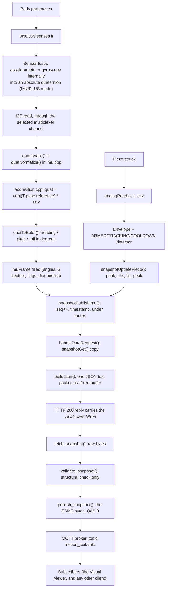
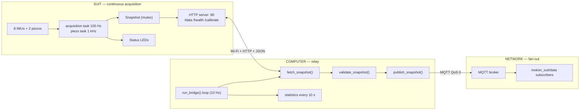

# Get Data — V5
### Wearable Motion Suit — ESP32 Firmware + Python MQTT Bridge

---

## Table of Contents

1. [Project Overview](#1-project-overview)
2. [Global Workflow](#2-global-workflow)
3. [Folder Structure](#3-folder-structure)
4. [File Explanation](#4-file-explanation)
5. [Communication Between Files](#5-communication-between-files)
6. [Execution Flow](#6-execution-flow)
7. [Data Flow](#7-data-flow)
8. [Initialization](#8-initialization)
9. [Runtime](#9-runtime)
10. [Communication Protocols](#10-communication-protocols)
11. [Algorithms](#11-algorithms)
12. [Error Handling](#12-error-handling)
13. [Configuration](#13-configuration)
14. [Architecture Summary](#14-architecture-summary)

---

## 1. Project Overview

### What the project is

This directory is the **acquisition half** of the motion-capture system: it
contains everything that turns **body movement into a stream of messages on a
network**.

A wearable suit carries eight small sensors that measure **how each body part
is oriented in space**. A microcontroller on the suit reads all of them
*continuously* — on its own, without being asked — and keeps the most recent
complete measurement in memory. It also publishes that memory over **Wi-Fi**
as a tiny website. A second program, running on a normal computer, keeps
asking that website for the latest measurement and immediately **re-publishes
it to a message broker**, where any number of other programs can subscribe to
it.

The suit additionally measures two **impact sensors** (piezos) at a much
higher rate, and shows its own health on three coloured **status lights**.

### Why it exists

The larger goal (the "Volting MUSIC Project") is to turn **body movement into
something a computer can react to** — for example, to drive music or visuals
from a performer's motion. Before any of that is possible, you first need a
reliable way to:

- **read** every sensor on the suit, continuously and at a stable rate;
- **survive** sensors that drop off a shared bus and come back;
- **express** each measurement relative to a known reference pose (a T-pose),
  so the numbers mean "how far the body moved", not "which way the chip
  happens to be glued to the fabric"; and
- **distribute** the result so that more than one consumer can use it at once.

That is exactly what **V4** provides. The distribution step is why this
version ends in a **broker** rather than in a console: the `Visual/` directory
(the 3D skeleton viewer) subscribes to the very same topic, and further
consumers can be added without touching the suit.

### Global objective

> Continuously read eight orientation sensors and two impact sensors on the
> suit, express every orientation relative to a captured T-pose, and make the
> result available first as an HTTP/JSON snapshot and then as an MQTT topic
> that any number of programs can subscribe to.

### Hardware involved

Before we go further, here are the physical parts. A few one-line definitions
first, because the rest of the document relies on them:

- **Microcontroller** — a very small, cheap computer on a single chip. It has
  no screen or keyboard; it runs one program and talks to electronic parts
  through its pins.
- **IMU (Inertial Measurement Unit)** — a sensor that measures motion and
  orientation. The specific IMU here (a **BNO055**) is special because it does
  the hard mathematics *inside itself* and directly reports orientation as a
  **quaternion** (explained in [Section 11](#11-algorithms)).
- **Quaternion** — a compact four-number description of a rotation. It is used
  instead of angles because rotations can be combined and compared with it
  without special cases near the poles.
- **I²C (pronounced "I-squared-C")** — a common way for a microcontroller to
  talk to several small chips using just **two shared wires**. Explained in
  [Section 10](#10-communication-protocols).
- **Multiplexer ("mux")** — an electronic switch that connects **one** of many
  devices to a shared line at a time.

The suit hardware, as far as the code reveals it:

| Part | Quantity | Role |
|---|---|---|
| **ESP32** microcontroller | 1 | The brain on the suit. Scans the sensors in the background, runs the Wi-Fi network and the web server. |
| **BNO055** IMU sensors | 8 | Measure the orientation of eight body parts: upper back, lower back, both upper arms, both forearms, both hands. |
| **TCA9548A** I²C multiplexer | 1 | Lets all 8 IMUs share the same two I²C wires by switching between them. |
| **Piezo sensors** | 2 (left / right) | Produce a voltage when struck. Sampled at 1 kHz and turned into counted hit events. |
| **LEDs** | 3 (red / yellow / green) | Status lights driven **by the firmware itself** to show the system state. |

> V4 has **no vibration motors and no remote LED control**: `config.h` defines
> no motor pins, and the HTTP server exposes no `/led` or `/vibration` route.
> The three LEDs are outputs of the status state machine described in
> [Section 4](#4-file-explanation), nothing else.

### Software involved

The project is made of **two programs** that run on two different machines and
talk to each other over Wi-Fi:

1. **The ESP32 firmware** (written in C++ using the Arduino framework).
   *"Firmware"* simply means the program stored inside the microcontroller.
   It lives in the `Arduino_Suit_ESP32_Get_Data_V4/` folder. It runs on the
   suit.

2. **The Python MQTT bridge** (written in Python).
   It lives in the `Python_MQTT_Bridge/` folder. It runs on your laptop or
   desktop and is the only program that talks to the suit directly.

### High-level architecture

The picture below shows the whole system at a glance. Read it left to right:
sensors feed the ESP32, the ESP32 offers a Wi-Fi network, the bridge connects
to it and forwards everything to a broker.



The single most important idea to take away:

> The ESP32 **does not wait to be asked before measuring**. It scans its
> sensors continuously in background tasks and keeps one always-fresh
> *snapshot* in memory. The web server merely hands out a copy of that
> snapshot. The bridge then copies those bytes, unchanged, onto a broker — it
> is a **relay, not a processor**.

Each of those words — Wi-Fi, HTTP, JSON, MQTT — is explained in
[Section 10](#10-communication-protocols).

---

## 2. Global Workflow

This section describes the **complete lifecycle** of the system, from
switching the suit on to seeing messages arrive on the broker.



In words:

1. **Power on.** The suit's firmware starts automatically.
2. **Hardware initialization.** The firmware prepares its pins, its status
   lights and the lock that protects the shared snapshot.
3. **Sensor detection.** It probes each multiplexer channel, identifies the
   BNO055 it finds there, and starts it — retrying, and falling back to a
   slower bus speed, when a channel misbehaves.
4. **Networking.** It creates its own Wi-Fi network and starts a small web
   server.
5. **Background acquisition.** Two independent tasks start: one samples the
   piezos at 1 kHz, the other scans all IMUs at 100 Hz.
6. **Boot calibration.** The acquisition task immediately requests a T-pose
   capture; the wearer holds the pose while the references are averaged.
7. **Computer connects.** You join the suit's Wi-Fi and start the bridge.
8. **Continuous relay.** The bridge polls the suit ten times per second and
   republishes every valid snapshot to the MQTT broker.

> Note: **V5 calibrates on boot.** `CALIBRATE_ON_BOOT` is `true`, so the very
> first thing the acquisition task does is request a T-pose capture. Until it
> finishes, the yellow LED blinks and the transmitted orientations carry
> `"cal": false`. A new calibration can be requested at any time with
> `POST /calibrate`.

---

## 3. Folder Structure

The `Data` folder contains two program folders plus this documentation.

```
Data/
├── Arduino_Suit_ESP32_Get_Data_V4/   ← firmware for the ESP32 (C++/Arduino)
├── Python_MQTT_Bridge/               ← HTTP-to-MQTT relay for the PC (Python)
└── README.md                         ← this document
```

### `Arduino_Suit_ESP32_Get_Data_V5/`

**Purpose.** The program that runs *on the suit*.

**Contents.** One main sketch (`.ino`), three header-only files (`config.h`,
`types.h`, `quat.h`) and ten pairs of `.cpp`/`.h` files, each pair handling
one responsibility: the I²C bus, the sensors, the calibration, the shared
snapshot, the piezos, the background scan, Wi-Fi, the web server, the JSON
encoder and the status lights.

**Interaction.** It produces the snapshot that the bridge consumes. It accepts
exactly one command from the outside: a calibration request.

### `Python_MQTT_Bridge/`

**Purpose.** The program that runs *on your computer*. It is the only
component that speaks to the suit.

**Contents.** A single `main.py` (a self-contained application built from
small functions), a `requirements.txt` pinning its two dependencies, its own
`README.md`, and an auto-generated `__pycache__/` folder.

**Interaction.** It connects to the suit's Wi-Fi, requests snapshots over
HTTP, and republishes them to an MQTT broker. It **does not modify** the
payload: the bytes it publishes are the bytes it received.

---

## 4. File Explanation

This is the heart of the document. For **every important file** we explain:
*why it exists*, *what it is responsible for*, its *main functions*, its
*dependencies*, its *inputs and outputs*, and *how it talks to the other
files*.

The two programs are described separately.

### 4.A — The ESP32 firmware (C++)

#### `Arduino_Suit_ESP32_Get_Data_V5.ino` — the entry point

**Why it exists.** Every Arduino program must have a starting file that
defines two special functions: `setup()` (runs once at power-on) and `loop()`
(runs over and over, forever). This file is that starting point and nothing
else — it delegates all real work to the modules.

**Responsibilities.** Boot the whole system in the correct order, start the
two background tasks, then keep the web server and the status lights
responsive.

**Main functions.**

- `setup()` — starts the serial debug output, prints a banner, then calls, in
  order: `initializeGPIO()`, `initializeStatus()`, `initializeSnapshot()`,
  `initializeI2C()`, `initializeIMUs()`, `initializeWiFi()`,
  `initializeServer()`, `startPiezoTask()` and `startAcquisitionTask()`. If
  `initializeWiFi()` returns `false` it stops in an endless `delay(1000)`
  loop — the suit is useless without its network, so it deliberately goes no
  further.
- `loop()` — calls `updateStatus()` (which drives the calibration blink),
  `serverHandleClient()` and then waits 1 millisecond.

**Dependencies.** It includes the headers of every module it starts
(`config.h`, `gpio.h`, `status.h`, `mux.h`, `imu.h`, `snapshot.h`, `piezo.h`,
`acquisition.h`, `wifi_manager.h`, `server.h`).

**Inputs.** None directly (it reacts to power-on).

**Outputs.** Debug text on the serial port; indirectly, everything the modules
do.

> Unlike a single-loop sketch, most of this firmware's work happens **outside**
> `loop()`. The two FreeRTOS tasks started at the end of `setup()` do the
> measuring; `loop()` only serves HTTP and blinks an LED.

#### `config.h` — all the settings in one place

**Why it exists.** So that every adjustable number (which pin controls which
part, the bus speed, the sensor timings, the Wi-Fi name and password, the task
priorities) lives in a *single, easy-to-find file*. Nothing here "does"
anything; it only defines `constexpr` constants.

**Responsibilities.** Describe the physical wiring, the sensor behaviour, the
network and the task layout to the rest of the firmware.

**Main contents.**

- Pin numbers for the two I²C wires, the two piezo sensors and the three LEDs.
- I²C settings: the multiplexer address (`TCA9548A_ADDR = 0x70`), the nominal
  clock (`I2C_CLOCK_HZ = 400000`), the fallback clock
  (`I2C_CLOCK_FALLBACK_HZ = 100000`), the transaction timeout and
  `MUX_FAILS_BEFORE_RECOVERY`.
- IMU settings: `NUM_IMUS = 8`, the BNO055 operating mode
  (`OPERATION_MODE_IMUPLUS`), the two candidate I²C addresses, the retry
  counts, the scan period (`IMU_SCAN_PERIOD_MS = 10`) and the
  `IMU_EQUIPPED[]` table that declares which channels actually carry a sensor.
- Calibration settings: `CALIBRATE_ON_BOOT`, `CALIBRATION_SETTLE_MS` and
  `CALIBRATION_SAMPLE_MS`.
- Piezo settings: sample period, trigger and re-arm thresholds, peak-tracking
  window, cooldown and envelope decay.
- Wi-Fi and HTTP settings, including `JSON_BUFFER_SIZE`.
- FreeRTOS settings: which core, stack size and priority each task gets.

**Interaction.** Almost every other firmware file includes `config.h` and
reads these values. All configurable parameters are listed in
[Section 13](#13-configuration).

#### `types.h` — the shape of the shared data

**Why it exists.** To define **one common set of record formats**, so every
module agrees on what a measurement looks like.

**Responsibilities.** Declare the enumerations and structures used everywhere.

**Main contents.**

- `enum BodyPart` — the eight channel meanings, from `BACK_UPPER` to
  `RIGHT_HAND`.
- `enum SystemState` — `SYSTEM_BOOT`, `SYSTEM_CALIBRATION`, `SYSTEM_READY`,
  `SYSTEM_DEGRADED`, `SYSTEM_ERROR`.
- `struct Quaternion` (`w, x, y, z`), `struct EulerAngles`
  (`heading, pitch, roll`) and `struct Vec3` (`x, y, z`).
- `struct ImuFrame` — everything known about one sensor: its T-pose-relative
  quaternion and the Euler angles derived from it, five measurement vectors
  (`accel`, `linAccel`, `gravity`, `gyro`, `mag`), the die temperature, the
  four BNO055 calibration counters, three status registers, and the two flags
  `ok` (last read succeeded) and `calibrated` (a T-pose reference exists).
- `struct PiezoChannelState` — `peak` (the decaying envelope), `lastHitPeak`
  and `hitCount`.
- `struct Snapshot` — a sequence number, a millisecond timestamp, an
  `ImuFrame` per channel and the two piezo states. This is *the* unit of data
  the whole system moves around.

**Interaction.** Used by `snapshot` (which stores one), by `acquisition` and
`piezo` (which fill them in), and by `json` (which reads them out).

> A *structure* (`struct`) is just a way to keep related values together under
> one name. `Snapshot` is the largest one: a complete, self-consistent picture
> of the whole suit at one instant.

#### `quat.h` — the rotation mathematics

**Why it exists.** Orientations arrive as quaternions and must be compared,
normalised, validated and converted. Those operations are small and used in
several places, so they live in one header of `inline` functions with no
`.cpp` file.

**Responsibilities.** Provide correct, allocation-free quaternion algebra.

**Main functions.**

- `quatConjugate(q)` — the inverse of a unit quaternion.
- `quatMultiply(a, b)` — the Hamilton product (composition of two rotations).
- `quatNormSq(q)` / `quatNormalize(q)` — squared length and unit-length
  rescaling; returns the identity for degenerate input.
- `quatIsValid(q)` — rejects `NaN`, infinities and any quaternion whose
  squared norm is outside `[0.7, 1.3]`. This is the firmware's main defence
  against a garbled I²C read.
- `quatDeltaLocal(current, reference)` — returns
  `conj(reference) * current`, the rotation *since* the reference expressed in
  the reference's own frame. This is the exact convention the viewer expects.
- `quatToEuler(q, heading, pitch, roll)` — converts a quaternion into the
  aerospace Z-Y-X triplet, in degrees, clamping the `asin` argument so that a
  vertical pitch cannot produce a `NaN`.

**Interaction.** Used by `imu.cpp` (validation), `calibration.cpp` (averaging
and validation) and `acquisition.cpp` (delta and Euler conversion).

#### `gpio.h` / `gpio.cpp` — preparing the simple electrical pins

**Why they exist.** The LEDs and piezo sensors are wired to plain pins of the
ESP32. Before use, each pin must be told whether it is an **output** or an
**input**, and the analog inputs must be given a resolution and a voltage
range. *"GPIO"* stands for **General-Purpose Input/Output** — the ordinary
pins.

**Responsibilities.** Set the direction of every simple pin, put the LEDs in
the "off" state, and configure the analog-to-digital converter.

**Main functions.**

- `initializeGPIO()` — sets the three LED pins as outputs and writes them
  low, sets the two piezo pins as inputs, then selects 12-bit analog
  resolution (`analogReadResolution(12)`, giving values 0–4095) and the
  `ADC_11db` attenuation on both piezo pins so they can measure the full
  input range.
- `setRedLED(state)`, `setYellowLED(state)`, `setGreenLED(state)` — thin
  wrappers over `digitalWrite`.
- `readLeftPiezo()`, `readRightPiezo()` — thin wrappers over `analogRead`.

**Inputs.** The piezo voltages.

**Outputs.** The LED pin levels and the electrical configuration of the pins.

**Interaction.** Called once by `setup()`. Afterwards `status.cpp` owns the
LED setters and `piezo.cpp` owns the piezo readers.

#### `status.h` / `status.cpp` — the system state and its lights

**Why they exist.** The suit has no screen, so its health must be visible at a
glance and readable over the network. This module owns both.

**Responsibilities.** Hold the current `SystemState`, translate it into an LED
pattern, and give it a name for the wire protocol.

**Main functions.**

- `initializeStatus()` — sets the state to `SYSTEM_BOOT` and refreshes the
  LEDs.
- `setSystemState(state)` — ignores no-op changes, prints a
  `[STATE] old -> new` line on every real transition, then refreshes the LEDs.
- `getSystemState()` — the current state.
- `systemStateName(state)` — the lowercase name used in the JSON `system`
  field (`boot`, `calibration`, `ready`, `degraded`, `error`, `unknown`).
- `refreshStatus()` — applies the LED pattern for the current state: yellow
  for boot and calibration, green for ready, red **and** green together for
  degraded, red alone for error.
- `updateStatus()` — called from `loop()`; does nothing unless the state is
  `SYSTEM_CALIBRATION`, in which case it toggles the yellow LED every 500 ms
  so the wearer can see that a T-pose is being captured.

**Inputs.** State changes requested by `acquisition.cpp` and
`wifi_manager.cpp`.

**Outputs.** LED levels, serial transitions, and the `system` field of every
JSON packet.

**Interaction.** `acquisition.cpp` sets the state once per scan;
`server.cpp` reads it for `/data` and `/health`; `loop()` drives the blink.

#### `mux.h` / `mux.cpp` — the I²C bus and the channel switch

**Why they exist.** All eight BNO055 sensors answer to the same I²C address,
which normally means they cannot share the same two wires. The **TCA9548A
multiplexer** solves this: it connects only **one** sensor to the wires at a
time. This module owns both the bus configuration and that switch.

**Responsibilities.** Configure the I²C peripheral, change its clock, select a
multiplexer channel, and recover the bus when it locks up.

**Main functions.**

- `initializeI2C()` — `Wire.begin(SDA_PIN, SCL_PIN, I2C_CLOCK_HZ)`, sets the
  transaction timeout, and resets the cached clock value.
- `setI2CClock(hz)` — changes the bus speed, but returns immediately if it is
  already at that value. The cache lives here (and is reset by
  `initializeI2C()`) so that a bus recovery can never leave a caller believing
  a stale clock is still applied.
- `selectMuxChannel(channel)` — writes the single byte `1 << channel` to the
  multiplexer and returns whether it acknowledged. Rejects channels outside
  `0..NUM_IMUS-1`. After `MUX_FAILS_BEFORE_RECOVERY` consecutive failures it
  triggers `recoverI2CBus()` and resets the counter.
- `recoverI2CBus()` — the classic stuck-bus fix: end the `Wire` driver, drive
  up to nine clock pulses by hand until `SDA` releases, generate a manual STOP
  condition, then re-initialise the bus. Every recovery is counted and printed.

**Inputs.** A channel number.

**Outputs.** An I²C write to the multiplexer; on failure, a bus recovery.

**Interaction.** Called by `imu.cpp` before every sensor access, so the
correct sensor is connected first.

#### `imu.h` / `imu.cpp` — talking to the orientation sensors

**Why they exist.** This is the module that actually **reads the body
orientation**, and the one that knows how to tell a missing sensor apart from
a sick one. It is the largest and most defensive module in the firmware.

**Responsibilities.** Detect, bind, configure and read the eight BNO055
sensors, and maintain per-channel diagnostics.

**Main functions.**

- `initializeIMU(index)` — the full bring-up of one sensor. For each candidate
  bus clock (the nominal one first, unless the channel has already been
  downgraded) it selects the mux channel, probes both possible BNO055
  addresses, binds the driver object to whichever answered, reads the chip-ID
  register and checks it equals `BNO055_ID` (`0xA0`), calls `begin()` in
  `OPERATION_MODE_IMUPLUS`, and finally calls `selectClockSource()`. Only if
  every step succeeds is the channel marked detected.
- `selectClockSource(index)` *(static)* — tries the external 32 kHz crystal
  and the internal oscillator in turn, each time waiting up to
  `IMU_FUSION_TIMEOUT_MS` for `waitForFusion()` to see a valid quaternion.
  A channel that only fuses on the internal clock is remembered as such.
- `initializeIMUs()` — loops over the eight slots, skipping channels that
  `IMU_EQUIPPED[]` declares empty, and retries `initializeIMU()` up to
  `IMU_INIT_ATTEMPTS` times with `IMU_INIT_RETRY_MS` between attempts. Prints
  one `OK` or `FAILED` line per sensor and a final detected/expected count.
- `readImuQuat(index, out)` — sets the channel's own bus clock, selects its
  mux channel, reads the fused quaternion, validates it with `quatIsValid()`
  and returns it normalised. Returns `false` on any failure.
- `readImuVectors(index, frame)` — reads the accelerometer, linear
  acceleration, gravity, gyroscope and magnetometer vectors into the frame.
  It assumes the channel is already selected, so it must be called right after
  a successful `readImuQuat()` on the same index.
- `readImuSlowData(index, frame)` — reads the die temperature, the four
  calibration counters and, via `readStatusRegisters()`, the self-test,
  system-status and system-error registers. These change slowly, so the
  acquisition task refreshes only one sensor per scan.
- `imuMarkLost(index)` — clears the detected flag and increments a per-channel
  lost counter.
- `imuDowngradeClock(index)` — the last resort before declaring a sensor lost:
  it pins that one channel to the fallback clock permanently, so a later
  re-init does not put it back on the speed that made it drop out.
- Diagnostics accessors: `imuDetected`, `imuDetectedCount`, `imuEquipped`,
  `imuEquippedCount`, `imuAddress`, `imuProbeMask`, `imuProbeName`,
  `imuChipId`, `imuClock`, `imuExternalCrystal`, `imuLostCount`.

**Inputs.** The physical sensors, via I²C.

**Outputs.** Validated quaternions and vectors written into the caller's
`ImuFrame`, plus the diagnostics that `/health` reports.

**Interaction.** It relies on `mux.cpp` to switch channels and on `quat.h` to
validate. It is driven entirely by `acquisition.cpp`.

> The probing is what makes the diagnostics useful: `imuProbeMask()` records
> *which addresses answered*, and `imuChipId()` records *what the chip claimed
> to be*. A channel that answers `0x28` but reports the wrong chip ID is an
> electrical problem, not a missing sensor — and the `FAILED` line says so.

#### `calibration.h` / `calibration.cpp` — capturing the T-pose

**Why they exist.** A raw BNO055 quaternion describes where the *chip* points,
which depends on how it was sewn onto the suit. To display a *body*, you need
each sensor's rotation **since a known pose**. This module captures that
reference.

**Responsibilities.** Run a non-blocking, three-phase capture and store one
reference quaternion per channel.

**Main functions.**

- `calibrationRequest()` — sets a `volatile` pending flag. Safe to call from
  any task or HTTP handler; the work itself is done by the acquisition task.
- `calibrationActive()` — true while pending or running.
- `calibrationProcess(rawQuats, rawValid)` — the state machine, advanced once
  per scan. `IDLE` waits for the request; `SETTLE` gives the wearer
  `CALIBRATION_SETTLE_MS` (5 s) to reach and hold the pose; `SAMPLE`
  accumulates every valid quaternion for `CALIBRATION_SAMPLE_MS` (1 s) and
  then calls `finalizeReferences()`. Returns `true` on the scan where it
  finishes.
- `accumulate(i, q)` *(static)* — adds a quaternion to the running sum,
  flipping its sign first when its dot product with the current sum is
  negative. This handles the double cover: `q` and `-q` are the same rotation,
  and adding them naively would cancel out.
- `finalizeReferences()` *(static)* — normalises each accumulated sum,
  validates it, and stores it as that channel's reference. Prints how many
  sensors were calibrated.
- `calibrationHasReference(index)` / `calibrationReference(index)` — the
  stored reference, or the identity quaternion when none exists.

**Inputs.** The raw quaternions of every scan, supplied by the acquisition
task.

**Outputs.** One reference quaternion per channel, and the `cal` flag that
ends up in every JSON entry.

**Interaction.** Requested by `server.cpp` (`POST /calibrate`) or by the
acquisition task itself on boot; executed inside `acquisition.cpp`; its result
is consumed by `quatDeltaLocal()` on every subsequent scan.

#### `snapshot.h` / `snapshot.cpp` — the shared memory of the firmware

**Why they exist.** Three different execution contexts touch the same data:
the acquisition task writes IMU frames, the piezo task writes hit counters,
and the HTTP handler reads everything. Without protection, the server could
serialise a half-written scan.

**Responsibilities.** Hold the single `Snapshot` and guarantee that every
reader sees a self-consistent copy.

**Main functions.**

- `initializeSnapshot()` — creates the FreeRTOS mutex. Must be called before
  any task starts, which is why `setup()` calls it before
  `startAcquisitionTask()`.
- `snapshotPublishImu(frames)` — copies all eight frames in, **increments
  `seq`** and stamps `timestampMs` from `esp_timer_get_time()`.
- `snapshotUpdatePiezo(left, right)` — replaces the two piezo states. It
  deliberately does *not* bump `seq`: the sequence number counts IMU scans, so
  a consumer can use it to detect a genuinely new pose.
- `snapshotGet(out)` — copies the whole structure out under the mutex.

**Inputs/Outputs.** This is shared state: written by two tasks, read by the
web server (see [Section 5](#5-communication-between-files)).

#### `piezo.h` / `piezo.cpp` — impact detection

**Why they exist.** A piezo produces a short, sharp voltage spike when struck.
Catching that spike needs a far higher sampling rate than the IMUs, and
turning it into a single "hit" needs hysteresis — otherwise one strike would
be counted many times as the signal rings.

**Responsibilities.** Sample both piezos at 1 kHz, maintain a decaying
envelope, and count hits with a three-phase detector.

**Main functions.**

- `startPiezoTask()` — creates the FreeRTOS task, pinned to `PIEZO_TASK_CORE`
  with `PIEZO_TASK_PRIORITY` (higher than the acquisition task, because
  missing a sample matters more than delaying a scan).
- `piezoTask(...)` *(static)* — the loop: read both pins, process both
  samples, publish the two states into the snapshot, then wait with
  `vTaskDelayUntil()` so the period stays exactly
  `PIEZO_SAMPLE_PERIOD_MS` regardless of how long the work took.
- `processSample(ch, sample, nowMs)` *(static)* — the detector. It first
  updates a decaying envelope (`envelope` falls by `PIEZO_ENVELOPE_DECAY` each
  sample but jumps to any larger new sample), then advances the state machine:
  `ARMED` waits for a sample above `PIEZO_TRIGGER_THRESHOLD`; `TRACKING`
  follows the peak for `PIEZO_PEAK_TRACK_MS` and, at its end, increments
  `hitCount` and stores `lastHitPeak`; `COOLDOWN` blocks re-triggering for
  `PIEZO_COOLDOWN_MS` *and* until the signal has fallen back below
  `PIEZO_REARM_THRESHOLD`.

**Inputs.** The two analog piezo pins.

**Outputs.** `PiezoChannelState` for each side, pushed into the snapshot.

**Interaction.** Uses `gpio.cpp` to read and `snapshot.cpp` to publish. It
never touches the I²C bus, so it cannot interfere with the IMUs.

#### `acquisition.h` / `acquisition.cpp` — the continuous scan

**Why they exist.** This is the engine of the firmware: the task that turns
sensors into snapshots, keeps failing sensors from poisoning the output, and
decides what the system state is.

**Responsibilities.** Scan all IMUs at a fixed rate, run the calibration state
machine, convert raw orientations into T-pose-relative Euler angles, recover
lost sensors, and maintain the system state.

**Main functions.**

- `startAcquisitionTask()` — creates the FreeRTOS task with its configured
  core, stack and priority.
- `acquisitionTask(...)` *(static)* — requests the boot calibration if
  `CALIBRATE_ON_BOOT`, then loops forever: `scanOnce()`, `attemptReinit()`,
  `updateSystemState()`, then sleep for whatever remains of
  `IMU_SCAN_PERIOD_MS` (or 1 ms if the scan already overran).
- `scanOnce()` *(static)* — one full pass. For every detected channel it calls
  `readImuQuat()`; on success it resets the failure counter, reads the five
  vectors, and (for the one channel selected by a rotating cursor) the slow
  data. On failure it increments the counter, and once it reaches
  `IMU_FAILS_BEFORE_LOST` it first tries `imuDowngradeClock()` and only marks
  the sensor lost if the channel was already on the fallback clock. It then
  calls `calibrationProcess()` with the raw quaternions, and finally — for
  every valid channel — computes
  `quat = quatDeltaLocal(raw, calibrationReference(i))`, derives
  `heading/pitch/roll` from it with `quatToEuler()`, and sets `ok` and
  `calibrated`. The completed frame array is handed to `snapshotPublishImu()`.
- `attemptReinit(nowMs)` *(static)* — does nothing while every equipped sensor
  is detected. Otherwise, at most once per `IMU_REINIT_PERIOD_MS`, it retries
  **one** missing channel (chosen by a rotating cursor, so no channel starves)
  and prints a recovery line if it comes back.
- `updateSystemState()` *(static)* — `SYSTEM_CALIBRATION` while a calibration
  is active; otherwise `SYSTEM_READY` when every equipped sensor read
  successfully, `SYSTEM_DEGRADED` when only some did, and `SYSTEM_ERROR` when
  none did.

**Inputs.** The IMUs, via `imu.cpp`.

**Outputs.** A published snapshot roughly every 10 ms, plus state transitions
and diagnostic serial lines.

**Interaction.** It is the only caller of `imu.cpp`'s read functions, the only
driver of `calibration.cpp`, and one of the two writers of `snapshot.cpp`.

> Because the reference quaternion defaults to the identity, a channel with no
> T-pose reference still produces angles — they are simply **absolute** rather
> than body-relative. The `cal` flag in the JSON is what tells a consumer which
> of the two it is looking at.

#### `wifi_manager.h` / `wifi_manager.cpp` — creating the Wi-Fi network

**Why they exist.** For the computer to reach the suit, a Wi-Fi network must
exist. Instead of joining an existing router, the suit **creates its own
network** and acts as the access point. This is simpler and needs no external
equipment.

**Responsibilities.** Start the ESP32 as a Wi-Fi Access Point and report the
outcome.

**Main function.**

- `initializeWiFi()` — sets `WIFI_AP` mode and calls `WiFi.softAP()` with the
  configured SSID, password, channel and client limit. On success it prints
  the SSID and `WiFi.softAPIP()`; on failure it sets `SYSTEM_ERROR` (which
  turns the red LED on) and returns `false`, which halts `setup()`.

**Inputs.** The name, password, channel and client limit from `config.h`.

**Outputs.** A live Wi-Fi network, or a hard failure.

**Interaction.** Called once by `setup()`, before the server starts.

> *"SoftAP"* means "software Access Point": the ESP32 behaves like a small
> Wi-Fi router that other devices can connect to. Its default address is
> `192.168.4.1`.

#### `json.h` / `json.cpp` — turning a snapshot into a text message

**Why they exist.** The snapshot lives inside the ESP32 as raw numbers, but it
must be **sent as text** the computer can understand. This module packs it
into **JSON** (explained in [Section 10](#10-communication-protocols)).

**Responsibilities.** Serialise one `Snapshot` into a caller-supplied buffer,
without allocating memory.

**Main functions.**

- `buildJson(buf, cap, snap, state)` — writes the whole packet: the protocol
  version (`"v": 2`), the sequence number, the timestamp, the system state
  name, the `piezo` object (peak, hit count and last hit peak for each side),
  and the `imu_data` array. Each array entry carries the body name, the `ok`
  and `cal` flags, the three Euler angles, the five vectors, the temperature,
  the four calibration counters and the three status registers. Returns the
  number of bytes written, or `0` if the buffer was too small.
- `appendf(buf, cap, offset, fmt, ...)` *(static)* — the append helper. It
  refuses to write past the capacity and, if a field would not fit, sets the
  offset to the capacity so that every later append fails too and the whole
  serialisation reports failure.
- `bodyName(index)` — the wire name of a channel (`"back_upper"` …
  `"right_hand"`, or `"unknown"`).

**Main contents.**

- `BODY_NAMES[]` — the eight wire names.
- `BODY_TRANSMITTED[]` — a per-channel switch controlling which entries are
  emitted. All eight are currently `true`.

**Inputs.** A `Snapshot` copy and the current `SystemState`.

**Outputs.** A JSON payload and its length.

**Interaction.** Called by `server.cpp` to produce the body of the `/data`
reply.

> Two fields carry the same numbers: `accel` and `total_accel` are both filled
> from `frame.accel`. `lin_accel` and `gravity` are the separate vectors the
> BNO055 derives from it.

#### `server.h` / `server.cpp` — the little web server

**Why they exist.** Something has to *listen* for incoming requests and route
each one to the right handler. That is the web server's job.

**Responsibilities.** Own the `WebServer` object and the JSON buffer, connect
each route to its handler, and start listening.

**Main functions.**

- `initializeServer()` — registers `GET /data`, `GET /health`,
  `POST /calibrate` and a catch-all not-found handler, then calls
  `s_server.begin()`.
- `serverHandleClient()` — services pending clients; called from `loop()`.
- `handleDataRequest()` *(static)* — copies the snapshot with
  `snapshotGet()`, serialises it with `buildJson()` into the static
  `JSON_BUFFER_SIZE` buffer, and replies `200 application/json` using
  `send_P()` with the exact length. If serialisation returned `0` it replies
  `500` with `{"error":"serialization_overflow"}`.
- `handleHealthRequest()` *(static)* — builds a smaller diagnostic document in
  its own 1792-byte buffer: the system state, the sequence number, the uptime,
  the free heap, the detected/expected sensor counts, and one object per
  channel reporting its body name, equipped and detected flags, bound address,
  probe result, chip ID, bus clock, crystal source and lost count.
- `handleCalibrateRequest()` *(static)* — calls `calibrationRequest()` and
  replies `{"status":"calibration_started"}` immediately. It does **not** wait
  for the capture to finish.
- `handleNotFound()` *(static)* — replies `404` with a JSON error body, so
  even a wrong URL returns parseable JSON.

**Inputs/Outputs.** HTTP requests in, JSON replies out.

**Interaction.** Reads from `snapshot.cpp` and `status.cpp`, calls into
`json.cpp`, `imu.cpp` (for diagnostics) and `calibration.cpp`. It never reads
a sensor itself — that is entirely the acquisition task's job.

### 4.B — The Python MQTT bridge (PC)

The bridge is deliberately one file. It is organised as a set of small,
single-purpose functions, each of which either talks to the suit, talks to the
broker, or coordinates the two.

#### `main.py` — the whole bridge

**Why it exists.** To **decouple** the suit from its consumers. The ESP32 can
serve only a handful of Wi-Fi clients and answers only when polled; a broker
can fan the same data out to as many subscribers as you like, from anywhere on
the network. The bridge is the adapter between those two worlds.

**Responsibilities.** Poll the suit over HTTP, validate what comes back,
republish it to MQTT, keep both links alive across failures, and report what
is happening.

**Main functions, by role.**

*Configuration and logging*

- Module-level constants read from the environment with `os.environ.get(...)`,
  so every one of them can be overridden without editing the file:
  `ESP32_DATA_URL`, `POLL_INTERVAL_S`, `HTTP_TIMEOUT_S`, `MQTT_BROKER_HOST`,
  `MQTT_BROKER_PORT` and `MQTT_TOPIC`. The remaining constants (backoff
  bounds, QoS, keepalive, reconnect bounds, the required snapshot keys, the
  statistics period) are fixed in the file.
- `configure_logging()` — a timestamped console logger at `INFO` level.

*Shutdown handling*

- `install_signal_handlers(stop_event)` — makes `SIGINT` and `SIGTERM` set a
  `threading.Event` instead of raising. The handlers do nothing else, so the
  main loop unwinds through its normal cleanup path.
- `interruptible_wait(stop_event, seconds)` — waits in slices of at most
  `MAX_WAIT_SLICE_S` (0.5 s), returning early once the stop event is set.

*The HTTP side*

- `create_http_session()` — one pooled `requests.Session`, so the TCP
  connection to the ESP32 is reused rather than rebuilt ten times a second.
- `fetch_snapshot(session)` — one `GET` with a timeout, `raise_for_status()`,
  and a `try/except requests.RequestException` that converts *every* network
  error, timeout or non-200 status into a `None` return. It never raises; the
  caller decides how to back off.
- `validate_snapshot(payload)` — parses the bytes as JSON and checks that the
  result is an object, that it contains all of `REQUIRED_SNAPSHOT_KEYS`
  (`seq`, `timestamp`, `system`, `imu_data`), and that `imu_data` is a list.
  Returns the parsed document **for logging only** — the published payload
  stays the original bytes.

*The MQTT side*

- `create_mqtt_client()` — a paho client using the v2 callback API and
  MQTT 3.1.1, with an empty client id (so the broker assigns a unique one) and
  bounded reconnect backoff between `MQTT_RECONNECT_MIN_S` and
  `MQTT_RECONNECT_MAX_S`.
- `_on_mqtt_connect(...)` — logs every connection attempt, success or refusal.
- `_on_mqtt_disconnect(...)` — logs unexpected drops; paho reconnects by
  itself.
- `publish_snapshot(client, payload)` — publishes the raw bytes at
  `MQTT_QOS` with `MQTT_RETAIN` false, and returns whether the message was
  accepted by the network layer.

*The loop and the entry point*

- `run_bridge(session, client, stop_event)` — the main loop, described in
  [Section 9](#9-runtime). It also owns all the counters (`published`,
  `http_failures`, `invalid_payloads`, `mqtt_drops`), the link-state tracking
  that keeps "ESP32 unreachable" from flooding the console, the reboot
  detection (a `seq` smaller than the previous one), and the aggregated
  statistics line printed every `STATS_PERIOD_S`.
- `main()` — logs the source and sink, creates the stop event and installs the
  handlers, creates the session and client, starts the MQTT background thread
  with `connect_async()` + `loop_start()`, runs the loop, and in a `finally`
  block always disconnects the client, stops the network thread and closes the
  HTTP session.

**Inputs.** The suit's `/data` endpoint, and the environment variables.

**Outputs.** MQTT messages on `MQTT_TOPIC`, and the console log.

**Interaction.** It is the only consumer of the firmware's HTTP API and the
only producer on the MQTT topic that `Visual/` subscribes to.

> The bridge never re-serialises. `validate_snapshot()` parses a copy purely to
> decide *whether* to forward; `publish_snapshot()` then forwards the untouched
> bytes. That is why a change to the firmware's JSON needs no change here.

#### `requirements.txt` — the two dependencies

**Why it exists.** To pin the only two third-party libraries the bridge needs.

**Main contents.**

- `requests>=2.31,<3` — the HTTP client used to poll the suit.
- `paho-mqtt>=2.0,<3` — the MQTT client. The `>=2.0` bound matters: the code
  uses `CallbackAPIVersion.VERSION2`, which does not exist in paho 1.x.

**Interaction.** Installed with `pip install -r requirements.txt` before
running `main.py`.

---

## 5. Communication Between Files

The clearest way to understand the architecture is to read it as a
**conversation**. Below are the two main conversations that happen in this
project.

### Conversation 1 — "Give me the latest snapshot"

> **`main.py` (bridge):** "Time for an update." *(Calls `fetch_snapshot`.)*
> **`fetch_snapshot`:** "I'll request `/data` from the suit." *(Sends an HTTP
> GET over Wi-Fi.)*
> **ESP32 `server.cpp`:** "A `/data` request arrived — I'll run its handler."
> **`handleDataRequest`:** "I don't need to read anything; the acquisition
> task already did. Give me the current snapshot." *(Calls `snapshotGet()`.)*
> **`snapshot.cpp`:** "Taking the mutex, copying the whole structure, releasing
> it. Here it is — self-consistent."
> **`handleDataRequest`:** "Now turn it into text." *(Calls `buildJson()`.)*
> **`json.cpp`:** "Writing version, seq, timestamp, state, piezo and eight IMU
> entries into your buffer. That's *n* bytes."
> **`handleDataRequest`:** "Sending it back as `200 application/json`."
> **`validate_snapshot`:** "It parses, it's an object, and it has `seq`,
> `timestamp`, `system` and a list `imu_data`. Good."
> **`publish_snapshot`:** "Publishing the *original bytes* to
> `motion_suit/data`."
> **Broker:** "Delivered to every subscriber."

As a diagram:



### Conversation 2 — "Re-zero the suit"

> **You:** *(send `POST /calibrate`, or power on with `CALIBRATE_ON_BOOT`)*
> **ESP32 `server.cpp` (`handleCalibrateRequest`):** "Raising the pending
> flag." *(Calls `calibrationRequest()`.)*
> **`calibration.cpp`:** "Flag set. I won't do anything here — the acquisition
> task owns the sensors."
> **`acquisition.cpp`:** "Next scan. Calling `calibrationProcess()` with this
> scan's raw quaternions."
> **`calibration.cpp`:** "Pending, so: `SETTLE`. Hold the T-pose for 5
> seconds."
> **`status.cpp`:** "`calibrationActive()` is true, so the state is
> `SYSTEM_CALIBRATION` — blinking the yellow LED from `loop()`."
> **`calibration.cpp`:** "Settle over. `SAMPLE`: accumulating every valid
> quaternion for 1 second, sign-corrected."
> **`calibration.cpp` (`finalizeReferences`):** "Normalising each sum, storing
> it as that channel's reference. 8/8 calibrated."
> **`acquisition.cpp`:** "From now on every frame's quaternion is
> `conj(reference) * current`, and `calibrated` is true."
> **`status.cpp`:** "No longer calibrating and every sensor reads — state is
> `SYSTEM_READY`, green LED."



### The dependency map

This diagram shows which file *uses* which. An arrow means "depends on /
calls".



---

## 6. Execution Flow

This section follows the program **from the moment power is applied until it
is switched off**, in order.

### On the suit (ESP32)

1. **Power-on / reset.** The chip runs `setup()` once.
2. `Serial.begin(115200)`, a 500 ms pause, then the `ESP32 MUSIC SUIT V4`
   banner.
3. `initializeGPIO()` — LED pins as outputs and off, piezo pins as inputs,
   12-bit ADC with 11 dB attenuation.
4. `initializeStatus()` — state `SYSTEM_BOOT`, yellow LED on.
5. `initializeSnapshot()` — creates the mutex, **before** any task exists.
6. `initializeI2C()` — starts the bus on pins 21/22 at 400 kHz with a 50 ms
   timeout.
7. `initializeIMUs()` — for each equipped channel: probe, bind, verify the
   chip ID, `begin()` in `IMUPLUS` mode, choose a clock source; up to three
   attempts each, and both bus speeds tried.
8. `initializeWiFi()` — creates the `ESP32_Test` access point. **On failure
   the boot stops here**, in an endless `delay(1000)` loop with the red LED
   lit.
9. `initializeServer()` — registers `/data`, `/health`, `/calibrate` and the
   404 handler, then starts listening on port 80.
10. `startPiezoTask()` and `startAcquisitionTask()` — the two background tasks
    begin running on core 0.
11. Prints "System ready".
12. **`loop()` forever:** `updateStatus()`, `serverHandleClient()`,
    `delay(1)`. Meanwhile the acquisition task requests the boot calibration
    and starts scanning.

### On the computer (Python bridge)

1. You connect your computer to the `ESP32_Test` Wi-Fi network.
2. You run `main.py`.
3. `configure_logging()` runs and the source/sink are printed.
4. The stop event is created and the signal handlers installed.
5. The HTTP session and the MQTT client are created;
   `connect_async()` + `loop_start()` hand the connection to paho's background
   thread, so an absent broker never blocks startup.
6. **Main loop:** `GET /data` → validate → publish → sleep 0.1 s, repeat.
   Failures take the backoff path instead.
7. Every 10 s an aggregated statistics line is printed.
8. On **Ctrl-C**, `SIGINT` or `SIGTERM`, the stop event is set, the loop exits
   at its next wait slice, and the `finally` block disconnects the client,
   stops the network thread and closes the session.

---

## 7. Data Flow

Here we **follow the numbers**, from a moving body part to a message on the
broker, listing every transformation on the way.



Step by step:

1. **Movement** happens on the body.
2. The **BNO055** senses it and, *inside the chip*, fuses its accelerometer and
   gyroscope into an absolute orientation quaternion (the "sensor fusion"
   described in [Section 11](#11-algorithms)).
3. The ESP32 reads that quaternion over **I²C**, after the **multiplexer** has
   connected the right sensor at that channel's own bus clock.
4. `imu.cpp` **validates** it — rejecting `NaN`, infinities and any quaternion
   whose norm is far from 1 — and normalises it.
5. `acquisition.cpp` converts it into a **T-pose-relative rotation** with
   `quatDeltaLocal()`, then into the **Euler triplet** `heading/pitch/roll`
   with `quatToEuler()`. The five measurement vectors and, for one sensor per
   scan, the slow diagnostic data are read into the same frame.
6. The eight frames are published into the shared **snapshot**, which bumps
   `seq` and stamps the timestamp under a mutex.
7. In parallel, the **piezo** task samples both pins at 1 kHz, tracks a
   decaying envelope, counts hits, and writes its two states into the same
   snapshot.
8. When `/data` arrives, `json.cpp` converts a **copy** of the snapshot into
   one JSON text message inside a fixed 8 KB buffer.
9. The message is sent back inside an **HTTP** reply over **Wi-Fi**.
10. The bridge checks the payload's structure and republishes the **untouched
    bytes** to the MQTT topic, where every subscriber receives them.

The **command** data flows the opposite way, and there is only one command: an
HTTP `POST /calibrate` → `calibrationRequest()` sets a flag → the acquisition
task runs the settle/sample state machine → new reference quaternions → every
subsequent frame is expressed relative to the new T-pose.

---

## 8. Initialization

"Initialization" is everything that must happen **before the system is ready
to do its real job**. There are two independent initializations.

### Suit initialization (inside `setup()`)

The order matters, because later steps depend on earlier ones:

1. **Serial** first, so that all following steps can print progress.
2. **GPIO** next, so the LEDs are in a known (off) state, the pins have a
   direction, and the ADC has its resolution and attenuation.
3. **Status**, which needs the LED pins to already be outputs. It sets
   `SYSTEM_BOOT`, so the yellow light comes on immediately.
4. **Snapshot**, which creates the mutex. This *must* precede the tasks, since
   both of them take it on their very first iteration.
5. **I²C bus**, because the sensors and the multiplexer all live on it.
6. **IMUs**, which need the bus and the multiplexer already working.
7. **Wi-Fi**, creating the network the computer will join. This is the only
   step whose failure is fatal.
8. **Web server**, which must be started *after* Wi-Fi exists.
9. **Piezo task**, then **acquisition task** — started last, so that every
   resource they touch (pins, mutex, bus, sensors) is already valid.

Only after all of these does the suit print "System ready". The boot
calibration then runs inside the acquisition task, not in `setup()`, so the
web server is already answering while the T-pose is being captured.

### Bridge initialization (inside `main()`)

1. Configure logging and print the source URL and the sink broker/topic.
2. Create the stop event and install the `SIGINT`/`SIGTERM` handlers.
3. Create the pooled HTTP session.
4. Create the MQTT client, with the v2 callback API and bounded reconnect
   backoff.
5. `connect_async()` then `loop_start()` — the connection is attempted on
   paho's own thread, so the loop can start polling the suit immediately even
   if the broker is unreachable.
6. Enter `run_bridge()`.

There is no sensor detection or calibration on the bridge side — it trusts
whatever the suit reports and only checks that the packet has the right shape.

---

## 9. Runtime

"Runtime" is the steady state: what repeats, how often, and what moves in and
out. There are **four loops** running on **two machines**.

### The suit's loop

```cpp
void loop()
{
    updateStatus();

    serverHandleClient();

    delay(1);
}
```

**What repeats.** Driving the calibration blink, and checking whether a web
request has arrived so its handler can run.

**How often.** Roughly every millisecond — but this is only a *readiness*
check. Most of the time there is nothing to do.

**What updates.** Nothing here reads a sensor. The snapshot this loop serves is
refreshed entirely by the background tasks.

**What is transmitted / received.** The suit receives HTTP requests and
transmits HTTP replies (JSON for `/data` and `/health`, a short JSON
acknowledgement for `/calibrate`, a JSON 404 otherwise).

> Key insight: **the suit is not passive.** Unlike a poll-driven design, the
> acquisition rate is set by `IMU_SCAN_PERIOD_MS` on the ESP32, *not* by how
> often the computer asks. Polling faster than 100 Hz simply returns the same
> `seq` twice; polling slower just means some scans are never fetched.

### The computer's loop

```python
while not stop_event.is_set():
    payload = fetch_snapshot(session)          # HTTP GET /data

    if payload is None:                        # failure path
        interruptible_wait(stop_event, backoff_s)
        backoff_s = min(backoff_s * 2.0, HTTP_BACKOFF_MAX_S)
        continue

    snapshot = validate_snapshot(payload)      # structural check only

    if snapshot is not None:
        publish_snapshot(client, payload)      # the ORIGINAL bytes

    interruptible_wait(stop_event, POLL_INTERVAL_S)   # 0.1 s
```

**What repeats.** Fetch → validate → publish → wait.

**How often.** Every `POLL_INTERVAL_S` = 0.1 s, i.e. **10 times per second**,
on the success path. On the failure path the wait is the current backoff
instead, doubling from 0.5 s up to 10 s.

**What updates.** The MQTT topic, the counters, and — every 10 s — the
statistics line.

**What is transmitted / received.** It transmits a `/data` request and an MQTT
publish; it receives the JSON reply.

### Threads (running several things at once)

Neither side does all its work in one line of execution.

**On the ESP32**, two FreeRTOS tasks run alongside the Arduino loop:

| Task | Core | Priority | Period | Job |
|---|---|---|---|---|
| `acquisition` | 0 | 1 | 10 ms (100 Hz target) | Scan all IMUs, run calibration, recover lost sensors, set the system state, publish the snapshot. |
| `piezo` | 0 | 2 | 1 ms (1 kHz, `vTaskDelayUntil`) | Sample both piezos, detect and count hits, update the piezo section of the snapshot. |
| `loop()` | Arduino core | — | ~1 ms | Serve HTTP, blink the calibration LED. |

The piezo task has the **higher** priority because a missed 1 ms sample loses
an impact, while a delayed IMU scan only shifts a pose slightly. Both tasks
and the web server touch the same `Snapshot`, which is exactly why every
access goes through the mutex in `snapshot.cpp`.

Note that the acquisition task's period is a *target*: `scanOnce()` measures
how long it took and sleeps only the remainder, falling back to a 1 ms yield
when a scan has already overrun.

**On the computer**, paho-mqtt runs its network loop in its own thread
(`loop_start()`). That thread owns the connection, the keepalive pings and
every reconnection, so the polling loop never blocks on the broker: a publish
is handed to that thread and returns immediately.

---

## 10. Communication Protocols

A **protocol** is simply an agreed set of rules two parties use to exchange
information. This project layers several protocols. Here is each one, and
*why* it is used.

### Serial (115200 baud)

**What.** A direct cable link between the ESP32 and a connected computer for
printing plain text.

**Why.** It is the developer's window into the suit: the boot banner, the
per-sensor `OK`/`FAILED` lines, every `[STATE]` transition, `[I2C] Bus
recovery`, `[IMU] Sensor n lost` / `recovered`, and the `[CAL]` progress are
all printed here. It is **not** used for the actual data transfer.

### I²C (Inter-Integrated Circuit)

**What.** A two-wire bus (a *data* wire `SDA` on pin 21 and a *clock* wire
`SCL` on pin 22) that lets the ESP32 talk to several chips. It runs at 400 kHz
by default, with a 100 kHz fallback and a 50 ms transaction timeout.

**Why.** The BNO055 sensors and the TCA9548A multiplexer all speak I²C, and it
needs only two wires no matter how many chips you attach.

**The address problem it creates.** Every I²C chip has an "address". The
BNO055 has only two possible ones (`0x28` and `0x29`), so eight of them cannot
coexist on one bus. That is exactly why the **multiplexer** exists. The
firmware still probes both addresses per channel, because a sensor may be
strapped to either — and knowing *which* answered is what makes a
mis-strapped sensor distinguishable from a dead one.

### The multiplexer channel selection (on top of I²C)

**What.** The TCA9548A (at I²C address `0x70`) is itself an I²C chip. Writing
it a single byte decides which of its eight downstream channels is connected.

**Why.** It lets the eight identical sensors coexist by connecting them **one
at a time**.

**What happens when it fails.** `selectMuxChannel()` counts consecutive
failures and, after three, runs a nine-pulse **bus recovery**: a stuck slave
holding `SDA` low is clocked until it releases, a STOP condition is generated
by hand, and the bus is re-initialised.

### Wi-Fi (SoftAP)

**What.** The ESP32 creates its own wireless network named `ESP32_Test`
(password `12345678`) on channel 1, accepting at most 4 clients, and gives
itself the address `192.168.4.1`.

**Why.** The computer needs a way to reach the suit wirelessly, and making the
suit its own access point avoids depending on any external router.

**Consequence.** That network has **no internet access**, so a machine running
the bridge needs a second interface if the broker is not on the suit's own
network.

### HTTP (HyperText Transfer Protocol)

**What.** The same request/reply language web browsers use. The computer sends
a short request naming a path (`/data`, `/health`, `/calibrate`); the suit
sends back a reply with a status code (`200` = success) and some content.

**Why.** It is simple, well understood, and already built into both the ESP32
`WebServer` library and Python's `requests` library. The suit behaves like a
tiny website; the bridge behaves like a browser that keeps refreshing.

**Methods matter here.** `/data` and `/health` are `GET`; `/calibrate` is
registered as `HTTP_POST` and will not answer a `GET`. Every reply, including
the `404`, has content type `application/json`, so a client never has to
special-case an error page.

### JSON (JavaScript Object Notation)

**What.** A lightweight **text** format for structured data, using `{ }` for
named groups and `[ ]` for lists. The `/data` payload, shortened to one sensor:

```json
{
  "v": 2,
  "seq": 15873,
  "timestamp": 1305435,
  "system": "ready",
  "piezo": {
    "left":  { "peak": 12, "hits": 3, "hit_peak": 2871 },
    "right": { "peak": 0,  "hits": 0, "hit_peak": 0 }
  },
  "imu_data": [
    { "body": "back_upper", "ok": true, "cal": true,
      "heading": 12.40, "pitch": -3.10, "roll": 0.75,
      "accel":        { "x": 0.12, "y": 9.78, "z": 0.04 },
      "total_accel":  { "x": 0.12, "y": 9.78, "z": 0.04 },
      "lin_accel":    { "x": 0.02, "y": 0.01, "z": 0.00 },
      "gravity":      { "x": 0.10, "y": 9.77, "z": 0.04 },
      "gyro":         { "x": 0.00, "y": 0.00, "z": 0.00 },
      "mag":          { "x": 0.00, "y": 0.00, "z": 0.00 },
      "temp": 31,
      "calib":  { "sys": 3, "gyro": 3, "accel": 3, "mag": 0 },
      "status": { "system": 5, "self_test": 15, "error": 0 } }
  ]
}
```

**Why.** It is readable by humans *and* easy for any consumer to turn back
into structured values. `"v": 2` labels the packet format, `seq` lets a
consumer detect duplicate or stale frames, and `ok` / `cal` tell it which
entries are trustworthy and which are T-pose-relative.

### MQTT (Message Queuing Telemetry Transport)

**What.** A publish/subscribe protocol over TCP. A **broker** sits in the
middle; publishers send messages tagged with a **topic**, and every client
subscribed to that topic receives them. The bridge publishes to
`motion_suit/data` at **QoS 0** with **retain off**.

**Why.** HTTP polling gives you one consumer that must reach the suit's own
Wi-Fi. MQTT turns that into any number of consumers anywhere on the network,
without the ESP32 having to know they exist.

**Why QoS 0 and no retain.** QoS 0 is "at most once": a message published
while disconnected is dropped rather than queued. For motion data that is the
right trade — a snapshot that arrives late is worse than one that never
arrives, and the next one is 100 ms away. Retain is off for the same reason: a
new subscriber should wait 100 ms for live data rather than be handed a stale
pose.

### Analog reading (ADC) — for the piezo sensors

**What.** Not a "conversation" protocol, but a signal path. The piezo sensors
produce a *voltage*; the ESP32's **Analog-to-Digital Converter** turns that
voltage into a number (`analogRead`), here at 12-bit resolution (0–4095) with
11 dB attenuation for the widest input range.

**Why.** A piezo output is a smoothly varying voltage, not a digital on/off,
so it must be measured as a number rather than simply read as high/low. The
thresholds in `config.h` (`500` to trigger, `200` to re-arm) are values on that
0–4095 scale.

---

## 11. Algorithms

This project contains several noteworthy pieces of logic. They are explained
here in plain language, with the *intuition* rather than the mathematics.

### 1. Sensor fusion (done inside the BNO055, not in this code)

Raw motion sensors are individually unreliable: a gyroscope drifts over time,
an accelerometer is noisy. The BNO055 chip continuously **combines** its
internal measurements to produce a single, stable orientation, delivered as a
quaternion.

The firmware selects `OPERATION_MODE_IMUPLUS`, which fuses the accelerometer
and the gyroscope only. Gravity therefore anchors pitch and roll absolutely,
but **heading is relative** — there is no compass reference — which is
precisely why a T-pose calibration is needed to make the numbers mean
something about the body.

The important point: **this project does not compute orientation itself.** It
asks the sensor for the finished quaternion (`getQuat()`) and only transforms
it afterwards.

### 2. Sharing eight identical sensors with a multiplexer

Because the BNO055 has only two possible I²C addresses, the firmware **never**
tries to read two sensors at once. Instead, for every reading it:

1. sets that channel's own bus clock,
2. tells the multiplexer to connect exactly that one sensor,
3. reads it,
4. moves on to the next.

The selection is done with a **bit pattern**: the multiplexer connects channel
*k* when bit *k* of the byte it receives is set to 1. The code produces that
byte with `1 << channel`.

### 3. T-pose calibration by quaternion averaging

The reference pose is not a single sample — a single sample would capture
whatever jitter happened at that instant. Instead the firmware averages one
second of samples, but averaging quaternions naively is wrong because `q` and
`-q` describe the *same* rotation and would cancel each other out.

`accumulate()` fixes this by checking the dot product of each new sample
against the running sum and flipping its sign when negative, so every sample
is added from the same hemisphere. The sum is then normalised back to unit
length. Over the small angular spread of a held pose, this is a good and very
cheap approximation of the true mean rotation.

### 4. From absolute quaternion to transmitted Euler triplet

Each scan performs two conversions in sequence:

1. **Delta.** `quatDeltaLocal(current, reference)` returns
   `conj(reference) * current` — the rotation *since* the T-pose, expressed in
   the frame the sensor occupied at calibration time. The left-multiplication
   matters: it keeps the rotation axes in the sensor's own frame, which is what
   the consumer's per-sensor mounting corrections expect.
2. **Euler.** `quatToEuler()` converts that delta into the aerospace Z-Y-X
   triplet `heading`/`pitch`/`roll` in degrees, clamping the `asin` argument
   to `[-1, 1]` so a vertical pitch cannot produce a `NaN`.

Only the three angles are transmitted. They carry the same information as the
delta quaternion (up to the sign ambiguity, which is irrelevant, and the two
decimal places of the wire format), and the consumer reconstructs the
quaternion by inverting exactly this formula.

### 5. Piezo hit detection

A struck piezo does not produce one clean pulse; it rings. Counting every
sample above a threshold would count one strike many times. The detector
therefore uses hysteresis in three phases:

- **ARMED** — waiting for a sample above `PIEZO_TRIGGER_THRESHOLD` (500).
- **TRACKING** — for the next `PIEZO_PEAK_TRACK_MS` (6 ms) it follows the
  maximum. When that window closes, *one* hit is recorded with that maximum as
  `lastHitPeak`.
- **COOLDOWN** — for `PIEZO_COOLDOWN_MS` (80 ms) **and** until the signal has
  fallen back below `PIEZO_REARM_THRESHOLD` (200), no new hit can start.

Separately, a **decaying envelope** is maintained: it jumps up to any larger
new sample and otherwise falls by `PIEZO_ENVELOPE_DECAY` per millisecond. That
envelope is what is published as `peak`, giving consumers a smooth "how hard is
it being hit right now" signal alongside the discrete hit count.

### 6. The mutex-protected snapshot

Three contexts touch the same data. Rather than locking individual fields, the
design uses one mutex and one whole-structure copy: writers replace an entire
section, and the reader copies the entire `Snapshot` out in one guarded
operation.

The consequence is the property the whole protocol depends on: a `/data` reply
is always a **self-consistent instant**. It can never contain sensor 0 from one
scan and sensor 7 from the next. `seq` identifies that instant, which is why
publishing piezo data deliberately does not bump it — piezo counters update
1000 times a second, and a consumer tracking poses should not see `seq` change
without a new scan behind it.

### 7. Graceful degradation on a flaky bus

An eight-sensor I²C chain on a fabric harness fails in stages, and the firmware
has a ladder of responses rather than a single give-up:

1. A failed read increments a per-channel counter; a good read resets it.
2. At `IMU_FAILS_BEFORE_LOST` (3) failures, the channel is **downgraded** to
   the 100 kHz fallback clock — but only once, and the choice is sticky, so a
   later re-init will not put it back on the speed that broke it.
3. If it fails three more times while already downgraded, it is marked **lost**
   and its `ok` flag goes false, so consumers know to ignore it.
4. Every `IMU_REINIT_PERIOD_MS` (5 s), **one** lost channel is retried, chosen
   by a rotating cursor so no channel starves.
5. Independently, three consecutive multiplexer addressing failures trigger a
   full nine-pulse bus recovery.

The system state follows automatically: all sensors reading is `ready`, some
is `degraded`, none is `error`.

---

## 12. Error Handling

This section gathers how the project copes when things go wrong. V4's error
handling is **layered and mostly non-fatal**: nearly every failure degrades the
output rather than stopping the program.

### Missing or silent sensors

- During start-up, each equipped channel gets up to `IMU_INIT_ATTEMPTS` (3)
  attempts, on both bus clocks, and the firmware **continues** with the others
  when one fails. The `FAILED` line reports which addresses answered, what
  chip ID was read and that no clock source produced fusion — enough to tell a
  missing sensor from a mis-wired one.
- During reading, a failed `readImuQuat()` does **not** produce a fake value:
  the frame's `ok` flag goes false and the consumer is told. This is the main
  behavioural difference from a naive design, where a dead sensor silently
  reports stale angles.
- `IMU_EQUIPPED[]` lets a channel be declared empty on purpose; such channels
  are skipped everywhere and never counted as failures.

**Consequence.** The computer always receives eight entries, but each one
carries `ok` and `cal`, so it always knows which are trustworthy.

### Bus-level failures

- `selectMuxChannel()` returns `false` rather than proceeding blindly, and
  triggers a nine-pulse bus recovery after three consecutive failures. Each
  recovery is numbered and printed.
- `Wire.setTimeOut(I2C_TIMEOUT_MS)` bounds every transaction, so a stuck slave
  cannot hang the acquisition task.
- `imuDowngradeClock()` gives a marginal channel one chance at half speed
  before it is declared lost.

### Corrupted readings

- `quatIsValid()` rejects `NaN`, infinities and any quaternion whose squared
  norm is outside `[0.7, 1.3]`, so a garbled I²C transfer is discarded rather
  than displayed.
- `quatToEuler()` clamps the `asin` argument, so a vertical pitch cannot
  produce a `NaN` even from a marginally non-unit quaternion.
- `quatNormalize()` returns the identity for a degenerate input instead of
  dividing by zero.

### Calibration failures

- `finalizeReferences()` skips any channel with zero samples and any channel
  whose averaged quaternion does not validate. Those channels simply keep
  `cal: false`.
- Because `calibrationReference()` returns the identity when no reference
  exists, an uncalibrated channel still produces angles — absolute ones — and
  the `cal` flag is what warns the consumer.

### Serialization overflow

- Both `buildJson()` and the `/health` builder use an `appendf` helper that
  refuses to write past the buffer and poisons the offset so every later append
  fails too. The handler checks the result and replies `500` with
  `{"error":"serialization_overflow"}` instead of sending a truncated,
  unparseable document.

### Fatal failure

- There is exactly one: if `WiFi.softAP()` fails, `initializeWiFi()` sets
  `SYSTEM_ERROR` (red LED) and returns `false`, and `setup()` stops in an
  endless `delay(1000)` loop. Without a network the suit has no way to deliver
  anything, so continuing would only hide the problem.

### Communication failures (computer side)

- `fetch_snapshot()` catches **every** `requests.RequestException` — connection
  errors, timeouts and non-200 statuses alike — and returns `None`. It never
  raises.
- The failure path uses **exponential backoff**: 0.5 s doubling up to a 10 s
  ceiling, reset to 0.5 s on the first success. The "ESP32 unreachable"
  warning is printed only on the transition into the failed state (or on the
  very first failure), so a suit that is switched off does not flood the
  console.
- Every request uses `HTTP_TIMEOUT_S = 2.0`, so a dropped Wi-Fi link cannot
  freeze the loop.

### Invalid or unexpected payloads

- `validate_snapshot()` rejects anything that is not JSON, is not an object,
  is missing any of `seq`, `timestamp`, `system` or `imu_data`, or whose
  `imu_data` is not a list. Each rejection is logged with the reason and
  counted in `invalid`, and nothing is published.
- A `seq` lower than the previous one is recognised as an **ESP32 reboot** and
  logged, rather than being treated as corruption.

### MQTT failures

- Connection refusals and unexpected drops are logged by the two callbacks;
  paho reconnects on its own with bounded backoff (1–30 s).
- A publish attempted while disconnected fails at QoS 0; `publish_snapshot()`
  returns `False` and the caller counts it in `mqtt_drops`. This is by design —
  see [Section 10](#10-communication-protocols).

### Recovery on shutdown

- `SIGINT`/`SIGTERM` only set an event, and `interruptible_wait()` checks it at
  most 0.5 s later, so shutdown is prompt without being abrupt.
- `main()`'s `finally` block always runs: it disconnects the MQTT client, stops
  the network thread and closes the HTTP session, then logs "Bridge stopped
  cleanly."
- If `signal.signal()` is unavailable (for instance on a non-main thread), the
  `ValueError`/`OSError` is swallowed and `KeyboardInterrupt` still ends the
  loop through its own handler in `main()`.

---

## 13. Configuration

Everything you might reasonably want to change lives in just two files:
`config.h` (suit) and the constants at the top of `main.py` (computer).

### Suit configuration — `Arduino_Suit_ESP32_Get_Data_V4/config.h`

**Pin assignments** (which ESP32 pin connects to which part):

| Constant | Pin | Connected to | Direction |
|---|---|---|---|
| `SDA_PIN` | 21 | I²C data wire | bidirectional |
| `SCL_PIN` | 22 | I²C clock wire | output |
| `PIEZO_LEFT_PIN` | 34 | Left piezo sensor | input (analog) |
| `PIEZO_RIGHT_PIN` | 35 | Right piezo sensor | input (analog) |
| `LED_RED_PIN` | 16 | Red status LED | output |
| `LED_YELLOW_PIN` | 17 | Yellow status LED | output |
| `LED_GREEN_PIN` | 18 | Green status LED | output |

**I²C / bus settings:**

| Constant | Value | Meaning |
|---|---|---|
| `TCA9548A_ADDR` | `0x70` | I²C address of the multiplexer |
| `I2C_CLOCK_HZ` | `400000` | Nominal bus clock |
| `I2C_CLOCK_FALLBACK_HZ` | `100000` | Slower clock tried for marginal channels |
| `I2C_TIMEOUT_MS` | `50` | Per-transaction timeout |
| `MUX_FAILS_BEFORE_RECOVERY` | `3` | Consecutive mux failures before a bus recovery |

**IMU settings:**

| Constant | Value | Meaning |
|---|---|---|
| `NUM_IMUS` | `8` | How many IMU channels the firmware handles |
| `BNO_OPERATION_MODE` | `OPERATION_MODE_IMUPLUS` | Accelerometer + gyroscope fusion (relative heading) |
| `BNO_USE_EXTERNAL_CRYSTAL` | `true` | Preferred clock source; the internal one is tried as a fallback |
| `BNO_ADDRESS_PRIMARY` / `BNO_ADDRESS_ALTERNATE` | `0x28` / `0x29` | The two addresses probed per channel |
| `IMU_FUSION_TIMEOUT_MS` | `300` | How long to wait for a valid quaternion after `begin()` |
| `IMU_FAILS_BEFORE_LOST` | `3` | Consecutive read failures before downgrade / loss |
| `IMU_REINIT_PERIOD_MS` | `5000` | How often one missing sensor is retried |
| `IMU_SCAN_PERIOD_MS` | `10` | Target acquisition period (100 Hz) |
| `IMU_INIT_ATTEMPTS` | `3` | Bring-up attempts per sensor at boot |
| `IMU_INIT_RETRY_MS` | `250` | Pause between those attempts |
| `IMU_EQUIPPED[]` | all `true` | Which channels actually carry a sensor |

**Calibration settings:**

| Constant | Value | Meaning |
|---|---|---|
| `CALIBRATE_ON_BOOT` | `true` | Request a T-pose capture as soon as acquisition starts |
| `CALIBRATION_SETTLE_MS` | `5000` | Time to reach and hold the T-pose |
| `CALIBRATION_SAMPLE_MS` | `1000` | Averaging window |

**Piezo settings** (all on the 12-bit `0..4095` ADC scale):

| Constant | Value | Meaning |
|---|---|---|
| `PIEZO_SAMPLE_PERIOD_MS` | `1` | Sampling period (1 kHz) |
| `PIEZO_TRIGGER_THRESHOLD` | `500` | Level that starts a hit |
| `PIEZO_REARM_THRESHOLD` | `200` | Level the signal must fall below to re-arm |
| `PIEZO_PEAK_TRACK_MS` | `6` | Peak-following window |
| `PIEZO_COOLDOWN_MS` | `80` | Minimum time between two hits |
| `PIEZO_ENVELOPE_DECAY` | `30` | Envelope fall per sample |

**Wi-Fi, HTTP and task settings:**

| Constant | Value | Meaning |
|---|---|---|
| `WIFI_SSID` | `"ESP32_Test"` | Name of the network the suit creates |
| `WIFI_PASSWORD` | `"12345678"` | Password for that network |
| `WIFI_CHANNEL` | `1` | Radio channel |
| `WIFI_MAX_CLIENTS` | `4` | Maximum simultaneous clients |
| `HTTP_PORT` | `80` | Web server port |
| `JSON_BUFFER_SIZE` | `8192` | Fixed buffer for the `/data` payload |
| `ACQUISITION_TASK_CORE` / `PIEZO_TASK_CORE` | `0` / `0` | Which core each task is pinned to |
| `ACQUISITION_TASK_STACK` / `PIEZO_TASK_STACK` | `4096` / `2048` | Stack sizes, in bytes |
| `ACQUISITION_TASK_PRIORITY` / `PIEZO_TASK_PRIORITY` | `1` / `2` | The piezo task outranks acquisition |

**Timing constants** not in `config.h` are the two literals in the main sketch:
the `500 ms` pause after `Serial.begin()` and the `1 ms` loop delay.

### Computer configuration — `Python_MQTT_Bridge/main.py`

Every value below is a module-level constant that can be overridden by an
environment variable of the same name, without editing the file:

| Constant | Default | Meaning |
|---|---|---|
| `ESP32_DATA_URL` | `"http://192.168.4.1/data"` | The suit's snapshot endpoint. Must match the SoftAP address. |
| `POLL_INTERVAL_S` | `0.1` | Seconds between polls (0.1 s = 10 per second). |
| `HTTP_TIMEOUT_S` | `2.0` | Seconds to wait for any reply before giving up. |
| `MQTT_BROKER_HOST` | `"192.168.56.1"` | Broker hostname or address. |
| `MQTT_BROKER_PORT` | `1883` | Broker port. |
| `MQTT_TOPIC` | `"motion_suit/data"` | Topic the snapshots are published on. |

The remaining constants are fixed in the file: `HTTP_BACKOFF_MIN_S` (0.5),
`HTTP_BACKOFF_MAX_S` (10.0), `MQTT_QOS` (0), `MQTT_RETAIN` (`False`),
`MQTT_KEEPALIVE_S` (30), `MQTT_RECONNECT_MIN_S`/`MAX_S` (1 / 30),
`REQUIRED_SNAPSHOT_KEYS`, `STATS_PERIOD_S` (10.0) and `MAX_WAIT_SLICE_S` (0.5).

> The broker host must match the one the consumer uses. `Visual/config.py`
> sets the same `192.168.56.1:1883` and the same `motion_suit/data` topic; the
> bridge's own `README.md` still describes an earlier public-broker default and
> is out of date on this point.

### Signals and controls (the bridge's only inputs)

| Input | Action |
|---|---|
| `Ctrl-C` | Sets the stop event; the loop exits and the `finally` block cleans up |
| `SIGINT` | Same as Ctrl-C, handled by `install_signal_handlers()` |
| `SIGTERM` | Same, for a supervised or containerised run |
| Environment variables | Override any of the six constants above at start-up |

### HTTP endpoints (the suit's "API")

| Request | Purpose | Options | Reply |
|---|---|---|---|
| `GET /data` | Read the latest complete snapshot | none | JSON (see [Section 10](#10-communication-protocols)) |
| `GET /health` | Per-channel diagnostics: state, uptime, free heap, detected count, and each channel's address, probe result, chip ID, clock, crystal and lost count | none | JSON |
| `POST /calibrate` | Request a T-pose capture (returns immediately) | none | `{"status":"calibration_started"}` |
| anything else | — | — | `404` `{"error":"not_found"}` |

---

## 14. Architecture Summary

You should now be able to answer the four key questions:

- **Where does the data come from?**
  From eight BNO055 IMU sensors on the suit (fused orientation quaternions)
  and two piezo sensors (impacts), all read by the ESP32 — the IMUs at 100 Hz
  by the acquisition task, the piezos at 1 kHz by their own task.

- **How does it move?**
  Sensors → **I²C** (through the **multiplexer**, one at a time) → validation
  and normalisation → **delta against the T-pose reference** → **Euler
  angles** → the mutex-protected `Snapshot` → packed into **JSON** text →
  sent over **Wi-Fi** inside an **HTTP** reply → validated by the bridge →
  republished **byte-for-byte** over **MQTT** → every subscriber.

- **Who processes it?**
  The BNO055 chips do the heavy fusion themselves. The ESP32 firmware does the
  meaningful transformation — validating, re-referencing to the T-pose,
  converting to angles, and deciding what is healthy. The Python bridge does
  **no** processing at all: it validates the shape and forwards the original
  bytes.

- **Who displays it?**
  Nothing in this directory. The suit shows its own state on three LEDs and
  prints diagnostics on the serial port; the bridge prints a statistics line
  every 10 seconds. The actual visualisation lives in the sibling `Visual/`
  directory, which subscribes to `motion_suit/data`.

And in the reverse direction, there is exactly one command: an HTTP
`POST /calibrate` → a pending flag → the acquisition task's settle/sample
state machine → new reference quaternions → every subsequent frame expressed
relative to the new T-pose.

The whole design rests on one clean separation:

> The **suit measures on its own schedule** and keeps one always-fresh,
> self-consistent snapshot that the web server simply hands out. The
> **bridge is a dumb, resilient relay** that turns one HTTP endpoint into a
> broadcast topic. Neither side knows or cares who is consuming the data —
> which is what makes it possible to add viewers, recorders or sound engines
> without touching the firmware.

