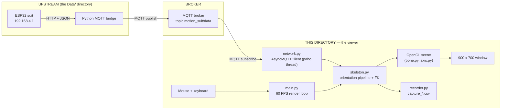
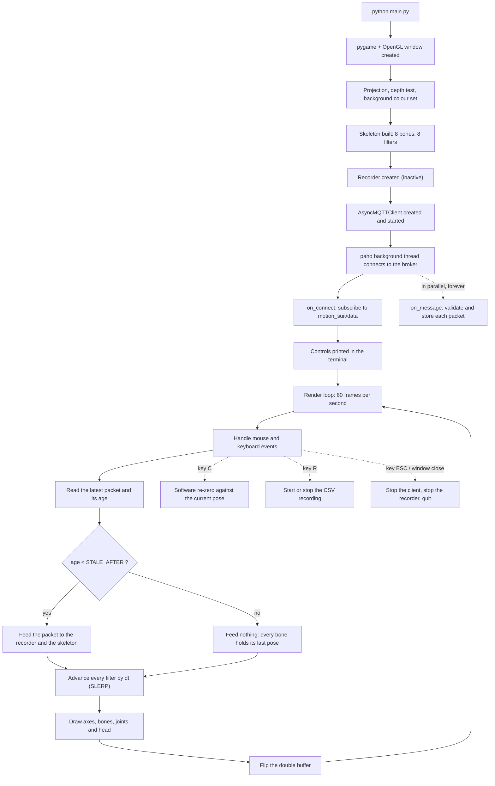
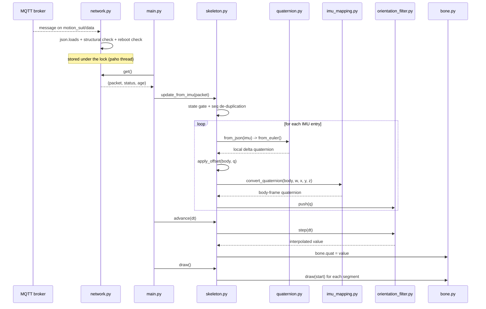
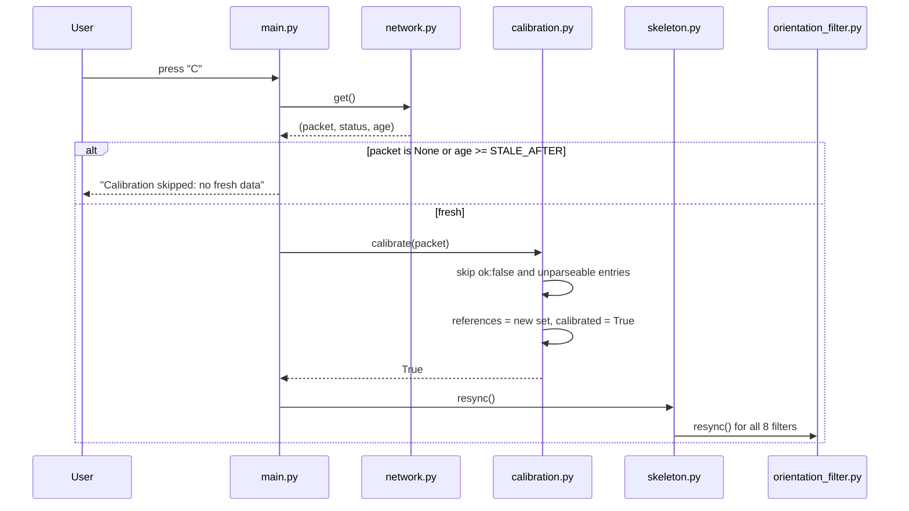
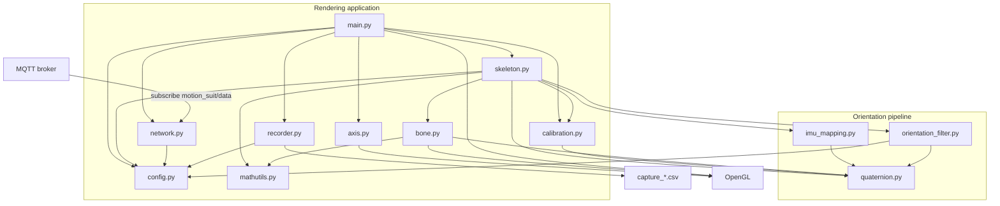
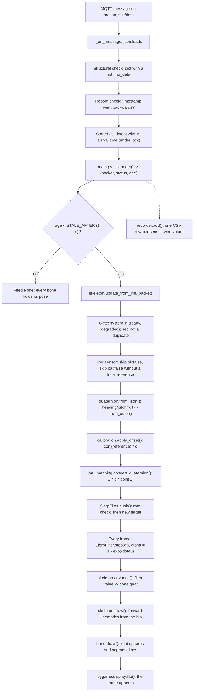
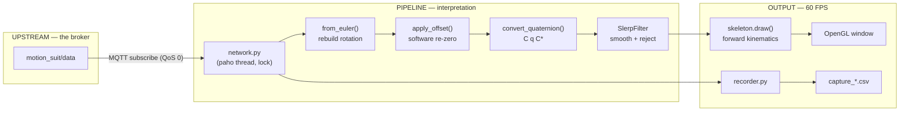

# 3D Model — V4
### Wearable Motion Suit — MQTT Client + 3D Skeleton Viewer

---

## Table of Contents

1. [Project Overview](#1-project-overview)
2. [Global Workflow](#2-global-workflow)
3. [Folder Structure](#3-folder-structure)
4. [File Explanation](#4-file-explanation)
5. [Communication Between Files](#5-communication-between-files)
6. [Execution Flow](#6-execution-flow)
7. [Data Flow](#7-data-flow)
8. [Initialization](#8-initialization)
9. [Runtime](#9-runtime)
10. [Communication Protocols](#10-communication-protocols)
11. [Algorithms](#11-algorithms)
12. [Error Handling](#12-error-handling)
13. [Configuration](#13-configuration)
14. [Architecture Summary](#14-architecture-summary)

---

## 1. Project Overview

### What the project is

This directory is the **display half** of the motion-capture system: it turns
the stream of numbers coming off the suit into an **articulated 3D skeleton**
that moves on screen in real time, and it can record a session to a
spreadsheet file.

It does **not** talk to the suit. It subscribes to a **message broker**, where
another program (the bridge in `Data/Python_MQTT_Bridge/`) publishes the
suit's measurements. From those measurements it reconstructs the rotation of
each body segment, re-expresses it around the axes of the body, smooths it,
and draws a stick figure with a head, a spine, two arms and two hands.

The user can orbit and zoom the camera, re-zero the pose against a held
T-pose, and start or stop a CSV recording.

### Why it exists

The suit produces numbers that are correct but not directly usable:

- each sensor reports its rotation in **its own frame**, which depends on how
  the chip happens to be sewn onto the fabric;
- packets arrive at the **bridge's rate**, not the screen's rate, so drawing
  them raw would look stepped;
- a single corrupted packet would make a limb jump;
- and a stream of angles tells you nothing about whether the *pose* is right.

This directory exists to solve all four: it applies a per-sensor **mounting
correction**, interpolates between packets, rejects implausible jumps, and
renders the result as a body you can actually look at. It is both the
demonstration surface for the whole project and the debugging tool that makes
sensor problems visible.

### Global objective

> Subscribe to the suit's MQTT topic, rebuild each sensor's rotation from the
> transmitted Euler angles, re-express it around body axes, smooth it into a
> continuous 60 FPS animation of an articulated skeleton, and optionally
> record the raw stream to CSV.

### Hardware involved

This program runs entirely on a normal computer. The only hardware it touches
directly is the display and the input devices; everything about the suit
reaches it as text over the network. A few one-line definitions, because the
rest of the document relies on them:

- **Quaternion** — a compact four-number description of a rotation. It is the
  program's internal representation everywhere, because rotations can be
  composed and interpolated with it without special cases.
- **Euler angles** — the same rotation expressed as three angles
  (`heading`, `pitch`, `roll`). This is what arrives on the wire; the program
  converts it back to a quaternion immediately.
- **SLERP (spherical linear interpolation)** — the correct way to blend two
  rotations: it follows the shortest arc on the sphere rather than averaging
  four numbers naively.
- **Forward kinematics** — computing where the end of a chain of segments ends
  up, by starting at the root and applying each segment's rotation and length
  in turn.
- **Broker** — the MQTT server in the middle; publishers send to it,
  subscribers receive from it.

What the program actually requires:

| Part | Quantity | Role |
|---|---|---|
| **Host computer** | 1 | Runs the viewer. Needs an OpenGL-capable graphics stack for `PyOpenGL`. |
| **Display window** | 1 | A 900 × 700 double-buffered OpenGL window created by `pygame`. |
| **Mouse** | 1 | Left-drag orbits the camera; the scroll wheel zooms. |
| **Keyboard** | 1 | `C` re-zeroes, `R` toggles recording, `ESC` exits. |
| **Network route to the broker** | 1 | The only link to the suit's data. No connection to the suit itself is needed. |

> The viewer never opens a connection to `192.168.4.1`. It is deliberately one
> step removed from the suit, which is what allows several viewers — or a
> viewer and a recorder and a sound engine — to run at once.

### Software involved

Unlike the acquisition side, this directory is **one program**, built from
twelve Python modules with one clear job each:

1. **The acquisition and orientation pipeline** — `config.py`, `network.py`,
   `quaternion.py`, `calibration.py`, `imu_mapping.py` and
   `orientation_filter.py`. These turn broker messages into clean,
   body-referenced rotations.

2. **The rendering application** — `mathutils.py`, `bone.py`, `axis.py`,
   `skeleton.py`, `recorder.py` and `main.py`. These turn rotations into
   geometry, pixels and CSV rows.

### High-level architecture

The picture below shows the whole system at a glance. Read it left to right:
the suit and the bridge live upstream, the broker is the boundary, and
everything to its right is this directory.



The single most important idea to take away:

> Packets arrive at the **bridge's rate** (about 10 per second) but the screen
> is redrawn at **60 frames per second**. The two rates are decoupled by a
> filter: each new packet sets a *target* orientation, and every frame the
> displayed orientation moves a fraction of the way toward it. That is why the
> motion looks continuous rather than stepped, and why data loss makes the
> figure **hold its pose** instead of snapping back.

Each of those words — MQTT, JSON, SLERP — is explained in
[Section 10](#10-communication-protocols) and
[Section 11](#11-algorithms).

---

## 2. Global Workflow

This section describes the **complete lifecycle** of the program, from
launching it to seeing a moving skeleton.



In words:

1. **Launch.** The window, the OpenGL state, the skeleton and the recorder are
   created.
2. **Subscribe.** The MQTT client starts its own background thread and
   connects; the subscription is made from the connect callback, so it
   survives every later reconnection.
3. **Render loop.** Sixty times a second the program handles input, reads the
   most recent packet, updates the skeleton and redraws the scene.
4. **Freshness gate.** A packet older than `STALE_AFTER` (1 second) is treated
   as absent: the skeleton is fed nothing and keeps its last pose while the
   window title changes to `STALE`.
5. **Continuous smoothing.** Whether or not a packet arrived this frame, every
   filter is advanced by the frame's elapsed time, so the motion stays smooth
   between packets.
6. **User actions.** At any time the camera can be orbited or zoomed, the pose
   re-zeroed with `C`, and a CSV recording started or stopped with `R`.
7. **Exit.** `ESC` or closing the window stops the MQTT client, closes any open
   recording and shuts pygame down.

> Note: **the viewer is a pure consumer.** It publishes nothing, and it has no
> way to command the suit — not even to trigger the firmware's own T-pose
> calibration, which is an HTTP request the bridge's side of the system owns.
> The `C` key performs a *software* re-zero that lives entirely in this
> program.

---

## 3. Folder Structure

The `Visual` folder contains one Python application plus this documentation.

```
Visual/
├── main.py                 ← entry point and 60 FPS render loop
├── network.py              ← MQTT subscriber (background thread)
├── config.py               ← all tunable constants
├── quaternion.py           ← rotation mathematics
├── calibration.py          ← software T-pose re-zero
├── imu_mapping.py          ← per-sensor mounting corrections
├── orientation_filter.py   ← SLERP smoothing and jump rejection
├── skeleton.py             ← body model, pipeline driver, forward kinematics
├── bone.py                 ← one rigid segment (kinematics + drawing)
├── axis.py                 ← world axis gizmo
├── mathutils.py            ← 3D vector helpers
├── recorder.py             ← CSV session recorder
├── requirements.txt        ← the three dependencies
├── __pycache__/            ← auto-generated bytecode
├── _avast_/                ← empty, not part of the application
├── example.md              ← the documentation template
└── README.md               ← this document
```

### The acquisition and orientation pipeline

**Purpose.** Turn broker messages into clean, body-referenced, smoothed
rotations.

**Contents.** `config.py`, `network.py`, `quaternion.py`, `calibration.py`,
`imu_mapping.py` and `orientation_filter.py`.

**Interaction.** These modules never draw anything and never import OpenGL.
They are driven from `skeleton.py`, which calls them in a fixed order for every
sensor of every packet. `quaternion.py` is the shared foundation: every other
module in this group depends on it.

### The rendering application

**Purpose.** Turn rotations into geometry on screen, and optionally into rows
in a file.

**Contents.** `mathutils.py`, `bone.py`, `axis.py`, `skeleton.py`,
`recorder.py` and `main.py`.

**Interaction.** `main.py` owns the loop and the window; `skeleton.py` owns the
body model and is the only bridge between the two groups; `bone.py` and
`axis.py` are the only modules that issue OpenGL calls besides `main.py`
itself.

---

## 4. File Explanation

This is the heart of the document. For **every important file** we explain:
*why it exists*, *what it is responsible for*, its *main functions*, its
*dependencies*, its *inputs and outputs*, and *how it talks to the other
files*.

The two groups are described separately.

### 4.A — The acquisition and orientation pipeline

#### `config.py` — all the settings in one place

**Why it exists.** So that every adjustable number — the proportions of the
body, the broker address, how hard the filter smooths — lives in a *single,
easy-to-find file*. Nothing here "does" anything; it only defines constants.

**Responsibilities.** Describe the body model, the network and the filtering
behaviour to the rest of the program.

**Main contents.**

- **Skeleton proportions** — `TORSO_LENGTH`, `LOWER_BACK_LENGTH`,
  `UPPER_ARM_LENGTH`, `FOREARM_LENGTH`, `HAND_LENGTH`, `HEAD_RADIUS` and
  `SHOULDER_OFFSET`, all in scene units.
- **Network** — `MQTT_BROKER_HOST`, `MQTT_BROKER_PORT`, `MQTT_TOPIC`,
  `MQTT_QOS`, `MQTT_KEEPALIVE_S`, the two reconnect bounds, and
  `STALE_AFTER`.
- **Filtering** — `FILTER_TIME_CONSTANT`, `FILTER_MAX_RATE_DPS` and
  `FILTER_MAX_REJECTS`.
- **Recording** — `RECORDER_FLUSH_PERIOD_S`.

**Interaction.** Imported by `network.py`, `orientation_filter.py`,
`skeleton.py`, `recorder.py` and `main.py`. All configurable parameters are
listed in [Section 13](#13-configuration).

> The three network constants must match the bridge's. `MQTT_BROKER_HOST`,
> `MQTT_BROKER_PORT` and `MQTT_TOPIC` here correspond exactly to the same three
> names in `Data/Python_MQTT_Bridge/main.py`; if they disagree, the viewer
> connects successfully and simply never receives anything.

#### `network.py` — the only file that talks to the broker

**Why it exists.** To concentrate **all network traffic** in one place, and to
keep it off the render thread. Every message from the broker passes through
here, so the rest of the program only ever sees a plain Python dictionary.

**Responsibilities.** Maintain the MQTT connection, validate incoming
payloads, keep the newest one available, and report the link's health.

**Main class — `AsyncMQTTClient`.**

- `__init__(host, port, topic)` — stores the endpoint, creates the lock that
  guards the shared state (`_latest`, `_status`, `_reboot_pending`,
  `_last_timestamp`, `_last_success`) and builds the paho client.
- `_create_client()` — a paho client using the v2 callback API and MQTT 3.1.1
  with an **empty client id**, so the broker assigns a unique one and several
  viewers never kick each other off the topic. Reconnect backoff is bounded
  between `MQTT_RECONNECT_MIN_S` and `MQTT_RECONNECT_MAX_S`.
- `_on_connect(...)` — **subscribes from inside the callback**. Doing it here
  rather than once at start-up is what makes the subscription survive every
  reconnection.
- `_on_disconnect(...)` — sets the status to `ERROR` but deliberately **keeps
  the last packet**, so `get()` keeps returning it with a growing age and the
  caller can hold the last pose.
- `_on_message(...)` — runs on paho's thread. Parses the payload, requires it
  to be a dictionary whose `imu_data` is a list, compares its `timestamp`
  against the previous one to detect a **reboot** (a timestamp that went
  backwards), then stores the packet, the status and the arrival time under
  the lock.
- `start()` — `connect_async()` + `loop_start()`, so start-up never blocks on
  an absent broker.
- `get()` — returns the triple `(latest_packet, status, age_in_seconds)`. Age
  is `inf` until the first successful message.
- `take_reboot()` — returns `True` exactly once after a reboot was detected,
  then clears the flag.
- `stop()` — disconnects and stops the network thread.

**Module constants.** `OK`, `ERROR` and `REBOOT`, the three status values.

**Inputs.** MQTT messages on `MQTT_TOPIC`.

**Outputs.** The latest validated packet, a status, and its age.

**Interaction.** Instantiated once by `main.py`; polled once per frame. It is
the only module in the program that imports `paho.mqtt`.

> Everything in this class exists to keep the render loop non-blocking. paho
> owns a thread; the render loop owns the screen; the lock is the only place
> they meet.

#### `quaternion.py` — the rotation mathematics

**Why it exists.** Rotations are composed, compared, interpolated and
converted all over the pipeline. All of that lives in one dependency-free
module built on `math` alone.

**Responsibilities.** Provide correct quaternion algebra, the Euler
conversions that match the firmware exactly, and the validity checks that keep
corrupt data out.

**Main functions.**

- `identity()`, `normalize(q)`, `conjugate(q)`, `multiply(a, b)`,
  `rotate_vector(q, v)`, `dot(a, b)`, `negate(q)` — the algebraic core.
- `delta_local(current, reference)` — returns `conj(reference) * current`: the
  rotation since the reference, expressed **in the reference's own frame**.
  The docstring records why: a world-frame delta would make the displayed
  rotation axes depend on which way the wearer happened to be facing during
  calibration.
- `to_euler(q)` — converts to the aerospace Z-Y-X triplet in degrees, using
  formulas identical to the firmware's `quatToEuler()`.
- `from_euler(heading, pitch, roll)` — the exact inverse: it rebuilds the very
  quaternion the firmware derived the transmitted angles from, up to the
  double cover and the wire format's two decimal places.
- `same_hemisphere(q, reference)` — returns `q` or `-q`, whichever is on the
  same side as the reference. Because `q` and `-q` are the same rotation,
  skipping this would make interpolation take "the long way around".
- `angle_between(a, b)` — the shortest rotation angle between two quaternions,
  in degrees. This is what the filter's rate check measures.
- `slerp(a, b, t)` — spherical linear interpolation, handling the double cover
  and falling back to a normalised linear blend when the two are nearly
  parallel (`dot > 0.9995`) and the trigonometry would be ill-conditioned.
- `is_valid(q)` — rejects `None`, wrong lengths, non-finite components and
  near-zero norms.
- `is_valid_euler(heading, pitch, roll)` — rejects non-finite values and
  absurd magnitudes, using deliberately loose bounds (`_EULER_YAW_LIMIT_DEG`
  360, `_EULER_PITCH_LIMIT_DEG` 180) so that a differently wrapped but
  perfectly valid heading is never dropped.
- `from_json(imu)` — the entry point from the wire: reads `heading`, `pitch`
  and `roll` from one IMU object, validates them, and returns the rebuilt
  quaternion — or **`None`** when anything is missing or implausible, so the
  caller can skip the sample instead of snapping the bone back to the T-pose.

**Inputs.** One IMU dictionary, or raw quaternions from the other modules.

**Outputs.** Quaternions as 4-tuples `(w, x, y, z)`.

**Interaction.** Imported by `calibration.py`, `imu_mapping.py`,
`orientation_filter.py`, `bone.py` and `skeleton.py`. It imports nothing from
the project.

#### `calibration.py` — the software T-pose re-zero

**Why it exists.** The firmware captures its own T-pose reference, but that
reference can be missing (a sensor that was not calibrated) or simply wrong
for the moment (the wearer has shifted). This module lets the operator capture
a new reference from the viewer, with one keystroke.

**Responsibilities.** Store one reference quaternion per body segment and
express later measurements relative to it.

**Main functions.**

- `_to_body_dict(data)` — accepts either a raw packet containing an `imu_data`
  list or an already body-indexed dictionary, and always returns a dictionary
  keyed by body name. This is what lets `calibrate()` be called with whatever
  the caller happens to hold.
- `calibrate(data)` — builds a fresh reference set: for every segment it skips
  sensors the firmware flagged `ok: false`, rebuilds the quaternion with
  `quat.from_json()`, and skips it if that returns `None`. If nothing valid
  remains it prints `Calibration skipped: no valid orientation data` and
  returns `False` **without touching the existing references**. Otherwise it
  replaces them wholesale, sets the `calibrated` flag and reports how many
  sensors were re-zeroed.
- `has_reference(body)` — whether a software reference exists for a segment.
  This is what lets the caller distinguish a sensor the firmware could not
  zero but that was re-zeroed here, from one with no reference at all.
- `apply_offset(body, q)` — returns `quat.delta_local(q, reference)`, the
  same local-delta convention the firmware uses, so the two calibrations
  **compose exactly**. Returns `q` unchanged when there is no reference.

**Module state.** `references` (a dict) and `calibrated` (a bool), both
module-level globals — the calibration is a property of the session, not of
any one object.

**Inputs.** A full packet, at the moment the user presses `C`.

**Outputs.** One reference quaternion per segment.

**Interaction.** `calibrate()` is called from `main.py`'s key handler;
`apply_offset()` and `has_reference()` are called from `skeleton.py` on every
sample.

#### `imu_mapping.py` — where each sensor is mounted on the body

**Why it exists.** A sensor's rotation is measured around **its own** axes,
which depend on how it is physically oriented on the limb. Two sensors on the
two arms are mounted mirror-imaged, so the same physical gesture produces
different numbers. This module re-expresses every rotation around **body**
axes, so the skeleton bends the way the wearer does.

**Responsibilities.** Define the display coordinate system, hold the per-sensor
mounting table, and apply the correction.

**Main contents and functions.**

- The six unit vectors `RIGHT`, `LEFT`, `UP`, `DOWN`, `BACK`, `FORWARD`,
  defining the OpenGL display frame: `+X` right, `+Y` up, `+Z` toward the
  viewer.
- `_quat_from_matrix(m)` — converts a 3 × 3 rotation matrix into a quaternion
  using Shepperd's method: the branch is chosen from the largest diagonal term
  so the square root is never taken of a near-zero value.
- `_mount_correction(x_to, y_to, z_to)` — builds the correction quaternion
  `C` from a statement of **where each sensor axis points on the body while
  the wearer holds the T-pose**. The three arguments become the columns of the
  matrix.
- `MOUNT_CORRECTION` — the table itself, one entry per body segment. The two
  back sensors differ from each other, and the left-side and right-side limb
  sensors are mirrored: `left_*` use `(FORWARD, LEFT, UP)` and `right_*` use
  `(BACK, RIGHT, UP)`. **This is the table to edit when a sensor is
  remounted.**
- `WORLD_ALIGN` and `_WORLD_ALIGN_ACTIVE` — an optional global re-orientation
  of the whole figure. `WORLD_ALIGN` is currently the identity, so
  `_WORLD_ALIGN_ACTIVE` is `False` and the extra transform is skipped
  entirely.
- `convert_quaternion(body, w, x, y, z)` — normalises the incoming local
  delta, applies `C · q · conj(C)`, optionally applies the world alignment,
  and normalises again.

**Inputs.** A local delta quaternion and the segment it belongs to.

**Outputs.** The same physical rotation, expressed around body axes.

**Interaction.** Called by `skeleton.py`, once per sensor per packet, after the
software offset and before the filter.

> The correction is a **similarity transform** (`C · q · C*`), not a plain
> multiplication. That distinction matters: it changes the *axes* the rotation
> is measured around without changing the rotation itself, which is exactly
> what "the sensor is glued on sideways" requires.

#### `orientation_filter.py` — smoothing and glitch rejection

**Why it exists.** Packets arrive roughly ten times a second; the screen
redraws sixty times a second. Something has to fill the gap, and it has to do
so without letting one corrupt packet throw a limb across the screen.

**Responsibilities.** Define the filter interface, and provide the SLERP
implementation the skeleton actually uses.

**Main classes and functions.**

- `OrientationFilter` — the abstract interface: `push(q)`, `step(dt)`, the
  `value` property and `resync()`, each raising `NotImplementedError`. It
  exists so that `Skeleton` never depends on the filtering algorithm.
- `SlerpFilter(time_constant, max_rate_dps, max_rejects)` — the
  implementation. It keeps a `_value` (what is displayed), a `_target` (the
  last accepted measurement), `_time_since_valid`, a `_rejects` counter and
  `_last_raw`.
  - `push(q)` — validates and normalises the sample. The **first** accepted
    sample initialises both value and target directly. Later samples are first
    hemisphere-aligned to the target, then rate-checked: the angular change is
    compared against `max_rate_dps × dt`. An excessive change is rejected —
    *unless* it is **confirmed** by agreeing with the previous raw sample,
    in which case it is accepted immediately, or unless `max_rejects`
    consecutive rejections have already happened, in which case the filter
    gives in and follows.
  - `step(dt)` — advances `_time_since_valid`, then moves `_value` toward
    `_target` by `alpha = 1 - exp(-dt / time_constant)`. That formula makes the
    smoothing **frame-rate independent**: a longer frame moves proportionally
    further.
  - `resync()` — clears the initialised flag so the next accepted sample is
    adopted instantly, with no interpolation.
- `make_filter()` — builds a `SlerpFilter` from the three `config.py` values.

**Inputs.** One body-frame quaternion per sensor per packet.

**Outputs.** A continuously interpolated quaternion, read once per frame.

**Interaction.** `Skeleton` creates one filter per bone with `make_filter()`,
pushes into them from `update_from_imu()` and steps them from `advance()`.

> The "confirmation" rule is the interesting part. Real motion is continuous,
> so a genuinely fast move agrees with itself one packet later; an isolated
> glitch never does. Without it, every fast intentional movement lagged up to
> `max_rejects` frames behind.

### 4.B — The rendering application

#### `mathutils.py` — 3D vector helpers

**Why it exists.** Forward kinematics needs to add vectors and scale them.
Rather than pull in a numeric library for two operations on 3-tuples, they are
written out here.

**Main functions.**

- `add(a, b)` — component-wise addition of two 3-tuples.
- `scale(v, s)` — multiplication of a 3-tuple by a scalar.

**Interaction.** Used by `bone.py` (to build a bone's end point) and
`skeleton.py` (to place the shoulders and the head).

#### `bone.py` — one rigid body segment

**Why it exists.** Every limb behaves the same way: it has a length, a rest
direction, and a current rotation, and it must be able to say where it ends and
to draw itself. That common behaviour is one class.

**Responsibilities.** Store one segment's geometry and orientation, and provide
its kinematics and rendering.

**Main class — `Bone`.**

- `__init__(length, direction=(0, 1, 0))` — stores the length and the rest
  direction in the T-pose, and initialises the orientation to the identity
  quaternion.
- `vector()` — rotates the rest direction by the current quaternion and scales
  it by the length, giving the segment as a vector.
- `end_position(start)` — the start point plus that vector. This is the single
  operation that makes a kinematic chain possible.
- `draw(start)` — draws a small blue sphere at the joint and a thick yellow
  line from `start` to `end_position(start)`, then restores the colour to
  white.

**Module helper.** `_joint_quadric()` creates the OpenGL quadric object on
first use and reuses it for every joint, avoiding an allocation per bone per
frame.

**Inputs.** A start position and, indirectly, the filtered quaternion assigned
by `Skeleton`.

**Outputs.** An end position, and OpenGL geometry.

**Interaction.** Eight instances are owned by `Skeleton`.

#### `axis.py` — the world axis gizmo

**Why it exists.** Without a fixed visual reference it is impossible to tell
whether the figure is rotating or the camera is. Three coloured axes at the
origin solve that.

**Main function.**

- `draw_axis(length=0.5)` — draws three lines from the world origin: red along
  `+X`, green along `+Y`, blue along `+Z`, then restores the colour to white.

**Interaction.** Called once per frame by `main.py`, before the skeleton.

#### `skeleton.py` — the body model and the pipeline driver

**Why it exists.** This is where the anatomy lives: which segments exist, how
they connect, and what has to happen to a packet before it can move one of
them. It is the only module that touches both halves of the program.

**Responsibilities.** Own the eight bones and their filters, run every incoming
sample through the orientation pipeline, and perform the forward-kinematic
traversal that draws the figure.

**Main class — `Skeleton`.**

- `__init__()` — creates the eight bones with their lengths from `config.py`
  and their rest directions (`_UP` for the two spine segments, `_LEFT` for the
  left limbs, `_RIGHT` for the right ones), builds the `bones` lookup table
  keyed by wire name, creates one filter per bone with `make_filter()`, and
  resets the duplicate-frame tracker `_last_seq`.
- `update_from_imu(data)` — the pipeline. It rejects anything that is not a
  dictionary with a list `imu_data`; it **drops packets whose `system` is not
  `ready` or `degraded`** (so a booting, calibrating or failed suit cannot
  drive the figure); it skips a packet whose `seq` equals the last one, since
  the render loop runs faster than packets arrive. Then, for each entry: skip
  if `ok` is `false`; skip if `cal` is `false` **and** no software reference
  exists for that segment; rebuild the quaternion with `from_json()` and skip
  if that returns `None`; apply the software offset; convert to the body frame;
  push into the segment's filter.
- `advance(dt)` — steps every filter by the frame time and copies each result
  into the matching bone. A segment that received no sample this frame simply
  keeps converging toward its old target.
- `draw()` — the forward-kinematic traversal. It starts at `_HIP`, draws the
  lower back and takes its end as the upper-back start, draws the upper back
  and takes its end as the neck. The two shoulders are the neck offset by
  ±`SHOULDER_OFFSET` **rotated by the torso quaternion**, so the arms follow
  the chest. Each arm is then a chain: shoulder → elbow → wrist → hand.
- `draw_head(neck, torso_quat)` — places a sphere above the neck, offset along
  the torso's own up direction so the head leans with the body.
- `resync()` — clears `_last_seq` and resyncs every filter, so the next sample
  is adopted instantly. Used after a manual calibration and after a detected
  reboot.

**Module constants.** `_UP`, `_LEFT`, `_RIGHT` (rest directions), `_HIP` (the
root position), and `_RENDERABLE_STATES = ("ready", "degraded")`.

**Inputs.** One packet per frame (or `None`), and the frame's elapsed time.

**Outputs.** OpenGL geometry, and the bone orientations themselves.

**Interaction.** It is the sole consumer of `calibration.py`, `imu_mapping.py`
and `orientation_filter.py`, and the sole owner of the `Bone` instances. It is
driven entirely by `main.py`.

> Note the order: **software offset first, mounting correction second, filter
> third.** The offset must be applied while the rotation is still in the
> sensor's frame, because that is the frame both it and the mounting table are
> defined in. Filtering last means the smoothing operates on what will actually
> be displayed.

#### `recorder.py` — the CSV session recorder

**Why it exists.** To capture a session for later analysis without adding a
second consumer to the broker: whatever is on screen can also be written to a
file.

**Responsibilities.** Open a timestamped CSV file, write one row per sensor per
distinct frame, and close it cleanly.

**Main class — `Recorder`.**

- `__init__()` — creates an inactive recorder with its file handle, writer,
  lock, `_last_seq` and `_last_flush`.
- `start()` — builds the filename `capture_%Y%m%d_%H%M%S.csv` from the local
  time, opens it (reporting an `OSError` and giving up rather than raising),
  writes the header row `seq, timestamp, body, ok, cal, heading, pitch, roll`,
  and enables recording.
- `add(data)` — ignores anything when not recording, and ignores non-dicts,
  packets without a list `imu_data`, and duplicates of the last `seq`. For each
  IMU entry it writes the wire values straight through, using `.get(...)` with
  an empty-string default so a missing field never raises. It flushes at most
  once per `RECORDER_FLUSH_PERIOD_S`.
- `stop()` — closes the file, clears the writer and reports, under the lock;
  does nothing if no recording was active.

**Inputs.** The same packets the skeleton receives.

**Outputs.** A CSV file in the working directory.

**Interaction.** Created and toggled by `main.py`; independent of the skeleton
and of the orientation pipeline entirely — it records the **wire format**, not
the processed pose.

> The columns deliberately mirror the wire format, including the `ok` and `cal`
> flags. A recording therefore preserves the distinction between a
> T-pose-relative reading and an absolute one, which a file of processed angles
> would have thrown away.

#### `main.py` — the conductor

**Why it exists.** To **tie everything together** and run the render loop. It
is the file you actually launch.

**Responsibilities.** Create the window and the OpenGL state, own the camera,
handle input, drive the skeleton and the recorder once per frame, and clean up
on exit.

**Main functions.**

- `run_opengl()` — everything. Initialises pygame and a 900 × 700
  double-buffered OpenGL window, sets the perspective projection, enables depth
  testing and the background colour, builds the `Skeleton`, the `Recorder` and
  the `AsyncMQTTClient`, starts the client, prints the controls, and enters the
  loop.
- `_print_controls()` — prints the mouse and keyboard summary at start-up.

**What the loop does, in order.**

1. `dt = clock.tick(60) / 1000.0` — cap the frame rate at 60 FPS and measure
   the real elapsed time.
2. Handle events: window close; left-button drag to orbit; wheel to zoom,
   clamped between `MIN_DISTANCE` and `MAX_DISTANCE`; `C` to re-zero; `R` to
   toggle recording; `ESC` to exit.
3. Rebuild the model-view matrix from the camera distance and the two orbit
   angles, then clear the colour and depth buffers.
4. `client.get()` for the latest packet and its age, and `client.take_reboot()`
   — a detected reboot prints a notice and resyncs the skeleton.
5. Compute freshness (`age < STALE_AFTER`) and update the window title only
   when the status string actually changes: `LIVE (state)`, `STALE - holding
   last pose` or `DISCONNECTED`, with ` | REC` appended while recording.
6. Feed the packet — **or `None` when it is stale** — to the recorder and the
   skeleton, then `skeleton.advance(dt)`.
7. Draw the axes and the skeleton, then flip the double buffer.

On exit it stops the client, stops the recorder and calls `pygame.quit()`.

**Module constants.** `WINDOW_SIZE`, `AUTO_START_RECORDING`,
`CAMERA_DISTANCE`, `CAMERA_ROT_X`, `CAMERA_ROT_Y`, `ORBIT_SPEED`,
`ZOOM_SPEED`, `MIN_DISTANCE`, `MAX_DISTANCE` and `BASE_CAPTION`.

**Inputs.** Your mouse and keyboard, and the packets from the broker.

**Outputs.** The rendered window, the window title, terminal messages and —
when enabled — the CSV file.

**Interaction.** It imports from `axis.py`, `calibration.py`, `network.py`,
`skeleton.py`, `recorder.py` and `config.py`. It is the top of the dependency
chain.

> The very first two lines set `OpenGL.ERROR_CHECKING = False` **before**
> importing `OpenGL.GL`. PyOpenGL otherwise checks for an error after every
> single GL call, which is a measurable cost in a loop that issues hundreds of
> them per frame.

---

## 5. Communication Between Files

The clearest way to understand the architecture is to read it as a
**conversation**. Below are the two main conversations that happen in this
program.

### Conversation 1 — "A new packet arrived"

> **Broker:** *(delivers a message on `motion_suit/data`)*
> **`network.py` (`_on_message`, on paho's thread):** "It parses, it is an
> object, and `imu_data` is a list. The timestamp did not go backwards.
> Storing it as the latest, under the lock."
> **`main.py`:** *(next frame)* "What is the latest?" *(Calls `client.get()`.)*
> **`network.py`:** "Here it is, and it is 40 ms old."
> **`main.py`:** "Younger than `STALE_AFTER`, so it is fresh. Recorder, take
> it. Skeleton, take it."
> **`skeleton.py` (`update_from_imu`):** "`system` is `ready`, and `seq` is new.
> For each sensor: `ok` is true, and `cal` is true, so I can use it."
> **`quaternion.py` (`from_json`):** "`heading`, `pitch`, `roll` are finite and
> plausible — rebuilding the delta quaternion with `from_euler()`."
> **`calibration.py` (`apply_offset`):** "No software reference for this
> segment, so unchanged." *(Or `conj(ref) · q` if there is one.)*
> **`imu_mapping.py` (`convert_quaternion`):** "Applying this segment's
> mounting correction: `C · q · conj(C)`."
> **`orientation_filter.py` (`push`):** "The change is within the rate limit —
> accepted. This is my new target."
> **`main.py`:** "Now advance everything by this frame's `dt`."
> **`orientation_filter.py` (`step`):** "Moving the displayed value a fraction
> of the way toward the target with SLERP."
> **`skeleton.py` (`advance` then `draw`):** "Copying each filter's value into
> its bone, then walking hip → spine → neck → shoulders → arms → hands and
> drawing."

As a diagram:



### Conversation 2 — "Re-zero the pose"

> **You:** *(press the `C` key)*
> **`main.py`:** "A key event. First, is the data fresh?" *(Calls
> `client.get()` and checks the age.)*
> **`main.py`:** "It is 60 ms old, so yes. Re-zeroing on a stale packet would
> store an outdated pose as the reference."
> **`calibration.py` (`calibrate`):** "Converting the packet to a body-indexed
> dictionary. For each segment: `ok` is not false, and `from_json` returned a
> quaternion — storing it as this segment's reference."
> **`calibration.py`:** "8 sensors re-zeroed. `calibrated` is now true."
> **`main.py`:** "Calibration succeeded, so resync the filters."
> **`skeleton.py` (`resync`):** "Clearing `_last_seq` and resyncing all eight
> filters — the next sample is adopted instantly instead of being interpolated
> from the old pose."
> **`skeleton.py`:** *(next packet)* "`apply_offset` now returns
> `conj(reference) · q` for every segment: the held pose reads as the
> identity, and the figure stands in the T-pose."



### The dependency map

This diagram shows which file *uses* which. An arrow means "depends on /
calls".



---

## 6. Execution Flow

This section follows the program **from launch until it is closed**, in order.
Two lines of execution run at the same time.

### In the render thread (the main thread)

1. **Launch.** `python main.py` calls `run_opengl()`.
2. `pygame.init()`, then a 900 × 700 window with `DOUBLEBUF | OPENGL` and the
   base caption.
3. The projection matrix is set with `gluPerspective(45, aspect, 0.1, 50)`,
   depth testing is enabled and the dark background colour is set.
4. `Skeleton()` builds eight bones and eight filters; `Recorder()` is created
   inactive; `AsyncMQTTClient()` is created and `start()`ed.
5. `AUTO_START_RECORDING` is checked — it is `False`, so no recording begins.
6. The camera state and the mouse-drag state are initialised;
   `_print_controls()` prints the help.
7. **Render loop, 60 times per second:** tick the clock for `dt`, drain the
   event queue, rebuild the model-view matrix, clear the buffers, read the
   latest packet, gate it on freshness, feed the recorder and the skeleton,
   advance the filters, draw the axes and the figure, flip the buffer.
8. **Exit** on `ESC` or a window-close event: `client.stop()`,
   `recorder.stop()`, `pygame.quit()`.

### In the MQTT network thread (paho's own thread)

1. `start()` calls `connect_async()` and `loop_start()`; the thread is created
   immediately and start-up does not block on the broker being reachable.
2. The thread attempts the connection, retrying on its own with backoff
   between `MQTT_RECONNECT_MIN_S` and `MQTT_RECONNECT_MAX_S`.
3. On success, `_on_connect` subscribes to `MQTT_TOPIC` — from inside the
   callback, so the subscription is re-established after every reconnection.
4. For every message, `_on_message` parses it, validates its structure, checks
   the timestamp for a reboot, and stores it under the lock.
5. On an unexpected drop, `_on_disconnect` sets the status to `ERROR` and
   leaves the last packet in place, then paho reconnects by itself.
6. `stop()` disconnects and stops the thread when the window closes.

---

## 7. Data Flow

Here we **follow the numbers**, from a message on the broker to a line drawn on
screen, listing every transformation on the way.



Step by step:

1. A **message** arrives on the subscribed topic. It is the byte-for-byte JSON
   the ESP32 produced.
2. `_on_message` **parses** it and checks its shape. Anything malformed sets
   the status to `ERROR` and is discarded — it never reaches the pipeline.
3. The packet is **stored** with its arrival time, under the lock, on paho's
   thread.
4. On the next frame, the render thread **reads** it along with its age.
5. The **freshness gate** decides whether it is used at all. Older than one
   second and it is replaced by `None`, which every downstream consumer
   silently ignores.
6. `update_from_imu` applies the **packet-level gates**: the suit must be
   `ready` or `degraded`, and the `seq` must differ from the last one — since
   the loop runs about six times faster than packets arrive, most frames see a
   repeat.
7. Then the **per-sensor gates**: `ok: false` means the firmware could not read
   that sensor; `cal: false` with no software reference means its angles are
   absolute rather than T-pose-relative, and would swing the bone to an
   arbitrary pose.
8. `from_json` **rebuilds the quaternion** from the three transmitted angles,
   inverting exactly the conversion the firmware performed.
9. `apply_offset` optionally **re-zeroes** it against the pose captured with
   `C`, using the same local-delta convention, so the two calibrations compose.
10. `convert_quaternion` **re-expresses** the rotation around body axes with
    that sensor's mounting correction.
11. `push` **accepts or rejects** it, and on acceptance it becomes the filter's
    target.
12. Every frame, `step` moves the displayed value toward the target, `advance`
    copies it into the bone, and `draw` walks the chain from the hip to compute
    every joint position and render it.

The **recording** path branches at step 4: `recorder.add()` receives the same
packet and writes the raw wire values — `seq`, `timestamp`, `body`, `ok`,
`cal`, `heading`, `pitch`, `roll` — with none of steps 8 to 12 applied.

---

## 8. Initialization

"Initialization" is everything that must happen **before the program is ready
to do its real job**. There are two independent initializations.

### Viewer initialization (inside `run_opengl()`)

The order matters, because later steps depend on earlier ones:

1. **pygame and the window** first. The OpenGL context does not exist until
   `set_mode(..., DOUBLEBUF | OPENGL)` has run, so nothing may issue a GL call
   before this.
2. **The projection matrix**, set once on `GL_PROJECTION` before switching back
   to `GL_MODELVIEW`, where the loop rebuilds the camera every frame.
3. **Depth testing and the clear colour**, so nearer geometry hides farther
   geometry and the background is the intended dark grey.
4. **The `Skeleton`**, which builds the eight bones and, through
   `make_filter()`, the eight filters that read their parameters from
   `config.py`.
5. **The `Recorder`**, created inactive.
6. **The `AsyncMQTTClient`**, created and started — this is what spawns the
   second thread.
7. **Camera and input state**, then the controls help.

Only after all of these does the render loop begin.

### Client initialization (inside `AsyncMQTTClient`)

1. `__init__` stores the endpoint and creates the lock and the shared state,
   with `_latest = None`, `_status = ERROR` and `_last_success = None` — so
   `get()` correctly reports an infinite age before the first message.
2. `_create_client()` builds the paho client with the v2 callback API, an empty
   client id and bounded reconnect backoff, and registers the three callbacks.
3. `start()` guards against being called twice, then `connect_async()` and
   `loop_start()`.
4. The **subscription is not made here.** It happens in `_on_connect`, which is
   what makes it survive reconnections.

There is no sensor detection and no negotiation with the suit — the viewer
trusts the packet's own `ok`, `cal` and `system` fields.

---

## 9. Runtime

"Runtime" is the steady state: what repeats, how often, and what moves in and
out. There are **two loops** running in **two threads**.

### The render loop

```python
while running:
    dt = clock.tick(60) / 1000.0          # cap at 60 FPS, measure real dt

    for event in pygame.event.get():      # mouse, keyboard, window
        ...

    data, _, age = client.get()

    if client.take_reboot():
        skeleton.resync()

    fresh = data is not None and age < STALE_AFTER

    recorder.add(data if fresh else None)
    skeleton.update_from_imu(data if fresh else None)
    skeleton.advance(dt)

    draw_axis()
    skeleton.draw()
    pygame.display.flip()
```

**What repeats.** Handle input → read the latest packet → update the model →
draw → flip.

**How often.** Up to **60 times per second**; `clock.tick(60)` both caps the
rate and returns the true elapsed milliseconds, which is what makes the
smoothing frame-rate independent.

**What updates.** The camera matrix, the filter values, every bone's
quaternion, the window title (only when the status string changes) and the
frame buffer.

**What is transmitted / received.** Nothing is transmitted. It receives the
latest packet from the shared state — the same object repeatedly, most frames.

> Key insight: **the render loop never waits for data.** It reads whatever is
> there. A packet arriving between two frames is simply picked up by the next
> one, and no packet at all just means the filters keep converging toward their
> existing targets.

### The network thread

```python
client.connect_async(host, port, MQTT_KEEPALIVE_S)
client.loop_start()          # paho owns this thread from here on

def _on_message(self, client, userdata, message):     # runs for every message
    data = json.loads(message.payload)
    ...
    with self._lock:
        self._latest = data
        self._status = status
        self._last_success = time.monotonic()
```

**What repeats.** Reading the socket, answering keepalives, dispatching
callbacks and reconnecting when needed.

**How often.** Message-driven — in practice at the bridge's publish rate, about
**10 times per second**.

**What updates.** `_latest`, `_status`, `_last_timestamp`, `_reboot_pending`
and `_last_success`, all under the lock.

**What is transmitted / received.** It receives publications on
`motion_suit/data` and transmits only MQTT protocol traffic (the subscription
and keepalives).

### Threads (running two things at once)

The render loop must redraw sixty times a second. But messages arrive whenever
the broker sends them, and a socket read can block. Doing both in a single line
of execution would mean either a stuttering display or dropped messages, so
paho runs its network loop in a **separate thread** — a second worker running
*at the same time* as the render loop.

The two threads share exactly five variables, and every access to them — the
writes in `_on_message` and `_on_disconnect`, the reads in `get()` and
`take_reboot()` — is wrapped in the same `threading.Lock`. Because `get()`
returns the packet *and* its age together under that lock, the render thread
can never see a fresh age paired with a stale packet.

`Recorder` carries its own lock as well. In the current design only the render
thread calls it, so the lock is defensive rather than required, but it also
guarantees that `stop()` cannot close the file part-way through a batch of
rows.

---

## 10. Communication Protocols

A **protocol** is simply an agreed set of rules two parties use to exchange
information. This program sits at the receiving end of several layers. Here is
each one, and *why* it is used.

### Console output (stdout)

**What.** Plain text printed to the terminal that launched the program: the
controls banner, connection and disconnection notices, calibration results,
reboot notices and recording filenames.

**Why.** It is the developer's window into the program's state, for everything
that does not belong in a 3D scene. The *live* status is instead shown in the
window title, which is updated only when it changes so it does not flicker.

### MQTT (Message Queuing Telemetry Transport)

**What.** A publish/subscribe protocol over TCP. A **broker** sits in the
middle; publishers send messages tagged with a **topic**, and every client
subscribed to that topic receives them. This program is a pure **subscriber**.

**Why.** It removes any coupling to the suit. The viewer does not need to be on
the suit's Wi-Fi, does not need to know its address, and does not compete with
other consumers — several viewers can subscribe to the same topic at once. The
empty client id makes that literally true: the broker assigns each viewer a
unique identifier so they never evict one another.

**Version and settings.** MQTT 3.1.1 with paho's v2 callback API, a
`MQTT_KEEPALIVE_S` of 30 seconds, and reconnect backoff bounded between 1 and
30 seconds.

### The subscription topic (on top of MQTT)

**What.** The single topic `motion_suit/data`, subscribed at `MQTT_QOS` 0.

**Why.** QoS 0 is "at most once": nothing is queued or redelivered. For motion
data that is the right trade — a snapshot that arrives late is worse than one
that never arrives, and the next one is about 100 ms away. It also means a
subscriber that reconnects starts from live data rather than a backlog.

**Where it must match.** This topic, the broker host and the port are the
contract with `Data/Python_MQTT_Bridge/main.py`. A mismatch produces a
perfectly healthy connection that never delivers a message, and a window title
stuck on `DISCONNECTED`.

### TCP/IP to the broker

**What.** The transport MQTT runs over: a plain TCP connection to
`MQTT_BROKER_HOST` on `MQTT_BROKER_PORT` (1883, the standard unencrypted MQTT
port).

**Why.** MQTT needs an ordered, reliable byte stream, and TCP provides it. No
TLS and no authentication are configured, so the link is suitable for a local
network rather than the open internet.

### JSON (JavaScript Object Notation)

**What.** A lightweight **text** format for structured data. The viewer
consumes only part of what the suit sends; the fields it actually reads,
shortened to one sensor:

```json
{
  "seq": 15873,
  "timestamp": 1305435,
  "system": "ready",
  "imu_data": [
    { "body": "back_upper", "ok": true, "cal": true,
      "heading": 12.40, "pitch": -3.10, "roll": 0.75 }
  ]
}
```

**Why.** It is readable by humans *and* trivially converted into Python
dictionaries with `json.loads`. Everything else the firmware sends — the
vectors, the temperature, the calibration counters, the piezo section — is
carried through untouched and simply ignored here, which is what lets the wire
format grow without breaking the viewer.

**What each field is for.** `seq` suppresses duplicate frames; `timestamp`
detects reboots and is recorded to CSV; `system` gates whether the packet may
drive the figure at all; `body` selects the bone; `ok` and `cal` say whether
the reading is usable and whether it is T-pose-relative; the three angles are
the orientation itself.

### OpenGL (the rendering interface)

**What.** Not a network protocol, but the interface through which the program
talks to the graphics hardware. `pygame` creates the window and the context;
`PyOpenGL` issues the drawing commands.

**Why.** The scene is small — a few dozen lines and spheres — so the
straightforward immediate-mode calls (`glBegin`/`glEnd`, `gluSphere`,
`glRotatef`) are more than fast enough and keep the drawing code readable. The
matrix stack is used the classic way: the projection is set once, and the
model-view matrix is rebuilt from scratch every frame from the camera state.

### CSV (the recording output)

**What.** A comma-separated text file written with Python's `csv` module, named
`capture_YYYYMMDD_HHMMSS.csv` and created in the working directory.

**Why.** It is the lowest-friction format for later analysis: any spreadsheet
or analysis library reads it directly. The file is flushed at most once per
second rather than after every frame, because a flush is a system call and the
render thread is the one making it.

---

## 11. Algorithms

This program contains several noteworthy pieces of logic. They are explained
here in plain language, with the *intuition* rather than the mathematics.

### 1. Rebuilding the rotation from three angles

The suit transmits `heading`, `pitch` and `roll` rather than the quaternion it
derived them from. `from_euler()` is the **exact inverse** of the firmware's
`quatToEuler()`: it composes the same intrinsic Z-Y-X rotation
(`Rz(heading) · Ry(pitch) · Rx(roll)`) that produced the angles, and therefore
recovers the original quaternion — up to the double cover (`q` and `-q` are the
same rotation) and the two decimal places of the wire format.

The consequence is that the wire format changed but the *internal
representation did not*: everything downstream still operates on quaternions,
and the pipeline never touches Euler angles again.

### 2. The local-delta convention

Both the firmware and this program express "rotation since the reference" as
`conj(reference) · current`, not `current · conj(reference)`. The difference is
not cosmetic: the first form leaves the rotation axes in the **reference's own
frame**, the second puts them in the world frame.

That matters because the mounting corrections in `imu_mapping.py` describe
where each sensor axis points on the body *at calibration time*. Only the local
form produces a delta whose axes live in the frame that table describes. Using
the world form made the displayed rotation axes depend on which way the wearer
happened to be facing when they calibrated.

Because the software re-zero in `calibration.py` uses the same convention, the
firmware's T-pose reference and the viewer's software reference **compose
exactly** — applying both is well defined, and applying only one still works.

### 3. Mounting correction as a similarity transform

A sensor on the left arm and one on the right are mounted mirror-imaged, so the
same physical gesture produces different raw numbers. `_mount_correction()`
builds a quaternion `C` from a plain statement of where each sensor axis points
on the body in the T-pose, by assembling those three vectors as the columns of
a rotation matrix and converting it with **Shepperd's method** — which picks
its branch from the largest diagonal term, so no square root is ever taken of a
near-zero value.

The correction is then applied as `C · q · conj(C)`. This is a *similarity
transform*: it changes the **axes** the rotation is measured around without
changing the rotation itself. A plain multiplication would instead add a fixed
rotation, which is a different and wrong thing.

### 4. SLERP smoothing with an exponential time constant

Each accepted measurement becomes a **target**; the displayed orientation
chases it. Every frame, the displayed value is slerped toward the target by the
fraction `alpha = 1 - exp(-dt / FILTER_TIME_CONSTANT)`.

This is an exponential approach, expressed on the rotation sphere. Two
properties make it the right choice: **SLERP** follows the shortest arc between
two rotations rather than averaging four numbers naively, and the `exp(-dt/τ)`
form makes the result **independent of the frame rate** — a frame that took
twice as long moves proportionally further, so the motion looks identical at 30
and at 60 FPS. With τ = 50 ms the display reaches roughly 63 % of the way to a
new target in the first 50 ms.

### 5. Rejecting implausible jumps — with confirmation

A corrupt packet can contain a valid-looking quaternion that is simply wrong.
The filter therefore measures the angle between the new sample and the current
target and compares it against `max_rate_dps × dt`, the most the body could
plausibly have rotated in the elapsed time.

A naive rate limiter would then lag behind every genuinely fast movement. The
refinement: a jump is accepted immediately if the **next raw sample agrees with
it**. Real motion is continuous, so a genuine fast move confirms itself after
one packet; an isolated glitch never does. As a final safeguard, after
`max_rejects` consecutive rejections the filter gives in and follows — so a
real discontinuity, such as a sensor being re-seated, cannot leave the figure
stuck forever.

### 6. Forward kinematics

`Skeleton.draw()` computes the figure by walking the chain from the root
outward. Each bone knows its length and its rest direction in the T-pose; its
current end point is `start + rotate(quat, direction) × length`, and that end
point becomes the next bone's start.

The traversal is: hip → lower back → upper back → neck. From the neck, the two
shoulders are offset by ±`SHOULDER_OFFSET` **rotated by the torso quaternion**,
which is what makes the arms follow the chest instead of floating beside a
turning body. Each arm is then shoulder → elbow → wrist → hand. The head uses
the same trick: it is offset along the torso's own up direction, so it leans
with the body.

Because every position is recomputed from the current quaternions each frame,
there is no accumulated state to drift.

### 7. Duplicate suppression and holding the last pose

The render loop runs at 60 FPS while packets arrive at about 10 Hz, so most
frames see the same packet again. Both `Skeleton.update_from_imu()` and
`Recorder.add()` therefore compare the packet's `seq` against the last one they
processed and return early on a match — the skeleton to avoid re-pushing an
identical sample into the filters, the recorder to keep the CSV reflecting the
true sensor rate rather than the render rate.

When data stops entirely, the design choice is to **hold**: `network.py` keeps
the last packet on disconnection, `main.py` substitutes `None` once it is older
than `STALE_AFTER`, and every consumer ignores `None`. The filters keep
converging toward targets that stop changing, so the figure settles into its
last known pose rather than collapsing to the T-pose — and the title bar says
`STALE` so the user knows why it stopped moving.

---

## 12. Error Handling

This section gathers how the program copes when things go wrong. Its error
handling is **defensive and non-fatal throughout**: every failure path degrades
the display rather than stopping it.

### Malformed or hostile payloads

- `_on_message` wraps `json.loads` in a `try/except (ValueError,
  UnicodeDecodeError)`, so a truncated or non-UTF-8 message sets the status to
  `ERROR` and is discarded.
- It then requires the result to be a dictionary whose `imu_data` is a list.
  Anything else is rejected before it can reach the pipeline.
- `Skeleton.update_from_imu()` and `Recorder.add()` repeat the same structural
  checks independently, and skip any `imu_data` entry that is not a dictionary.
  Neither trusts its caller.

### Missing or implausible orientation values

- `from_json()` catches `KeyError`, `TypeError` and `ValueError` when reading
  the three angles, then applies `is_valid_euler()`, which rejects `NaN`,
  infinities and absurd magnitudes.
- On any failure it returns **`None`**, and the caller skips that sensor for
  that frame. The bone keeps its last pose. Returning the identity instead
  would snap the limb back to the T-pose on every parse failure — a much more
  visible and misleading artefact.
- `is_valid()` guards the filter against `None`, wrong-length tuples,
  non-finite components and near-zero norms.
- `normalize()` returns the identity for a zero-norm quaternion rather than
  dividing by zero.

### Sensors the suit itself reports as unusable

- An entry with `ok: false` is skipped: the firmware could not read that sensor
  this scan.
- An entry with `cal: false` is skipped **unless** `has_reference(body)` says a
  software re-zero exists for it. Without any T-pose reference the transmitted
  angles are absolute rather than relative, and would swing the bone to an
  arbitrary pose.
- A packet whose `system` is not `ready` or `degraded` is dropped whole, so a
  booting, calibrating or failed suit cannot drive the figure at all.

### Connection loss

- `_on_disconnect` records the failure and logs it, but **keeps the last
  packet**. Because `get()` returns the age alongside it, the caller sees the
  data go stale and holds the pose.
- paho reconnects on its own with bounded backoff, and `_on_connect`
  re-subscribes, so recovery needs no intervention.
- `_on_connect` also checks `reason_code.is_failure` and reports a refused
  connection distinctly from a lost one.
- The window title distinguishes all three states: `LIVE (state)`,
  `STALE - holding last pose` and `DISCONNECTED`.

### Suit reboots

- `_on_message` compares each packet's `timestamp` with the previous one; a
  timestamp that went backwards means the ESP32 restarted. The status becomes
  `REBOOT` and a one-shot flag is set.
- `main.py` consumes that flag with `take_reboot()` — which returns `True`
  exactly once — prints a notice suggesting a recalibration, and calls
  `skeleton.resync()` so the filters adopt the new stream immediately instead
  of interpolating across the discontinuity.

### Calibration failures

- Pressing `C` with no data, or with data older than `STALE_AFTER`, prints
  `Calibration skipped: no fresh data` and changes nothing. Re-zeroing on a
  stale packet would store an outdated pose as the reference.
- `calibrate()` builds a **new** reference dictionary and only installs it if
  at least one sensor produced a valid quaternion. A failed calibration
  therefore leaves the previous references intact rather than clearing them.

### Recording failures

- `Recorder.start()` catches `OSError` when opening the file — a read-only
  directory, a bad path, a permissions problem — prints the reason and simply
  does not start. The viewer keeps running.
- `add()` reads every field with `.get(..., "")`, so a packet missing a field
  produces an empty cell rather than an exception on the render thread.
- `stop()` checks whether a recording was actually active, so it is safe to
  call unconditionally at exit — which `run_opengl()` does.

### Concurrency

- Every access to the shared state between the two threads goes through the
  same lock, on both the write side (`_on_message`, `_on_disconnect`) and the
  read side (`get`, `take_reboot`).
- `get()` returns the packet and its age together under that lock, so the two
  can never be inconsistent with each other.
- `start()` and `stop()` are both idempotent, guarded by the `_running` flag.

---

## 13. Configuration

Everything you might reasonably want to change lives in just two files:
`config.py` (the model, the network and the filter) and the constants at the
top of `main.py` (the window and the camera).

### Viewer configuration — `config.py`

**Skeleton proportions** (in scene units; the hip sits at `y = -0.5`):

| Constant | Value | Meaning |
|---|---|---|
| `TORSO_LENGTH` | `0.6` | Upper back, from the upper back to the neck |
| `LOWER_BACK_LENGTH` | `0.4` | Lower back, from the hip to the upper back |
| `UPPER_ARM_LENGTH` | `0.35` | Shoulder to elbow |
| `FOREARM_LENGTH` | `0.30` | Elbow to wrist |
| `HAND_LENGTH` | `0.15` | Wrist to fingertips |
| `HEAD_RADIUS` | `0.12` | Radius of the head sphere |
| `SHOULDER_OFFSET` | `0.25` | Half the shoulder width, either side of the neck |

**Network settings** (these three must match the bridge):

| Constant | Value | Meaning |
|---|---|---|
| `MQTT_BROKER_HOST` | `"192.168.56.1"` | Broker hostname or address |
| `MQTT_BROKER_PORT` | `1883` | Broker port (standard, unencrypted) |
| `MQTT_TOPIC` | `"motion_suit/data"` | Topic to subscribe to |
| `MQTT_QOS` | `0` | At most once; nothing is queued or redelivered |
| `MQTT_KEEPALIVE_S` | `30` | Keepalive interval |
| `MQTT_RECONNECT_MIN_S` | `1` | Shortest reconnect backoff |
| `MQTT_RECONNECT_MAX_S` | `30` | Longest reconnect backoff |
| `STALE_AFTER` | `1.0` | Seconds after which a packet is treated as absent |

**Orientation filtering:**

| Constant | Value | Meaning |
|---|---|---|
| `FILTER_TIME_CONSTANT` | `0.05` | τ of the exponential SLERP approach, in seconds (50 ms) |
| `FILTER_MAX_RATE_DPS` | `1200.0` | Plausible angular rate; faster changes are candidates for rejection |
| `FILTER_MAX_REJECTS` | `8` | Consecutive rejections after which the filter follows anyway |

**Recording:**

| Constant | Value | Meaning |
|---|---|---|
| `RECORDER_FLUSH_PERIOD_S` | `1.0` | Minimum seconds between CSV flushes, to keep syscalls off the render thread |

### Application constants — `main.py`

| Constant | Value | Meaning |
|---|---|---|
| `WINDOW_SIZE` | `(900, 700)` | Window width and height in pixels |
| `AUTO_START_RECORDING` | `False` | Whether to begin recording at launch |
| `CAMERA_DISTANCE` | `3.0` | Initial distance from the figure |
| `CAMERA_ROT_X` | `20.0` | Initial pitch of the orbit camera, in degrees |
| `CAMERA_ROT_Y` | `-30.0` | Initial yaw of the orbit camera, in degrees |
| `ORBIT_SPEED` | `0.5` | Degrees of orbit per pixel of mouse drag |
| `ZOOM_SPEED` | `0.2` | Distance change per wheel notch |
| `MIN_DISTANCE` / `MAX_DISTANCE` | `1.0` / `10.0` | Zoom limits |
| `BASE_CAPTION` | `"ESP32 Motion Capture 3D"` | Window title, before the status suffix |

The projection is fixed in `run_opengl()`: a 45° field of view with near and
far planes at `0.1` and `50`, and the frame rate is capped by `clock.tick(60)`.

### Key mappings (in `main.py`)

| Key | Action |
|---|---|
| Mouse drag (left button) | Orbit the camera |
| Scroll wheel | Zoom in and out, clamped to `[1.0, 10.0]` |
| `C` | Software re-zero against the current pose — requires fresh data |
| `R` | Start or stop a CSV recording (`capture_YYYYMMDD_HHMMSS.csv`) |
| `ESC` | Exit |
| Window close | Exit, with the same cleanup |

### The MQTT interface (what the viewer consumes)

| Field | Where it comes from | How the viewer uses it |
|---|---|---|
| `seq` | Firmware scan counter | Suppresses duplicate frames in the skeleton and the recorder |
| `timestamp` | Firmware uptime in ms | Detects reboots; written to the CSV |
| `system` | Firmware state machine | Gate: only `ready` and `degraded` may drive the figure |
| `imu_data[].body` | Firmware body-name table | Selects which bone, mounting correction and filter to use |
| `imu_data[].ok` | Last read succeeded | Skips the sensor for this frame when `false` |
| `imu_data[].cal` | T-pose reference exists | Skips the sensor when `false` and no software reference exists |
| `imu_data[].heading` / `.pitch` / `.roll` | Delta quaternion, converted by the firmware | Rebuilt into a quaternion by `from_euler()` |

Everything else in the packet — the acceleration, gravity, gyroscope and
magnetometer vectors, the temperature, the calibration counters, the status
registers and the whole `piezo` section — is received and ignored.

---

## 14. Architecture Summary

You should now be able to answer the four key questions:

- **Where does the data come from?**
  From the MQTT broker, on the topic `motion_suit/data`. The viewer never
  contacts the suit; the ESP32 and the bridge in the sibling `Data/` directory
  are what put the data there.

- **How does it move?**
  Broker → **`network.py`** on paho's own thread (parsed, structurally
  validated, reboot-checked, stored under a lock) → read once per frame by
  **`main.py`** with its age → gated on freshness, then on the suit's state and
  the frame's `seq` → per sensor, gated on `ok` and `cal` → **`from_euler()`**
  rebuilds the quaternion → **`apply_offset()`** optionally re-zeroes it →
  **`convert_quaternion()`** re-expresses it around body axes →
  **`SlerpFilter`** accepts it as a target → every frame the displayed value
  slerps toward that target → **`Skeleton.draw()`** turns the eight rotations
  into joint positions → OpenGL.

- **Who processes it?**
  This directory does all of the interpretation. The firmware supplies raw
  T-pose-relative angles and the bridge forwards them untouched; every decision
  about *what the body is doing* — mounting geometry, smoothing, glitch
  rejection, which sensors to trust, forward kinematics — is made here.

- **Who displays it?**
  `main.py` owns the window and the camera; `skeleton.py` walks the body
  hierarchy; `bone.py` draws each joint and segment; `axis.py` draws the world
  reference. `recorder.py` provides the second, non-visual output: a CSV of the
  raw wire values.

And in the reverse direction there is nothing: the viewer publishes no MQTT
messages and issues no commands. Its only "outputs" are pixels, terminal text
and an optional CSV file — which is precisely why several viewers can watch the
same topic at once without interfering.

The whole design rests on one clean separation:

> **Acquisition and interpretation live on opposite sides of the broker.** The
> suit and the bridge are responsible for producing an honest stream of
> measurements, complete with flags saying which ones to trust. This directory
> is responsible for everything that turns those measurements into a body:
> where each sensor is mounted, how to fill the gap between packets, what to do
> when a packet is wrong, and what to do when packets stop. Neither side needs
> to know how the other works — only the shape of the JSON between them.


